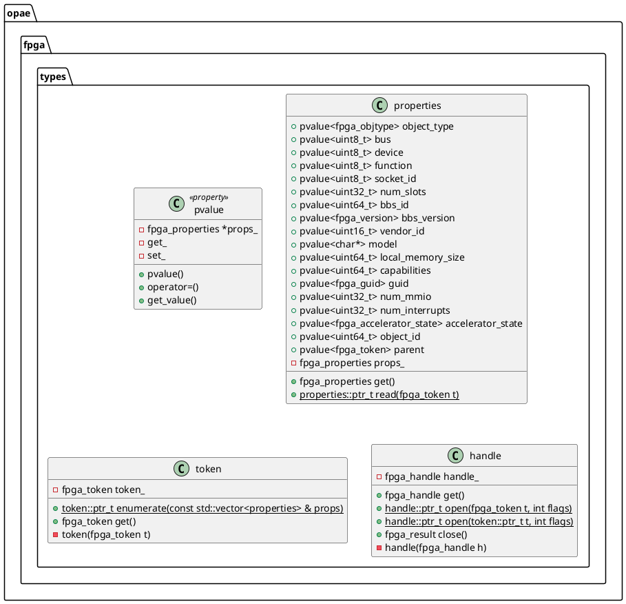
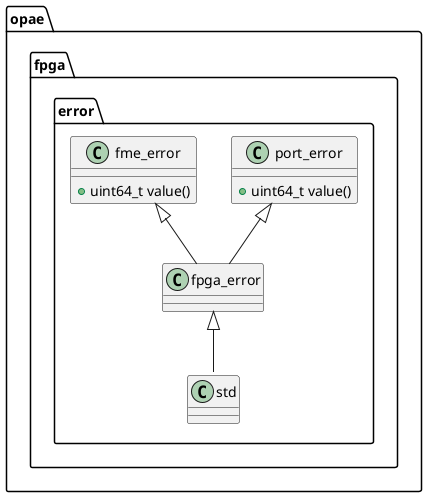
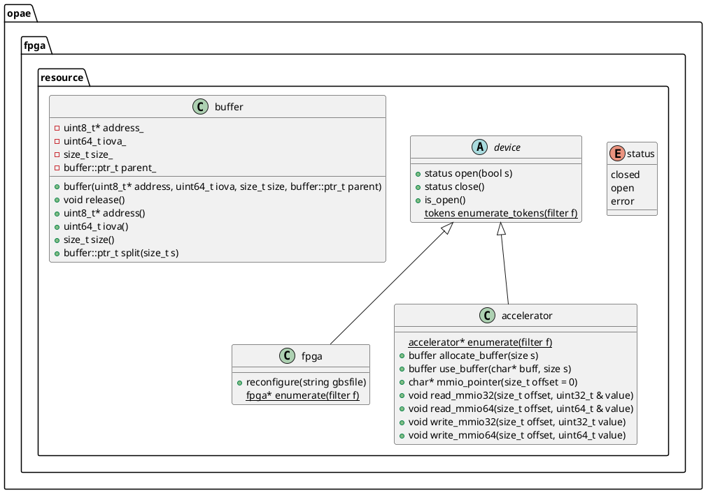

# OPAE C++ API
## Overview
The OPAE C++ API enables C++ developers with the means to use FPGA resources by integrating the OPAE software stack into C++ applications. It is built on top of the OPAE C API and is split up into two components:
1. The basic or fundemental types that wrap the data structures defined in the OPAE C API.
2. Classes that abstract FPGA resources and functions

## Goals
The following is a list of goals and design decisions made while designing this API.

### Simplicity
Keep the API as small and lightweight as possible. Although features such as system validation or orchestration are beyond the scope of this API, using this API for their development should be relatively easy.

### Extensibility and Interoperability
While keeping to the goal of simplicity, the OPAE C++ API is designed to allow for better reuse by either extending the API or by integrating with other languages. 

### Modern C++ Coding Practices
The OPAE C++ API will use the C++ 11 standard library and make use of its features whenever practical. Furthermore, the OPAE C++ API is designed to require as few as possible any other third party libraries/dependencies.

### Error Handling
The OPAE C++ API is designed to throw exceptions when appropriate. The structure of OPAE C++ exceptions will be similar to the error codes in the OPAE C API. This gives users of the API more freedom on error handling while providing better debug information in cases of failure.

### Coding Style
_TODO_

## Fundamental Types
Basic types for the OPAE C++ API are found in the `opae.fpga.types` namespace.
They serve as an adapter layer between the OPAE-C API and the OPAE-C++ layer.
Aside from providing a C++ binding to the C fundemental types, these types also
* Manage the lifetime and scope of the corresponding C struct
  * For example, a C++ destructor will take care of calling the appropriate C function to deallocate or release the data structure being wrapped
* Provide an easy to use syntax for using them

Most classes in this namespace have a `get()` method that returns the C data structure being wrapped. This is useful for when one wishes to use one of OPAE C API functions.

Below is a diagram of the classes defined in the opae::fpga::types namespace.






## Resource Abstractions
The second layer in the OPAE C++ API encapsulates fpga resources into types that tie the fundemental types to the methods or operations applicaple to them. The classes in this layer are designed in a hierarchy that enables more code reuse through inheritance or by composition.



## Examples
```c++

    int main(int argc, char* argv[])
    {

    }

```