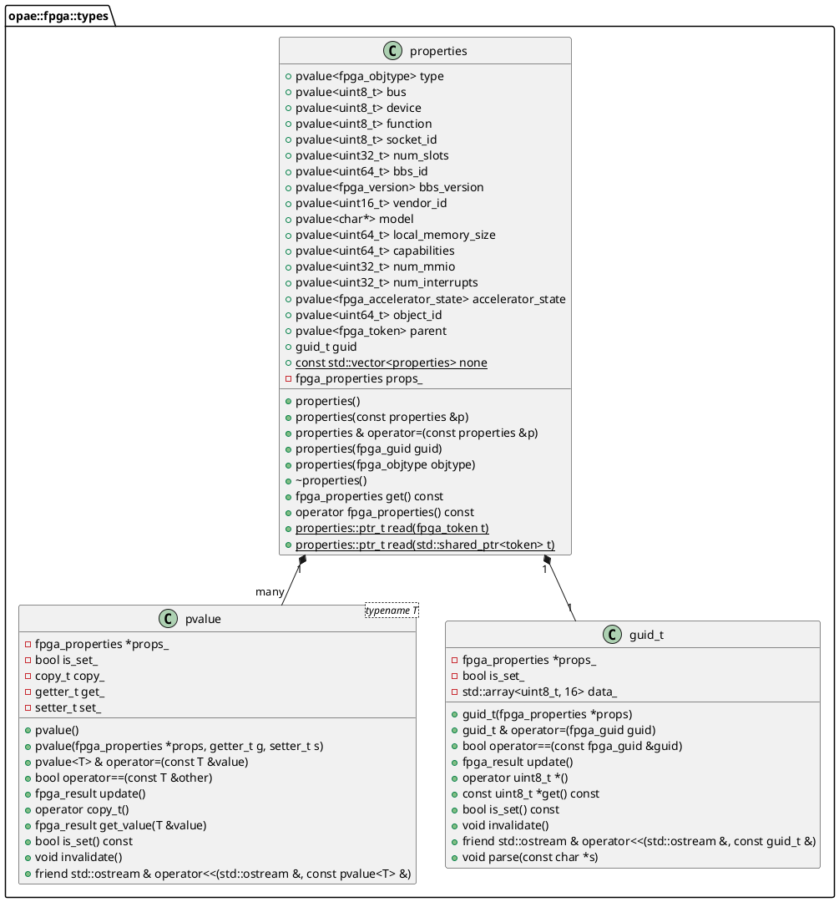
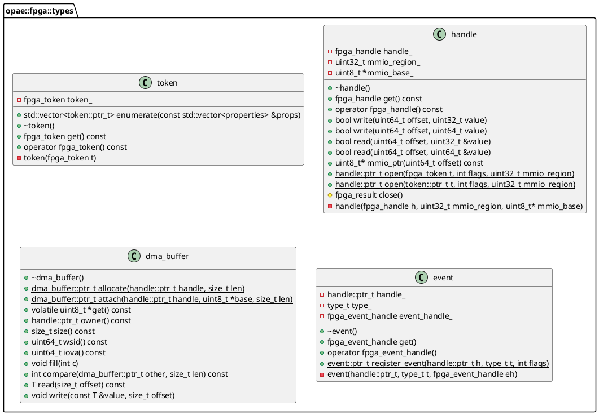
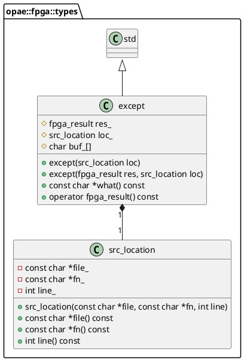
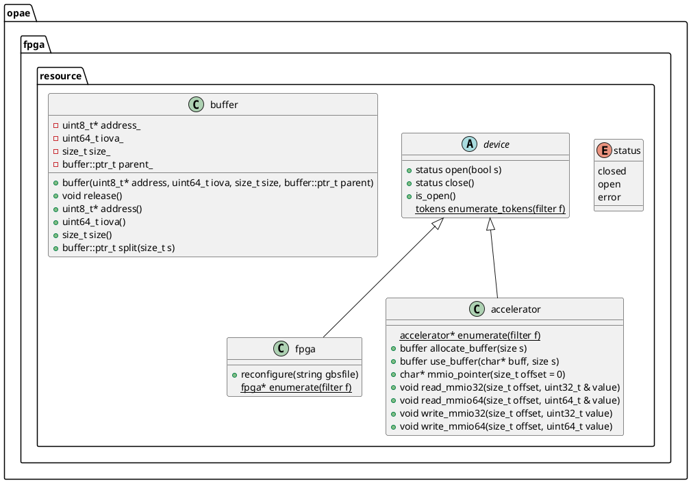

# OPAE C++ API
## Overview
The OPAE-C++ API enables C++ developers with the means to use FPGA resources by integrating the OPAE software stack into C++ applications. It is built on top of the OPAE-C API and is comprised of two components:
1. The basic or fundemental types that wrap the data structures defined in the OPAE-C API.
2. Classes that abstract FPGA resources and functionality.

## Goals
The following is a list of goals and design decisions made while designing the OPAE-C++ API.

### Simplicity
Keep the API as small and lightweight as possible. Although features such as system validation or orchestration are beyond the scope of this API, using this API for their development should be relatively easy.

### Extensibility and Interoperability
While keeping to the goal of simplicity, the OPAE-C++ API is designed to allow for better reuse by either extending the API or by integrating with other languages. 

### Modern C++ Coding Practices
The OPAE-C++ API will use the C++ 11 standard library and make use of its features whenever practical. Furthermore, the OPAE-C++ API is designed to require the minimal number of third party libraries/dependencies.

### Error Handling
The OPAE-C++ API is designed to throw exceptions when appropriate. The structure of OPAE-C++ exceptions will be similar to the error codes in the OPAE-C API. This gives users of the API more freedom on error handling while providing better debug information in cases of failure.

### Coding Style
Formatting of the OPAE-C++ API will apply most of the recommendations of the Google C++ style style. For example, the OPAE-C++ API will:
* Use opening braces on the same line as their scope definition
* Use spaces instead of tabs for indentation
* Use indentation of two spaces

Refer to the [Google C++ Style Guide](https://google.github.io/styleguide/cppguide.html) for more information.

## Fundamental Types
Basic types for the OPAE-C++ API are found in the `opae::fpga::types` namespace.
They serve as an adapter layer between the OPAE-C API and the OPAE-C++ layer.
Aside from providing a C++ binding to the C fundamental types, these types also
* Manage the lifetime and scope of the corresponding C struct.
  * For example, a C++ destructor will take care of calling the appropriate C function to deallocate or release the data structure being wrapped.
* Provide a friendly syntax for using the OPAE type.

Most classes in this namespace have a `get()` method that returns the C data structure being wrapped. This is useful for when one wishes to use one of OPAE-C API functions. Additionally, most classes in this namespace have implicit conversion operators that allow instances of these types to be interoperable with OPAE-C API functions. These operators are designed so that they are invoked when instances are converted to their corresponding C structure (either explicitly or implicitly).

The two diagrams below illustrate the design of the class in the `opae::fpga::types` namespace. 

### Properties classes
The first diagram shows classes related to `fpga_properties`. The class, `properties`, wraps `fpga_properties` and uses public members of type `pvalue` and `guid_t` to get/set properties stored in an instance of an `fpga_properties`.
These two classes are designed to call an accessor method in the OPAE-C API to either read property values or write them. Because most accessor methods in the OPAE-C API share a similar signature, `pvalue` generalizes them into common operations that translate into calling the corresponding C API function. The class, `guid_t`, follows similar patterns when reading or assigning values.




### Resource Classes
The basic types in `opae::fpga::types` used for enumerating and accessing fpga resources are shown in the diagram below.



`properties` are used to narrow the search space for `token`s. Before enumerating the accelerator resources in the system, applications can produce one or more `properties` objects whose values are set to the desired characteristics for the resource. For example, an application may search for an accelerator resource based on its guid.

Once one or more `token`s have been enumerated, the application must choose which `token`s to request. The `token` is then converted to a `handle` by requesting that a `handle` object be allocated and opened for it.

Once a `handle` has been successfully opened, the application may use the `handle` to allocate `dma_buffer`s or to register `event`s. The `dma_buffer` and `event` objects retain a reference to their owning `handle` so that the `handle` does not lose scope before freeing the `dma_buffer` and `event` objects.



When the OPAE-C++ API encounters an error from the OPAE-C API, it captures the current source code location and the error code into an object of type `except`, then throws the `except`. Applications should implement the appropriate catch blocks required to respond to runtime exceptions.

## Resource Abstractions
The second layer in the OPAE-C++ API encapsulates fpga resources into types that tie the fundemental types to the methods or operations applicaple to them. The classes in this layer are designed in a hierarchy that enables more code reuse through inheritance or by composition.



## Examples
```c++

    int main(int argc, char* argv[])
    {    
        const char* NLB0 = "D8424DC4-A4A3-C413-F89E-433683F9040B";
 
        properties props_filter;
 
        props_filter.socket_id = 1;
        props_filter.type = FPGA_ACCELERATOR;
        uuid_t uuid;
        if (uuid_parse(NLB0, uuid) == 0){
            props_filter.guid = uuid;
        }
        props_filter.bbs_id = 0; // This is invalid - libopae-c prints out a warning
        auto tokens = token::enumerate({props_filter});
        if (tokens.size() > 0){
            auto tok = tokens[0];
            auto props = properties::read(tok);
            std::cout << "guid prop read: " << props->guid << "\n";
 
            std::cout << "bus: 0x" << std::hex << props->bus << "\n";
            handle::ptr_t h = handle::open(tok, FPGA_OPEN_SHARED);
            uint64_t value1 = 0xdeadbeef, value2 = 0;
            h->write(0x100, value1);
            h->read(0x100, value2);
            std::cout << "mmio @0x100: 0x" << std::hex << value2 << "\n";
            std::cout << "mmio @0x100: 0x" << std::hex << *reinterpret_cast<uint64_t*>(h->mmio_ptr(0x100)) << "\n";
        }
 
        return  0;
    }

```
