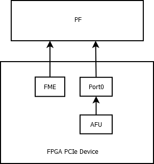
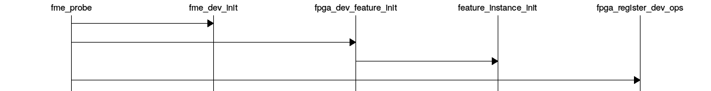
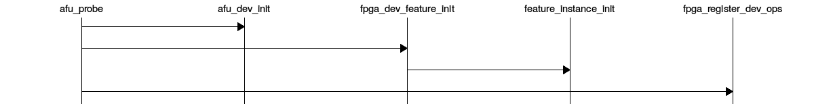

# OPAE Intel&reg; FPGA Linux Device Driver Architecture #

.. toctree::

.. highlight:: c

.. highlight:: sh

.. highlight:: console

The OPAE Intel&reg; FPGA driver provides interfaces for userspace applications to
configure, enumerate, open, and access FPGA accelerators on platforms equipped
with Intel&reg; FPGA solutions and enables system-level management functions such
as FPGA reconfiguration, power management, and virtualization.

## Hardware Architecture ##

From the OS's point of view, the FPGA hardware appears as a regular PCIe device.
The FPGA device memory is organized using a predefined data structure (Device
Feature List). Features supported by the particular FPGA device are exposed
through these data structures, as illustrated below:



The driver supports PCIe SR-IOV to create Virtual Functions (VFs) which can be
used to assign individual accelerators to virtual machines.


## FPGA Management Engine (FME) ##

The FPGA Management Engine performs power and thermal management, error
reporting, reconfiguration, performance reporting, and other infrastructure
functions. Each FPGA has one FME, which is always accessed through the Physical
Function (PF).

User-space applications can acquire exclusive access to the FME using `open()`,
and release it using `close()` as a privileged user (root).

.. note::

```
    In the case that an errant application terminates without freeing
    the FME/Port resources, Linux closes all file descriptors owned by
    the terminating process, freeing those resources.
```

## Port ##

A Port represents the interface between the static FPGA fabric (the "blue
bitstream") and a partially reconfigurable region containing an Accelerator Function Unit (AFU) (the "green
bitstream"). The Port controls the communication from software to the accelerator and
exposes features such as reset and debug.

A PCIe device may have several Ports, and each Port can be exposed through a VF
by assigning it using the `FPGA_FME_PORT_ASSIGN` ioctl on the FME device.

## Accelerator Function Unit (AFU) ##

An Accelerator Function Unit is attached to a Port and exposes a 256K MMIO region to be used for accelerator-specific control registers.

User-space applications can acquire exclusive access to an AFU attached to a
Port by using `open()` on the Port device, and release it using `close()`.

User-space applications can also `mmap()` accelerator MMIO regions.

## Partial Reconfiguration ##

As mentioned above, accelerators can be reconfigured through partial
reconfiguration of a green bitstream file (GBS). The green bitstream must have
been generated for the exact blue bitstream and targeted reconfigurable region
(Port) of the FPGA; otherwise, the reconfiguration operation will fail and
possibly cause system instability. This compatibility can be checked by
comparing the interface ID noted in the GBS header against the interface ID
exposed by the FME through sysfs. This check is usually done by
user-space before calling the reconfiguration IOCTL.


.. note::

```
    Currently, any software program accessing the FPGA, including those
    running in a virtualized host, must be closed prior to attempting a Partial
    Reconfiguration. The steps would be:
```

1. Unload the driver from the guest
2. Unplug the VF from the guest
3. Disable SR-IOV
4. Perform Partial Reconfiguration
5. Enable SR-IOV
6. Plug the VF to the guest
7. Load the driver in the guest

## FPGA Virtualization ##

To enable accessing an accelerator from applications running in a VM, the
respective AFU's Port needs to be assigned to a VF using the following steps:

1. The PF owns all AFU Ports by default. Any Port that needs to be reassigned
to a VF must be released from the PF firstly through the `FPGA_FME_PORT_RELEASE`
ioctl on the FME device.

2. Once N Ports are released from the PF, then user can use below command to
enable SRIOV and VFs. Each VF owns only one Port with AFU.

```console
    echo N > $PCI_DEVICE_PATH/sriov_numvfs
```

3. Pass through the VFs to VMs.

4. The AFU under VF is accessible from applications in VM (using the same
driver inside the VF).

Note that an FME can't be assigned to a VF, thus PR and other management
functions are only available via the PF.

## Driver Organization ##

### PCIe Module Device Driver ###


The FPGA devices appear as regular PCIe devices; thus, the FPGA PCIe
device driver (`intel-fpga-pci.ko`) is always loaded first once an
FPGA PCIe PF or VF is detected. This driver plays an infrastructural
role in the driver architecture. It:

1. Creates FPGA container device as parent of the feature devices.
2. Walks through the Device Feature List, which is implemented in PCIe
device BAR memory, to discover feature devices and their sub-features
and create platform device for them under the container device.
3. Supports SR-IOV.
4. Introduces the feature device infrastructure, which abstracts
operations for sub-features and exposes common functions to feature
device drivers.

### PCIe Module Device Driver Functions ###

* Contains PCIe discovery, device enumeration, and feature discovery.
* Creates sysfs directories for the parent device, FPGA Management Engine (FME), and Port.
* Creates the platform driver instances, causing Linux to load their respective platform module drivers.

### FME Platform Module Device Driver ###

The FPGA Management Engine (FME) driver (`intel-fpga-fme.ko`) is a
platform driver which is loaded automatically after FME platform
device creation from the PCIe driver. It provides the key features for
FPGA management, including:

1. Power and thermal management, error reporting, performance reporting,
and other infrastructure functions. Users can access these functions
via sysfs interfaces exposed by FME driver.

2. Partial Reconfiguration. The FME driver registers an FPGA Manager
during PR sub-feature initialization; once it receives an
`FPGA_FME_PORT_PR` ioctl from user, it invokes the common interface
function from FPGA Manager to complete the partial reconfiguration of
the bitstream to the given Port.

3. Port management for virtualization. The FME driver introduces two
ioctls, `FPGA_FME_PORT_RELEASE`, which releases given Port from PF; and
`FPGA_FME_PORT_ASSIGN`, which assigns Port back to PF. Once the Port is
released from the PF, it can be assigned to the VF through the SR-IOV
interfaces provided by PCIe driver. (Refer to "FPGA Virtualization"
for more details).

### FME Platform Module Device Driver Functions ###

* Creates the FME character device node.
* Creates the FME sysfs files and implements the FME sysfs file accessors.
* Implements the FME private feature sub-drivers.
* FME private feature sub-drivers:
    * FME Header
    * Thermal Management
    * Power Management
    * Global Error
    * Partial Reconfiguration
    * Global Performance

### Port Platform Module Device Driver ###

Similar to the FME driver, the FPGA Port (and AFU) driver
(`intel-fpga-afu.ko`) is probed once the Port platform device is
created. The main function of this module is to provide an interface
for userspace applications to access the individual accelerators,
including basic reset control on Port, AFU MMIO region export, DMA
buffer mapping service, UMsg notification, and remote debug functions
(see above).

### Port Platform Module Device Driver Functions ###

* Creates the Port character device node.
* Creates the Port sysfs files and implements the Port sysfs file accessors.
* Implements the Port private feature sub-drivers.
* Port private feature sub-drivers:
    * Port Header
    * AFU
    * Port Error
    * UMsg
    * Signal Tap

## Application FPGA Device Enumeration ##

This section introduces how applications enumerate the FPGA device from
the sysfs hierarchy under `/sys/class/fpga`.

In the example below, two Intel&reg; FPGA devices are installed in the host. Each
FPGA device has one FME and two Ports (AFUs).

For each FPGA device, a device directory is created under `/sys/class/fpga`:

```c
    /sys/class/fpga/intel-fpga-dev.0
    /sys/class/fpga/intel-fpga-dev.1
```

Each node has one FME and two Ports (AFUs) as child devices:

```c
    /sys/class/fpga/intel-fpga-dev.0/intel-fpga-fme.0
    /sys/class/fpga/intel-fpga-dev.0/intel-fpga-port.0
    /sys/class/fpga/intel-fpga-dev.0/intel-fpga-port.1

    /sys/class/fpga/intel-fpga-dev.1/intel-fpga-fme.1
    /sys/class/fpga/intel-fpga-dev.1/intel-fpga-port.2
    /sys/class/fpga/intel-fpga-dev.1/intel-fpga-port.3
```

In general, the FME/Port sysfs interfaces are named as follows:

```c
    /sys/class/fpga/intel-fpga-dev.i/intel-fpga-fme.j/
    /sys/class/fpga/intel-fpga-dev.i/intel-fpga-port.k/
```

with `i` consecutively numbering all of the container devices,
`j` consecutively numbering the FME's and `k` consecutively numbering
all Ports.

The device nodes used for `ioctl()` and `mmap()` can be referenced through:

```c
    /dev/intel-fpga-fme.j
    /dev/intel-fpga-port.k
```

## PCIe Driver Enumeration ##

This section gives an overview of the code flow for device enumeration
performed by intel-fpga-pci.ko. The main data structures and functions
are highlited. This section is best followed when viewing the accompanying
source code (`pcie.c`).

### Enumeration Data Structures ###

```c
    enum fpga_id_type {
        PARENT_ID,
        FME_ID,
        PORT_ID,
        FPGA_ID_MAX
    };

    static struct idr fpga_ids[FPGA_ID_MAX];
```


```c
    struct fpga_chardev_info {
        const char *name;
        dev_t devt;
    };

    struct fpga_chardev_info fpga_chrdevs[] = {
        { .name = FPGA_FEATURE_DEV_FME },
        { .name = FPGA_FEATURE_DEV_PORT },
    };
```

```c
    static struct class *fpga_class;
```

```c
    static struct pci_device_id cci_pcie_id_tbl[] = {
        {PCI_DEVICE(PCI_VENDOR_ID_INTEL, PCIe_DEVICE_ID_RCiEP0_INTG_XEON),},
        {PCI_DEVICE(PCI_VENDOR_ID_INTEL, PCIe_DEVICE_ID_VF_INTG_XEON),},
        {PCI_DEVICE(PCI_VENDOR_ID_INTEL, PCIe_DEVICE_ID_RCiEP0_DISCRETE),},
        {PCI_DEVICE(PCI_VENDOR_ID_INTEL, PCIe_DEVICE_ID_VF_DISCRETE),},
        {0,}
    };

    static struct pci_driver cci_pci_driver = {
        .name = DRV_NAME,
        .id_table = cci_pcie_id_tbl,
        .probe = cci_pci_probe,
        .remove = cci_pci_remove,
        .sriov_configure = cci_pci_sriov_configure
    };
```

```c
    struct cci_drvdata {
        int device_id;
        struct device *fme_dev;
        struct mutex lock;
        struct list_head port_dev_list;
        int released_port_num;
        struct list_head regions;
    };
```

```c
    struct build_feature_devs_info {
        struct pci_dev *pdev;
        void __iomem *ioaddr;
        void __iomem *ioend;
        int current_bar;
        void __iomem *pfme_hdr;
        struct device *parent_dev;
        struct platform_device *feature_dev;
    };
```

### Enumeration Flow ###

* `ccidrv_init()`
    * Initialize `fpga_ids` using `idr_init()`.
    * Initialize `fpga_chrdevs[i].devt` using `alloc_chrdev_region()`.
    * Initialize `fpga_class` using `class_create()`.
    * `pci_register_driver(&cci_pci_driver);`

* `cci_pci_probe()`
    * Enable the PCI device, request access to its regions, set PCI master mode, configure DMA.

* `cci_pci_create_feature_devs()` `build_info_alloc_and_init()`
    * Allocate a `struct build_feature_devs_info`, initialize it..
    * `.parent_dev` is set to a parent sysfs directory (intel-fpga-dev.*id*) that contains the FME and Port sysfs directories.

* `parse_feature_list()`
    * Walk the BAR0 Device Feature List to discover the FME, the Port, and their private features.

* `parse_feature()` `parse_feature_afus()` `parse_feature_fme()`
    * When an FME is encountered:
        * `build_info_create_dev()`
             * Allocate a platform device for the FME, storing in `build_feature_devs_info.feature_dev`.
             * `feature_dev.id` is initialized to the result of `idr_alloc(fpga_ids[FME_ID],`
             * `feature_dev.parent` is set to `build_feature_devs_info.parent_dev`.
             * Allocate an array of `struct resource` in `feature_dev.resource`.
        * Allocate a `struct feature_platform_data`, initialize it, and store a pointer in `feature_dev.dev.platform_data`
            * `create_feature_instance()` `build_info_add_sub_feature()`
            * Initialize `feature_dev.resource[FME_FEATURE_ID_HEADER]`.
            * `feature_platform_data_add()`
            * Initialize `feature_platform_data.features[FME_FEATURE_ID_HEADER]`, everything but .fops.

* `parse_feature()` `parse_feature_afus()` `parse_feature_port()`
    * When a Port is encountered:
        * `build_info_create_dev()`
            * Allocate a platform device for the Port, storing in `build_feature_devs_info.feature_dev`.
            * `feature_dev.id` is initialized to the result of `idr_alloc(fpga_ids[PORT_ID],`
            * `feature_dev.parent` is set to `build_feature_devs_info.parent_dev`.
            * Allocate an array of `struct resource` in `feature_dev.resource`.
            * Allocate a `struct feature_platform_data`, initialize it, and store a pointer in `feature_dev.dev.platform_data`
        * `build_info_commit_dev()`
            * Add the `struct feature_platform_data.node` for the Port to the list of Ports in `struct cci_drvdata.port_dev_list`
        * `create_feature_instance()` `build_info_add_sub_feature()`
            * Initialize `feature_dev.resource[PORT_FEATURE_ID_HEADER]`.
        * `feature_platform_data_add()`
            * Initialize `feature_platform_data.features[PORT_FEATURE_ID_HEADER]`, everything but .fops.

* `parse_feature()` `parse_feature_afus()` `parse_feature_port_uafu()`
    * When an AFU is encountered:
        * `create_feature_instance()` `build_info_add_sub_feature()`
            * Initialize `feature_dev.resource[PORT_FEATURE_ID_UAFU]`.
        * `feature_platform_data_add()`
            * Initialize `feature_platform_data.features[PORT_FEATURE_ID_UAFU]`, everything but .fops.

* `parse_feature()` `parse_feature_private()` `parse_feature_fme_private()`
    * When an FME private feature is encountered:
        * `create_feature_instance()` `build_info_add_sub_feature()`
            * Initialize `feature_dev.resource[id]`.
        * `feature_platform_data_add()`
            * Initialize `feature_platform_data.features[id]`, everything but .fops.

* `parse_feature()` `parse_feature_private()` `parse_feature_port_private()`
   * When a Port private feature is encountered:
        * `create_feature_instance()` `build_info_add_sub_feature()`
            * Initialize `feature_dev.resource[id]`.
        * `feature_platform_data_add()`
            * Initialize `feature_platform_data.features[id]`, everything but .fops.

* `parse_ports_from_fme()`
    * If the driver is loaded on the Physical Function (PF), then..
        * Run the `parse_feature_list()` flow on each port described in the FME header.
        * Use the BAR mentioned in each Port entry in the header.

## FME Platform Device Initialization ##

This section gives an overview of the code flow for FME device initialization
performed by intel-fpga-fme.ko. The main data structures and functions
are highlited. This section is best followed when viewing the accompanying
source code (`fme-main.c`).

### FME Platform Device Data Structures ###

```c
    struct feature_ops {
        int (*init)(struct platform_device *pdev, struct feature *feature);
        int (*uinit)(struct platform_device *pdev, struct feature *feature);
        long (*ioctl)(struct platform_device *pdev, struct feature *feature,
                    unsigned int cmd, unsigned long arg);
        int (*test)(struct platform_device *pdev, struct feature *feature);
    };
```

```c
    struct feature {
        const char *name;
        int resource_index;
        void __iomem *ioaddr;
        struct feature_ops *ops;
    };
```

```c
    struct feature_platform_data {
        struct list_head node;
        struct mutex lock;
        unsigned long dev_status;
        struct cdev cdev;
        struct platform_device *dev;
        unsigned int disable_count;
        void *private;
        int num;
        int (*config_port)(struct platform_device *, u32, bool);
        struct platform_device *(*fpga_for_each_port)(struct platform_device *,
                void *, int (*match)(struct platform_device *, void *));
        struct feature features[0];
    };
```

```c
    struct perf_object {
        int id;
        const struct attribute_group **attr_groups;
        struct device *fme_dev;
        struct list_head node;
        struct list_head children;
        struct kobject kobj;
    };
```

```c
    struct fpga_fme {
        u8 port_id;
        u64 pr_err;
        struct device *dev_err;
        struct perf_object *perf_dev;
        struct feature_platform_data *pdata;
    };
```

### FME Platform Device Initialization Flow ###



* `fme_probe()` `fme_dev_init()`
    * Initialize a `struct fpga_fme` and store it in the `feature_platform_data.private` field.

* `fme_probe()` `fpga_dev_feature_init()` `feature_instance_init()`
    * Save a `struct feature_ops` into the `feature_platform_data.features` for each populated feature.
    * Call the `test` function, if any, from the struct.
    * Call the `init` function from the struct.

* `fme_probe()` `fpga_register_dev_ops()`
    * Create the FME character device node, registering a `struct file_operations`.

## Port Platform Device Initialization ##

This section gives an overview of the code flow for port device initialization
performed by `intel-fpga-afu.ko`. The main data structures and functions
are highlighted. This section is best followed when viewing the accompanying
source code (`afu.c`).

### Port Platform Device Data Structures ###

```c
    struct feature_ops {
        int (*init)(struct platform_device *pdev, struct feature *feature);
        int (*uinit)(struct platform_device *pdev, struct feature *feature);
        long (*ioctl)(struct platform_device *pdev, struct feature *feature,
                    unsigned int cmd, unsigned long arg);
        int (*test)(struct platform_device *pdev, struct feature *feature);
    };
```

```c
    struct feature {
        const char *name;
        int resource_index;
        void __iomem *ioaddr;
        struct feature_ops *ops;
    };
```

```c
    struct feature_platform_data {
        struct list_head node;
        struct mutex lock;
        unsigned long dev_status;
        struct cdev cdev;
        struct platform_device *dev;
        unsigned int disable_count;
        void *private;
        int num;
        int (*config_port)(struct platform_device *, u32, bool);
        struct platform_device *(*fpga_for_each_port)(struct platform_device *,
                void *, int (*match)(struct platform_device *, void *));
        struct feature features[0];
    };
```

```c
    struct fpga_afu_region {
        u32 index;
        u32 flags;
        u64 size;
        u64 offset;
        u64 phys;
        struct list_head node;
    };
```

```c
    struct fpga_afu_dma_region {
        u64 user_addr;
        u64 length;
        u64 iova;
        struct page **pages;
        struct rb_node node;
        bool in_use;
    };
```

```c
    struct fpga_afu {
        u64 region_cur_offset;
        int num_regions;
        u8 num_umsgs;
        struct list_head regions;
        struct rb_root dma_regions;
        struct feature_platform_data *pdata;
    };
```

### Port Platform Device Initialization Flow ###



* `afu_probe()` `afu_dev_init()`
    * Initialize a `struct fpga_afu` and store it in the `feature_platform_data.private` field.

* `afu_probe()` `fpga_dev_feature_init()` `feature_instance_init()`
    * Save a `struct feature_ops` into the `feature_platform_data`.features for each populated feature.
    * Call the `test` function, if any, from the struct.
    * Call the `init` function from the struct.

* `afu_probe()` `fpga_register_dev_ops()`
    * Create the Port character device node, registering a `struct file_operations`.

## FME IOCTLs ##

IOCTLs that are called on an open file descriptor for /dev/intel-fpga-fme.*j*

`FPGA_GET_API_VERSION`

* return the current version as an integer, starting from 0.

`FPGA_CHECK_EXTENSION`

* (not currently supported).

`FPGA_FME_PORT_RELEASE`

* arg is a pointer to a:

```c
    struct fpga_fme_port_release {
        __u32 argsz;   // in: sizeof(struct fpga_fme_port_release)
        __u32 flags;   // in: must be 0
        __u32 port_id; // in: port ID (from 0) to release.
    };
```

`FPGA_FME_PORT_ASSIGN`

* arg is a pointer to a:

```c
    struct fpga_fme_port_assign {
        __u32 argsz;   // in: sizeof(struct fpga_fme_port_assign)
        __u32 flags;   // in: must be 0
        __u32 port_id; // in: port ID (from 0) to assign. (must have been previously released by FPGA_FME_PORT_RELEASE)
    };
```

`FPGA_FME_PORT_PR`

* arg is a pointer to a:

```c
    struct fpga_fme_port_pr {
        __u32 argsz;          // in: sizeof(struct fpga_fme_port_pr)
        __u32 flags;          // in: must be 0
        __u32 port_id;        // in: port ID (from 0)
        __u32 buffer_size;    // in: size of bitstream buffer in bytes. Must be 4-byte aligned.
        __u64 buffer_address; // in: process address of bitstream buffer
        __u64 status;         // out: error status (bitmask)
    };
```


## Port IOCTLs ##

IOCTLs that are called on an open file descriptor for /dev/intel-fpga-port.*k*

`FPGA_GET_API_VERSION`

* return the current version as an integer, starting from 0.

`FPGA_CHECK_EXTENSION`

* (not currently supported).

`FPGA_PORT_GET_INFO`

* arg is a pointer to a:

```c
    struct fpga_port_info {
        __u32 argsz;       // in: sizeof(struct fpga_port_info)
        __u32 flags;       // out: returns 0
        __u32 num_regions; // out: number of MMIO regions, 2 (1 for AFU and 1 for STP)
        __u32 num_umsgs;   // out: number of UMsg's supported by the hardware
    };
```

`FPGA_PORT_GET_REGION_INFO`

* arg is a pointer to a:

```c
    struct fpga_port_region_info {
        __u32 argsz;   // in: sizeof(struct fpga_port_region_info)
        __u32 flags;   // out: (bitmask) { FPGA_REGION_READ, FPGA_REGION_WRITE, FPGA_REGION_MMAP }
        __u32 index;   // in: FPGA_PORT_INDEX_UAFU or FPGA_PORT_INDEX_STP
        __u32 padding; // in: must be 0
        __u64 size;    // out: size of MMIO region in bytes
        __u64 offset;  // out: offset of MMIO region from start of device fd
    };
```

`FPGA_PORT_DMA_MAP`

* arg is a pointer to a:

```c
    struct fpga_port_dma_map {
        __u32 argsz;     // in: sizeof(struct fpga_port_dma_map)
        __u32 flags;     // in: must be 0
        __u64 user_addr; // in: process virtual address. Must be page aligned.
        __u64 length;    // in: length of mapping in bytes. Must be a multiple of page size.
        __u64 iova;      // out: IO virtual address
    };
```

`FPGA_PORT_DMA_UNMAP`

* arg is a pointer to a:

```c
    struct fpga_port_dma_unmap {
        __u32 argsz; // in: sizeof(struct fpga_port_dma_unmap)
        __u32 flags; // in: must be 0
        __u64 iova;  // in: IO virtual address returned by a previous FPGA_PORT_DMA_MAP
    };
```

`FPGA_PORT_RESET`

* arg must be NULL.

`FPGA_PORT_UMSG_ENABLE`

* arg must be NULL.

`FPGA_PORT_UMSG_DISABLE`

* args must be NULL.

`FPGA_PORT_UMSG_SET_MODE`

* arg is a pointer to a:

```c
    struct fpga_port_umsg_cfg {
        __u32 argsz;       // in: sizeof(struct fpga_port_umsg_cfg)
        __u32 flags;       // in: must be 0
        __u32 hint_bitmap; // in: UMsg hint mode bitmap. Signifies which UMsg's are enabled.
    };
```

`FPGA_PORT_UMSG_SET_BASE_ADDR`

* UMsg must be disabled prior to issuing this ioctl.
* The iova field must be for a buffer large enough for all UMsg's (num_umsgs * PAGE_SIZE).
    * The buffer will be marked as "in use" by the driver's buffer management.
    * If iova is NULL, any previous region is unmarked as "in use".
* arg is a pointer to a:

```c
    struct fpga_port_umsg_base_addr {
        __u32 argsz; // in: sizeof(struct fpga_port_umsg_base_addr)
        __u32 flags; // in: must be 0
        __u64 iova;  // in: IO virtual address from FPGA_PORT_DMA_MAP.
    };
```

.. note::

```
    To clear the port errors, you have to write the exact bitmask of the current errors, eg:

    $ cat errors > clear
```

# sysfs files #

## FME Header sysfs files ##

intel-fpga-dev.*i*/intel-fpga-fme.*j*/

| sysfs file         | mmio field                         | type         | access    |
|--------------------|------------------------------------|--------------|-----------|
| ports_num          | fme_header.capability.num_ports    | decimal int  | Read-only |
| cache_size         | fme_header.capability.cache_size   | decimal int  | Read-only |
| version            | fme_header.capability.fabric_verid | decimal int  | Read-only |
| socket_id          | fme_header.capability.socket_id    | decimal int  | Read-only |
| bitstream_id       | fme_header.bitstream_id            | hex uint64_t | Read-only |
| bitstream_metadata | fme_header.bitstream_md            | hex uint64_t | Read-only |

## FME Thermal Management sysfs files ##

intel-fpga-dev.*i*/intel-fpga-fme.*j*/thermal_mgmt/

| sysfs file         | mmio field                           | type         | access                           |
|--------------------|--------------------------------------|--------------|----------------------------------|
| threshold1         | thermal.threshold.tmp_thshold1       | decimal int  | User: Read-only Root: Read-write |
| threshold2         | thermal.threshold.tmp_thshold2       | decimal int  | User: Read-only Root: Read-write |
| threshold_trip     | thermal.threshold.therm_trip_thshold | decimal int  | Read-only                        |
| threshold1_reached | thermal.threshold.thshold1_status    | decimal int  | Read-only                        |
| threshold2_reached | thermal.threshold.thshold2_status    | decimal int  | Read-only                        |
| threshold1_policy  | thermal.threshold.thshold_policy     | decimal int  | User: Read-only Root: Read-write |
| temperature        | thermal.rdsensor_fm1.fpga_temp       | decimal int  | Read-only                        |

## FME Power Management sysfs files ##

intel-fpga-dev.*i*/intel-fpga-fme.*j*/power_mgmt/

| sysfs file        | mmio field                        | type             | access                           |
|-------------------|-----------------------------------|------------------|----------------------------------|
| consumed          | power.status.pwr_consumed         | hex uint64_t     | Read-only                        |
| threshold1        | power.threshold.threshold1        | hex uint64_t     | User: Read-only Root: Read-write |
| threshold2        | power.threshold.threshold2        | hex uint64_t     | User: Read-only Root: Read-write |
| threshold1_status | power.threshold.threshold1_status | decimal unsigned | Read-only                        |
| threshold2_status | power.threshold.threshold2_status | decimal unsigned | Read-only                        |
| rtl               | power.status.fpga_latency_report  | decimal unsigned | Read-only                        |

## FME Global Error sysfs files ##

intel-fpga-dev.*i*/intel-fpga-fme.*j*/errors/

| sysfs file         | mmio field                     | type             | access     |
|--------------------|--------------------------------|------------------|------------|
| pcie0_errors       | gerror.pcie0_err               | hex uint64_t     | Read-write |
| pcie1_errors       | gerror.pcie1_err               | hex uint64_t     | Read-write |
| gbs_errors         | gerror.ras_gerr                | hex uint64_t     | Read-only  |
| bbs_errors         | gerror.ras_berr                | hex uint64_t     | Read-only  |
| warning_errors     | gerror.ras_werr.event_warn_err | hex int          | Read-write |
| inject_error       | gerror.ras_error_inj           | hex uint64_t     | Read-write |

intel-fpga-dev.*i*/intel-fpga-fme.*j*/errors/fme-errors/

| sysfs file         | mmio field                             | type             | access     |
|--------------------|----------------------------------------|------------------|------------|
| errors             | gerror.fme_err                         | hex uint64_t     | Read-only  |
| first_error        | gerror.fme_first_err.err_reg_status    | hex uint64_t     | Read-only  |
| next_error         | gerror.fme_next_err.err_reg_status     | hex uint64_t     | Read-only  |
| clear              | Clears errors, first_error, next_error | various uint64_t | Write-only |

.. note::

```
    To clear the FME errors, you must write the exact bitmask of the current errors, eg
```

```sh
    cat errors > clear
```

## FME Partial Reconfiguration sysfs files ##

intel-fpga-dev.*i*/intel-fpga-fme.*j*/pr/

| sysfs file   | mmio field                                    | type        | access    |
|--------------|-----------------------------------------------|-------------|-----------|
| interface_id | pr.fme_pr_intfc_id0_h, pr.fme_pre_intfc_id0_l | hex 16-byte | Read-only |

## FME Global Performance sysfs files ##

intel-fpga-dev.*i*/intel-fpga-fme.*j*/perf/clock

| sysfs file | mmio field                 | type         | access    |
|------------|----------------------------|--------------|-----------|
| clock      | gperf.clk.afu_interf_clock | hex uint64_t | Read-only |

intel-fpga-dev.*i*/intel-fpga-fme.*j*/perf/cache/     (Not valid for DISCRETE)

| sysfs file                 | mmio field                      | type         | access     |
|----------------------------|---------------------------------|--------------|------------|
| freeze                     | gperf.ch_ctl.freeze             | decimal int  | Read-write |
| read_hit                   | gperf.CACHE_RD_HIT              | hex uint64_t | Read-only  |
| read_miss                  | gperf.CACHE_RD_MISS             | hex uint64_t | Read-only  |
| write_hit                  | gperf.CACHE_WR_HIT              | hex uint64_t | Read-only  |
| write_miss                 | gperf.CACHE_WR_MISS             | hex uint64_t | Read-only  |
| hold_request               | gperf.CACHE_HOLD_REQ            | hex uint64_t | Read-only  |
| tx_req_stall               | gperf.CACHE_TX_REQ_STALL        | hex uint64_t | Read-only  |
| rx_req_stall               | gperf.CACHE_RX_REQ_STALL        | hex uint64_t | Read-only  |
| data_write_port_contention | gperf.CACHE_DATA_WR_PORT_CONTEN | hex uint64_t | Read-only  |
| tag_write_port_contention  | gperf.CACHE_TAG_WR_PORT_CONTEN  | hex uint64_t | Read-only  |

intel-fpga-dev.*i*/intel-fpga-fme.*j*/perf/iommu/    (Not valid for DISCRETE)

| sysfs file | mmio field           | type        | access                           |
|------------|----------------------|-------------|----------------------------------|
| freeze     | gperf.vtd_ctl.freeze | decimal int | User: Read-only Root: Read-write |

intel-fpga-dev.*i*/intel-fpga-fme.*j*/perf/iommu/afu*k*/   (Not valid for DISCRETE)

| sysfs file        | mmio field                  | type         | access    |
|-------------------|-----------------------------|--------------|-----------|
| read_transaction  | gperf.VTD_AFU0_MEM_RD_TRANS | hex uint64_t | Read-only |
| write_transaction | gperf.VTD_AFU0_MEM_WR_TRANS | hex uint64_t | Read-only |
| tlb_read_hit      | gperf.VTD_AFU0_TLB_RD_HIT   | hex uint64_t | Read-only |
| tlb_write_hit     | gperf.VTD_AFU0_TLB_WR_HIT   | hex uint64_t | Read-only |

intel-fpga-dev.*i*/intel-fpga-fme.*j*/perf/fabric/

| sysfs file  | mmio field              | type         | access                           |
|-------------|-------------------------|--------------|----------------------------------|
| enable      | gperf.fab_ctl.(enabled) | decimal int  | User: Read-only Root: Read-write |
| freeze      | gperf.fab_ctl.freeze    | decimal int  | User: Read-only Root: Read-write |
| pcie0_read  | gperf.FAB_PCIE0_RD      | hex uint64_t | Read-only                        |
| pcie0_write | gperf.FAB_PCIE0_WR      | hex uint64_t | Read-only                        |
| pcie1_read  | gperf.FAB_PCIE1_RD      | hex uint64_t | Read-only                        |
| pcie1_write | gperf.FAB_PCIE1_WR      | hex uint64_t | Read-only                        |
| upi_read    | gperf.FAB_UPI_RD        | hex uint64_t | Read-only                        |
| upi_write   | gperf.FAB_UPI_WR        | hex uint64_t | Read-only                        |

intel-fpga-ev.*i*/intel-fpga/fme.*j*/perf/fabric/port*k*/

| sysfs file  | mmio field         | type         | access    |
|-------------|--------------------|--------------|-----------|
| pcie0_read  | gperf.FAB_PCIE0_RD | hex uint64_t | Read-only |
| pcie0_write | gperf.FAB_PCIE0_WR | hex uint64_t | Read-only |
| pcie1_read  | gperf.FAB_PCIE1_RD | hex uint64_t | Read-only |
| pcie1_write | gperf.FAB_PCIE1_WR | hex uint64_t | Read-only |
| upi_read    | gperf.FAB_UPI_RD   | hex uint64_t | Read-only |
| upi_write   | gperf.FAB_UPI_WR   | hex uint64_t | Read-only |

## Port Header sysfs files ##

intel-fpga-dev.*i*/intel-fpga-port.*k*/

| sysfs file | mmio field                            | type        | access    |
|------------|---------------------------------------|-------------|-----------|
| id         | port_header.capability.port_number    | decimal int | Read-only |
| ltr        | port_header.control.latency_tolerance | decimal int | Read-only |

## Port AFU Header sysfs files ##

intel-fpga-dev.*i*/intel-fpga-port.*k*/

| sysfs file | mmio field      | type        | access    |
|------------|-----------------|-------------|-----------|
| afu_id     | afu_header.guid | hex 16-byte | Read-only |

## Port Error sysfs files ##

intel-fpga-dev.*i*/intel-fpga-port.*k*/errors/

| sysfs file          | mmio field              | type             | access     |
|---------------------|-------------------------|------------------|------------|
| errors              | perror.port_error       | hex uint64_t     | Read-only  |
| first_error         | perror.port_first_error | hex uint64_t     | Read-only  |
| first_malformed_req | perror.malreq           | hex 16-byte      | Read-only  |
| clear               | perror.(all errors)     | various uint64_t | Write-only |

.. note::

```
    To clear the Port errors, you must write the exact bitmask of the current errors, eg
```

```sh
    cat errors > clear
```
