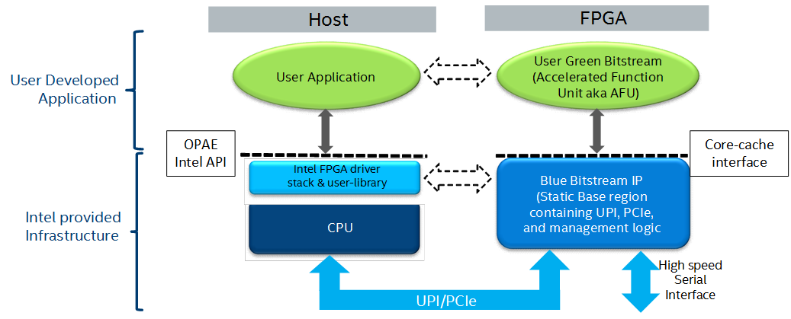
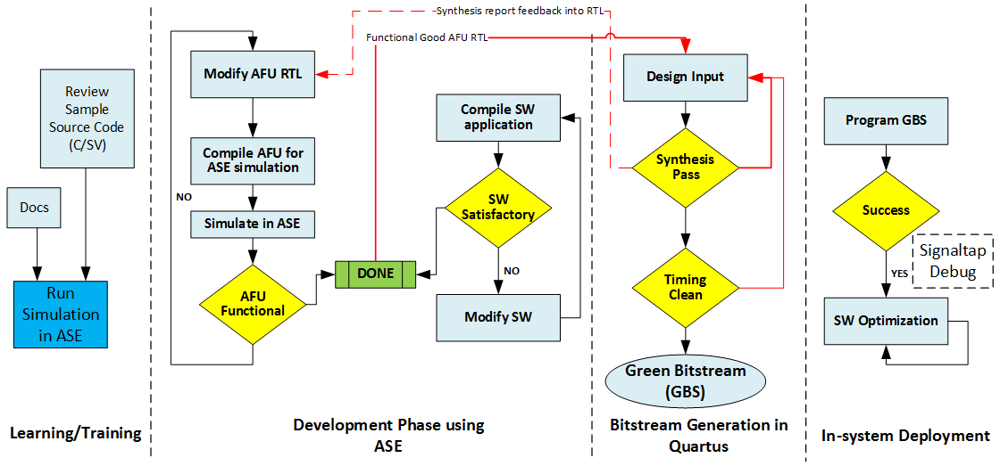
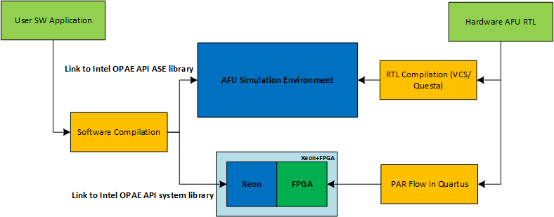
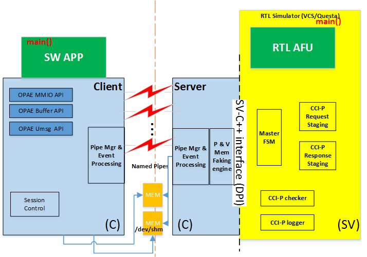
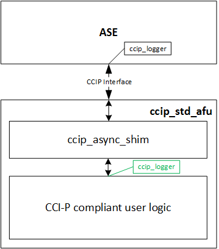

# OPAE AFU Simulation Environment (ASE) User Guide #

.. toctree::

.. highlight:: c

.. highlight:: console


## Intended Audience ##

This document is written for developers who plan to use AFU Simulation Environment (ASE) as a tool to begin development on the Intel&reg; Xeon&reg;-FPGA Platform with an Intel&reg; FPGA IP (a.k.a Blue Bitstream) accelerator before deployment in a real system. The document is intended for both beginners and experienced developers.

To use the ASE Environment, the developer must have access to Accelerated Functional Unit (AFU) source code in RTL format like {System}Verilog, VHDL) or in SystemC, etc. or in a High-level Synthesis (HLS) language, so long as the generated output can be interpreted by industry-common RTL Simulator tools. Application software can be developed to operate this AFU in the same unified environment.

The minimum set of skills required for developing with ASE, is competence in C/C++, synthesizable SystemVerilog development, familiarity with RTL simulators like Synopsys\* VCS-MX or Mentor Graphics\** ModelSim-SE*/QuestaSim, and preferably some FPGA PAR experience. Additional skills may be necessary and recommended for more advanced work. Teams of developers who specialize in either RTL development or Software development may use ASE in lock-step to develop functional AFUs for Intel&reg; Xeon&reg;-FPGA platform.


## Introduction ##

AFU Simulation Environment (ASE) is the term used to refer to the Intel&reg; Xeon&reg;-FPGA user application development and debug environment. It aims to provide a consistent transaction level hardware interface and software API that allows users to develop production-quality AFU RTL and SW host application that can then be run on the real FPGA system without modifications.

ASE can be used to develop and  simulate AFU and software code that will run on tightly-coupled FPGA and the programmable FPGA acceleration cards. The figures shown may refer to one of the two platforms, but the enviroment may be used to simulate either of the two platforms.

.. note::
```
The ASE environment is integrated to support one AFU and one application at a time. Multiple slot simulation in a single platform is not supported in ASE.
```

### Overview of Supported platforms ###



The Intel&reg; Xeon&reg;-FPGA tightly-coupled FPGA platform provides coherent accelerator attachment to an Intel platform via Intel&reg; Ultra Path Interconnect (UPI) and two PCIe channels. In this case the FPGA Blue Bitstream (BBS) realized on the FPGA hosts a proprietary UPI Protocol layer and PCIe fabric in FPGA logic (registers, slices, LUTs, etc. This Blue Bitstream incorporates a Caching Agent (CA) that participates in Intel&reg; Xeon&reg; caching activities.


### AFU Simulation Environment (ASE) ###

 overview")

ASE is a unified environment that aims to reduce time-to-market AFU hardware and software development. It is packaged in OPAE software distribution.

ASE exposes two interfaces:

* **Software**: Open Programmable Acceleration Engine (OPAE) API realized in C

* **Hardware**: Core Cache Interface (CCI-P) specification realized in SystemVerilog

Customers developing AFU RTL and Software application must comply with these interfaces to be able to successfully deploy their IPs on the integraded FPGA or programmable FPGA acceleration cards.

### Capabilities of ASE ###


* ASE provides a protocol checker that helps identify protocol correctness. ASE can be used to rule-check if the Accelerator Functional Unit (AFU) complies to CCI-P protocol specifications, and whether OPAE API has been used correctly. It provides methods to identify potential issues early before in-system deployment.

* ASE can help identify certain lock conditions and Configuration/Status Registers (CSR) address mapping and pointer math mistakes.

* ASE presents a fake memory model to the AFU which keeps tabs on memory requested as accelerator workspaces, immediately flagging illegal memory transactions to locations outside of requested memory spaces. This is a good way to identify address violation bugs in simulation.

* ASE does not guarantee synthesizability of the AFU design. However ASE and Intel&reg; Quartus&reg; Prime Pro suite can be used in an iterative design flow to generate a successfully compiled Green Bitstream (GBS) from AFU RTL functionally verified in ASE for interoperability within the modeled platform.

* ASE provides a data hazard checker which can be used to warn users of CCI-P traffic patterns that may cause WAW, RAW, WAR hazards. These transactions may be debugged using the waveform viewer or by using a relevant Memory Protocol Factory (MPF) shim.

* ASE does not require administrator privileges needed to run, it is completely user-level. ASE may be run on a "plain vanilla" user Linux box with all the required tools installed.


### Limitations of ASE ###

When using ASE in the application development cycle, consider the following:

* ASE is a transaction level simulator for a single AFU slot and single application in platform with Intel FPGA IP. ASE does model either Intel UPI or PCIe specific packet structures  and protocol layers.

* ASE does not simulate caching activities and is not a cache simulator. It cannot reliably simulate cache collision or capacity issues.

*  ASE is designed to take an actual in-system AFU RTL and its corresponding OPAE software application and verify them for correctness. ASE cannot consume a Green Bitstream (GBS) file.

* Although ASE models some latency parameters, it cannot model real-time system-specific latency behavior. It is also not intended to be a timing simulation of the design or latency/bandwidth profile of the real system, but good for functionally correct development.

* ASE does not simulate multi-AFU or multi-socket configurations.


### Recommended Workflow of ASE ###



Accelerator Functional Unit (AFU) using ASE can be broken down into four stages.

* **Learning/Training**: In this step, the user may use ASE to understand the interface specifications and platform overview. Sample code may be reviewed to get an understanding for CCI-P specifications and OPAE Intel API function calls. These samples may be run by the user in ASE simulation.

* **Development Phase**: In the development phase, ASE is used to develop AFU RTL and Software logic in a single workflow. Design RTL can be either developed from scratch or by modifying existing sample RTL. ASE behaviorally models the Intel Blue Bitstream IP providing immediate functionality feedback at the development phase. Any errors in CCI-P protocols, transactions, or invalid memory accesses can be flagged off in this stage and fixed at development time, without involving long place and route run times.

* **Bitstream Generation**: Once functional AFU RTL and SW have been developed satisfactorily, the AFU RTL can be seamlessly ported to the Intel&reg; Quartus&reg; Prime Pro tool and placed-routed for the specific kind of Intel Blue Bitstream IP (integraded FPGA or programmable FPGA acceleration cards). Synthesis reports can be used as feedback to fix AFU RTL. This can be taken back to Development Phase and functionally validated in ASE. It must be noted that bitstream generation can take hours depending on the design’s complexity, area occupancy, etc. Once a bitstream is generated, timing analysis is performed to check for timing corners, setup-hold violations, clock closure, etc. Feedback or failures from these also can be fed back to the design and validated in the ASE environment. Once all these criteria are sufficed, a Green Bitstream (GBS) containing the AFU RTL is generated.

* **In-system Deployment**: Once a successful GBS is generated, this can be tested in system or deployed. Further in-system debug of failures can be performed using Quartus Signaltap. Platform specific software optimization can be performed in this stage. Platform specific optimizations to the application may be pursued in the same manner as any other software optimization task.




AFU RTL code and OPAE software code produced in ASE is portable between the Simulation and Place-and-Route (PAR) Quartus environment. This is true as long as the AFU RTL code developed in the ASE environment is synthesizable and meets timing criteria.
* In the simulation environment, the AFU RTL is compiled in either Synopsys\* VCS-MX or Mentor\* Modelsim-SE/Questasim tools. The Software application is compiled for an ASE-specific implementation of the OPAE API.
* In the in-system environment, the AFU RTL will be synthesized in Intel&reg; Quartus&reg; and a bitstream produced. The FPGA in the Intel platform is programmed using this bitstream. The Software application is compiled for an platform-specific implementation of the OPAE API.

.. note::

```
ASE is capable of consuming AFU code in RTL source form only, and not in Bitstream form.
```

## System Requirements ##

ASE is available under the Open Programmable Acceleration Engine (OPAE) software release. The current OPAE ASE release support both tightly-coupled FPGA and programmable FPGA acceleration cards. ASE does not require an FPGA in the platform, and uses the Green Bitstream (GBS) AFU in source form. Bitstream configurations cannot be simulated in ASE.

ASE is supported only on 64-bit Linux operating systems. ASE requires a 64-bit RTL simulator, either Synopsys\* VCS-MX or Mentor Graphics\* QuestaSim/ModelSim-SE. The RTL simulator specific requirements are not listed here. Consult with your RTL simulator vendor for Synopsys\* or Mentor Graphics\* specific requirements.

The following RTL Simulators versions are supported in the current version of ASE:

* Synopsys\* VCS-MX (tested versions)
	* VCS-MX H2013.06-SP1
	* VCS-MX J2014.12-SP3
	* VCS-MX K2015.09-SP1
	* VCS-MX L2016.06

* Mentor Graphics\* Modelsim-SE/Questasim (tested versions)
	* QuestaSim 10.5b
	* ModelSim-SE 10.5a
	* QuestaSim 10.4d

.. note::
```
Both Mentor Graphics\* Modelsim-SE/Questasim and Synopsys\* VCS-MX system requirements are different are varied.

ASE is tested in some common configurations including the support list for Mentor\* and Synopsys\*. It is impractical to verify ASE functionality on all possible OS configurations. When choosing an operating system configuration, please consult the RTL Simulator supported OS List.
```

ASE uses Inter-Process Communication (IPC) constructs. Although under most circumstances these constructs operate normally without glitches. The following Linux locations should exist and be writeable. In most Linux distributions, ```/dev/shm``` comes pre-mounted as a default option.

The other ASE requirements are as follows:

* **C-Compiler**: gcc 4.4 or above

	* Boost Development libraries
	* UUID Development libraries
	* JSON Development libraries
	* Please see the dependencies of the OPAE System library build process

* **Cmake**: version 2.8 or above
* **GLIBC**: version 2.19 or above
* **Python**: This is optional, but is used by ```ase/scripts/generate_ase_environment.py``` script. However, the functions of the script can be performed manually. Python >=2.7 is recommended.
* **Intel&reg; Quartus&reg; Pro 17**: If you are simulating the provided NLB sample, ASE needs to find the ```$QUARTUS_HOME/eda/sim_lib/``` directory supplied with Intel&reg; Quartus&reg; Pro. The NLB sample RTL uses the Altera gates library.set GLS_SIM to 1 in the ```ase/Makefile```.

ASE provides a bash script called env_check.sh in ```ase/scripts/``` directory. Run this script to determine if you have the required tools installed.

Check the RTL simulator’s product information for supported operating systems, installation notes, and other related information. In general, the RTL simulator must be able to compile SystemVerilog Direct Programming Interface (DPI) constructs, have SystemC support, and be able to compile the standard examples that come with the installation.

Intel does not provide consulting support for installing the RTL simulators from Synopsys\* or Mentor Graphics\*.


## Package Description ##

ASE implementation of OPAE API may be downloaded either in RPM format (see Download instructions) or as a source.

The source form directory tree looks as follows:

```{.shell}

	OPAE_BASEDIR
		|-- ase
		|	|-- api
		|	|   `-- src
		|	|-- rtl
		|	|   `-- dcp_emif_model
		|	|-- sample_config
		|	|   `-- mcp_nlb0
		|	|       |-- config
		|	|       `-- rtl
		|	|-- scripts
		|	`-- sw
		|
		|-- cmake
		|--	common
		|	|-- include
		|	|   |-- fpga_app
		|	|   `-- opae
		|	`-- utils
		|-- doc
		|-- libopae
		|-- samples
		|-- tests
		`-- tools

```

The above tree directory roughly depicts the package structure of the ASE distribution. There are a minimum number of directories that are required to successfully build and run the ASE simulator. These are listed in this section.

* ```common```: This directory contains the OPAE library definitions, and defines various macros for access to an FPGA in an OPAE context.
* ```samples```: Contains a sample that will run on Native Loopback (NLB) RTL AFU
* ```libopae```: Intel platfrom specific implementation of the OPAE API.
* ```ase```: ASE simulator implementation location contains several subdirectories, namely:
	* ```rtl```: RTL components of ASE. This must be compiled in the RTL simulator for both programmable FPGA acceleration cards and tightly-coupled FPGA mode simulator builds.
		* ```dcp_emif_model```: programmable FPGA acceleration card Local DDR memory model. This must be compiled for all programmable FPGA acceleration card mode simulation model.
	* ``` sw```: Software components of ASE. These are required for all simulations of ASE, and are compiled using GNU Compiler Collection (GCC).
	* ```api/src```: This directory contains the OPAE Intel ASE implementation. This is compiled into a library that may be statically or dynamically linked.
	* ```scripts```: Contains several helper scripts. These are described in [Helper Scripts in ASE](#helper-scripts-in-ase) Section.
	* ```sample_config```: Contains sample configurations of different AFUS. These are described in [Sample Configurations](#sample-configurations) Section.


### Helper Scripts in ASE ###

Several scripts are supplied in the ASE distribution under the ```ase/scripts``` directory. These can be used for initialization, help with setting up tools, and even cleanup of an existing ASE simulation environment.

#### Set up Simulation tools ####

An RTL Simulator tool is required for running ASE amongst other [System Requirements](#system-requirements). To set up the tools required, use ase/scripts/ase_setup.sh as a template script. The script has many empty placeholders that are site and environment specific. Consult your Electronic Design Automation (EDA) tools  administrator, and/or the RTL simulator User Guides for help setting up the tools.

```{.bash}

	# This file must be edited before sourcing it.
	$ emacs ase/scripts/ase_setup.sh
	.
	.
	.

	# Source tools script
	$ source ase/scripts/ase_setup.sh

```

#### ASE Environment Check ####

This script checks the status of the OS distribution, distro and available system libraries. This is a non-exhaustive check, and looks for only the most important dependencies, e.g. GCC version, GLIBC version, etc.

```{.bash}

	$ ./scripts/env_check.sh

```


#### Create Empty ASE Environment ####

The simulator for ASE execution may be built either in-tree or out-of-tree. Choice of either approach does not affect user experience or simulator capabilities. An out-of-tree build may be useful if the OPAE package has been installed in a read-only location and is shared across the file-system.

For this reason, an ASE environment create/clone script is made available. This script will generate only an empty ASE environment, and does not take any inputs. The ASE environment is created

```{.bash}

	# Change directory to target date
	$ cd <work-dir>

	# Run clone script
	$ <install-path>/opae/ase/scripts/create_ase_simbuild_env.sh
	#################################################################
	#                                                               #
	#             OPAE Intel(R) Xeon(R) + FPGA Library              #
	#               AFU Simulation Environment (ASE)                #
	#                                                               #
	#################################################################
	Script running from: /tmp/opae/ase/scripts/
	ASE Sources found... will proceed to create directory
	ASE Source directory: /tmp/opae/ase

	ASE simulator build environment created
	Next steps: This simulation environment must be configured for an AFU
	            See ASE Documentation on usage steps


	# Empty ASE directory created
	$ ls
	ase ...
	$ tree ase
	ase
	|-- ase.cfg
	|-- ase_regress.sh
	`-- Makefile

	0 directories, 3 files

	$

```

.. note::
```
The ``ase/scripts/create_ase_simbuild_env.sh`` will not generate any AFU specific configuration files. These will need to be provided by the user or using the ``generate_ase_environment.py`` script.
```


#### Generate ASE Environment Script ####

ASE supplies a Generate ASE Environment helper script that does a brute-force check of supplied AFU RTL directories. The script is imperfect and lists every file ending in an ```.sv, .vs, .vhd, .v``` file and directories separated by ```+```.

* **Mandatory Option**: The script requires a directory path to RTL AFU.
* **Optional -t**: By default the tool option selected is ```VCS```. If Mentor\* tools are used, supply the ```QUESTA``` option.
* **Optional -p**: By default integraded FPGA ```intg_xeon``` option is selected. If programmable FPGA acceleration card is used, supply the ```discrete``` option.
* **Optional -x**: Exclsions for path searches can be supplied using this option.

Along with the AFU configuration files, depending on the RTL tools used, certain tool control scripts are generated.
* **VCS**: In ```VCS``` configuration, ```synopsys_sim.setup``` and ```vcs_run.tcl``` files are created.
* **QUESTA**: In ```QUESTA``` configuration, ```vsim_run.tcl``` file is created.

The ```.tcl``` files are used at simulation run-time.

Details on generated files:
* ```vlog_files.list``` lists all the Verilog and SystemVerilog files found in the AFU directory path
* ```vhdl_files.list``` lists all the VHDL files found in the AFU directory path.
* ```ase_sources.mk``` ties the above two files into ```DUT_VLOG_SRC_LIST``` and ```DUT_VHD_SRC_LIST``` Makefile variables.
  * ```ASE_PLATFORM``` is set to the platform type selected or to the default type.
  * Extra VCS or QUESTA options may be set using the ```SNPS_{VLOGAN,VHDLAN,VCS}_OPT``` or ```MENT_{VLOG,VCOM,VSIM}_OPT``` options in the Makefile. See [ASE Makefile Variables](#ase-makefile-variables) for more information.

Absolute paths are used wherever possible. One helpful option to use for portability across users and groups may be to use an environment variables may be used. These can be used directly in the generated files for building and running the simulator.

.. note::

```
Users must manually check this file for correctness before using it in the simulation.
```

```{.bash}

	$ ./scripts/generate_ase_environment.py  --help
	#################################################################
	#                                                               #
	#             OPAE Intel(R) Xeon(R) + FPGA Library              #
	#               AFU Simulation Environment (ASE)                #
	#                                                               #
	#################################################################
	usage: generate_ase_environment.py [-h] [-t {VCS,QUESTA}] [-p {intg_xeon,discrete}]
                                   [-x EXCLUDE]
								   dirlist [dirlist ...]

	positional arguments:
		dirlist               list of directories to scan

	optional arguments:
		-h, --help            show this help message and exit
		-t {VCS,QUESTA}, --tool {VCS,QUESTA}
			                  simulator tool to use, default is VCS
	    -p {intg_xeon,discrete}, --plat {intg_xeon,discrete}
			                  FPGA Platform to simulate
	    -x EXCLUDE, --exclude EXCLUDE
				              file name pattern to exclude

```

#### Clean ASE Environment ####

the ASE cleanup script located at ```scripts/ipc_clean.py``` may be used for killing zombie simulation processes and temporary files left behind by failed simulation processes or crashes.

```{.bash}

	$ ./scripts/ipc_clean.py

	############################################################
	#                                                          #
	#                ASE IPC Cleanup script                    #
	#                                                          #
	############################################################
	IPC mounts seem to be readable... will attempt cleaning up IPC constructs by user ' user_foo '
	Removing .ase_ready file ...
	Type 'y' to clean up all zombie ase_simv processes : y
	Going ahead with cleaning up ASE processes opened by  user_foo
	$


```

### Sample Configurations ###

#### Integraded FPGA NLB Mode0 RTL example ###

ASE ships a copy of the sampel Native LoopBack (NLB) RTL AFU inside the ```ase/sample_config/mcp_nlb0``` directory. This NLB RTL can be simulated in ASE using the ```opae/samples/hello_fpga.c``` example. Specific steps to achieve this is described in [Running Sample NLB in tightly-coupled FPGA configuration](#running-sample-nlb-in-mcp-configuration) section.

## Overview of ASE Usage ##

AFU Simulation Environment (ASE) is structured as a server-client simulation environment. Broadly speaking the AFU RTL is compiled into a simulator server process and the application compiled/linked against OPAE ASE library forms the client process. Communications between server and client is done using named pipes. Most of the simulation infrastructure is abstracted in ASE code, and does not require any user modifications.




* **Server Process**:

	* Server process interfaces with 3rd Party RTL Simulator packages (currently Mentor\* Modelsim-SE and Synopsys\* VCS-MX are supported) via SystemVerilog-DPI library and interface to the simulator software.
	* Communication to client is achieved using Named Pipes. A pipe event monitoring engine is also built into the server process. Communication about control, status and session management is done using the named pipes.
	* The server process also exposes a "fake" physical memory modeling engine that allows the RTL AFU to access "physical" addresses. Virtual to "fake physical" address translations are handled in this block.
	* CCI-P interface is managed in SystemVerilog. All CCI-P events are logged and time stamped.
	* The server also includes a CCI-P Checker block that rule-checks CCI-P transactions originating in the AFU. This allows for development-time live checking of protocol issues, and early warning of CCI-P protocol non-compliance, hazards, race conditions, etc.
	* Lastly. buffer allocation calls are mapped to POSIX Shared Memory (/dev/shm). Information about these buffers are shared back and forth between server-client processes using the named pipes.

.. note::
```
The Physical addresses generated in ASE are not realistic and are not replicable in-system.
```


* **Client Process**:

	* Client primarily implements an OPAE interface and a library to ASE's implementation of platform capabilties like MMIO, Buffer management, session control. Actual features are available based on what platform is configured in the build stage. These are exposed using OPAE API's functions.
	* A compiled program would compile/link against the ASE implementation of OPAE library. All OPAE calls will routed to ASE instead of the OPAE platform driver.


The two processes (both server and client) are built using two separate build scripts.

* **Client**: OPAE library implementations for System and ASE are built using the main ```cmake``` script supplied at the base of the distribution. The libary produced will be installed in ```lib``` directory (depending on the install method).
* **Server**: ASE Server process (containing the ASE Software, Systemverilog engines and the AFU RTL logic code) are compiled using a Makefile located inside the ```ase``` directory.

### AFU Build Instructions ###

#### ASE Application (Client) Build Instructions ####

If you downloaded a source tarball, you will need this step, else go directly to the Application build step.

.. note::
```
For the sake this discussion, we will use the directory ``/tmp/opae/`` as the base directory where OPAE API software distribution is installed. ``/tmp`` prefix may point to any system or user directory.

ASE Source directory will point to ``/tmp/opae/ase/``

```

* The first step in the Software build is to build the OPAE libraries.

```{.bash}

	# Change directory to opae directory
	$ cd /tmp/opae/

	# Check contents
	$ ls
	ase  cmake  CMakeLists.txt  common  doc  libopae  mybuild  README  samples  tests  tools

	# Create an out-of-build directory, and change to it
	$ mkdir mybuild
	$ cd mybuild

	# Configure the software build using cmake (see options)
	# $ cmake <Path to CMakeLists.txt>
	# Install directory, in this example is <Path  to opae>/myinst/

	$ cmake ../ -DBUILD_ASE=YES -DCMAKE_INSTALL_PREFIX=/tmp/opae/myinst/
	-- The C compiler identification is GNU 4.8.4
	-- The CXX compiler identification is GNU 4.8.4
	-- Check for working C compiler: /usr/bin/cc
	-- Check for working C compiler: /usr/bin/cc -- works
	.
	.
	.
	-- Configuring done
	-- Generating done
	-- Build files have been written to: /tmp/opae/mybuild

	# Build and install libraries
	$ make
	$ make install

	# The environment Variable PATH should be pointed to /myinst/bin
	# Check library install paths
	$ cd /tmp/opae/myinst/
	$ ls
	doc  include  lib

	$ ls lib
	libopae-c-ase.so  libopae-c.so  libopae-c.so.0  libopae-c.so.0.1.0 ...

```

The software application **must** be built for ASE using ```libopae-c-ase.so``` using a ```gcc``` command.

There are a few ways to build this:

##### Dynamically linking libopae-c-ase.so #####

```{.bash}

	# Change directory to <Path to Directory>/opae/samples/
	#   -luuid is required by UUID code
	#   -lopae-c-ase is required for linking against ASE library
	#
	$ gcc -g -o hello_fpga hello_fpga.c -L /tmp/opae/myinst/lib/ -I /tmp/opae/myinst/include/ -luuid -lpthread -lopae-c-ase -std=c99

	# When running the application, use
	# Make sure the relevant LD_LIBRARY_PATH variable is set
	$ ./hello_fpga

```

The ASE implementation of the OPAE library attempts to functionally mirror system behavior. Hence, the application may also be dynamically linked to the System library, and then overloaded with the ```LD_PRELOAD``` environment.

```{.bash}

	# Change directory to <Path to Directory>/opae/samples/
	#   -luuid is required by UUID code
	#   -lopae-c is required for linking against ASE library
	#
	$ gcc -g -o hello_fpga hello_fpga.c -L /tmp/opae/myinst/lib/ -I /tmp/opae/myinst/include/ -luuid -lpthread -lopae-c -std=c99

	# When running the application, use
	# Make sure the relevant LD_LIBRARY_PATH variable is set
	# ASE_WORKDIR environment variable must also be set.
	$ LD_PRELOAD=libopae-c-ase.so ./hello_fpga

```

##### Compiling the libopae-c-ase.so library with OPAE Software application #####

A much simpler method to use the OPAE ASE library implementation and compile it to the OPAE software application directly in one command using GCC.

```{.bash}

	# Compile command
	$ gcc -g -o hello_fpga_ase hello_fpga.c /tmp/opae/myinst/lib/libopae-c-ase.so -I /tmp/opae/myinst/include/ -std=c99 -luuid

	# When running the application, start the simulator
	# Then set LD_LIBRARY_PATH and ASE_WORKDIR
	$ ./hello_fpga_ase

```

#### ASE Simulator (Server) Build Instructions ####

ASE uses a platform differentiation key in the simulator Makefile to enable different platform features and produces a simulator configuration based on that.

Users must note the following **REQUIRED** Build configurations

| Configuration | Description | Default |
|---------------|:------------|:--------|
| ```ASE_PLATFORM``` | This is the platform differentiator  must be set in ```ase_sources.mk``` to point to the required simulator features. <br>```FPGA_PLATFORM_INTG_XEON``` and ```FPGA_PLATFORM_DISCRETE``` are the only legal values. | ```FPGA_PLATFORM_INTG_XEON``` |
| ```SIMULATOR``` | This must be set in ```ase_sources.mk``` to point to the correct kind of RTL simulator. Currently Synopsys\* VCS-MX and Modelsim-SE (Questasim)  simulator builds are supported in ASE. Only 64-bit configurations are supported. <br>```VCS``` and ```QUESTA``` are the only legal values. | ```VCS``` |
|```DUT_VLOG_SRC_LIST```, ```DUT_VHDL_SRC_LIST```, and ```DUT_INCDIR``` | These options point to AFU Verilog, VHDL and include path settings required for RTL simulators to build the simulation model correctly | None supplied &mdash; Users must fill this in. |

For more information on other switches see [ASE Makefile targets](#ase-makefile-targets)

To generate the AFU specific files for the simulator build, you may use the ```scripts/generate_ase_environment.py``` script. This script is imperfect, and will require manual inspection of generated configurations in order to get correct operation.


.. note::
```
Any AFU RTL specific define macros or include paths must be edited in ``ase_sources.mk``.
```

You may use the [Generate ASE Environment](#generate-ase-environment-script) script to generate the required AFU ```ase_sources.mk``` and ```vlog_files.list```.

```{.bash}

	# change to ASE directory
	$ cd /tmp/opae/ase/

	# Use the scripts/generate_ase_environment.py
	$ ./scripts/generate_ase_environment.py -t VCS -p discrete <Path to sample RTL>
	.
	.
	.
	# Edit files as needed.

	$ ls
	ase_sources.mk  vcs_run.tcl  synopsys_sim.setup  vlog_files.list  ...

```
The ```vlog_files.list``` and ```ase_sources.mk``` files may need to be checked manually for correctness. The simulator is now be built with a 'make' command.

```{.shell}

	$ cd <opae>/ase/
	$ make
	.
	.

	$ ls work/ase_simv
	work/ase_simv

```

### ASE Runtime Instructions ###

Broadly in the server-client configuration of ASE, the server (ASE simulator) is invoked first. Then the client software application is invoked next along. The run time options are shown here.

```{.bash}

	$ make sim \
		[SIMULATOR=<VCS|QUESTA>] \
		[ASE_CONFIG=<Path to ase.cfg>] \
		[ASE_SCRIPT=<Path to ase_regress.sh if ASE_MODE=4>]

```

For a start, we recommend using two terminal windows.

**Terminal 1**: When ```make sim``` is run, When the simulator is invoked, ASE initializes and the AFU, issues a reset and then waits for transactions to come in. The software application must wait until "Ready for Simulation" message is displayed in **Terminal 1**.

The environment variable ```ASE_WORKDIR``` is indicated in **Terminal 1**.

```{.shell}

	# Invoke the simulator
	$ make sim
	SIMULATOR=VCS
	CC=gcc
	#################################################################
	#                                                               #
	#             OPAE Intel(R) Xeon(R) + FPGA Library              #
	#               AFU Simulation Environment (ASE)                #
	#                                                               #
	#################################################################
	ASE platform set to MCP_SKYLAKE mode
	.
	.
	.
	SIM-SV: Transaction Logger started
	SIM-SV: Simulator started...
	SIM-C : +CONFIG /tmp/opae/ase/ase.cfg file found !
	SIM-C : +SCRIPT /tmp/opae/ase/ase_regress.sh file found !
	SIM-C : PID of simulator is 41819
	SIM-C : Reading /tmp/opae/ase/ase.cfg configuration file
	SIM-C : ASE was started in Mode 1 (Server-Client without SIMKILL)
	        ASE mode                   ... Server-Client mode without SIMKILL
			Inactivity kill-switch     ... DISABLED
			Reuse simulation seed      ... ENABLED
			ASE Seed                   ... 1234
			ASE Transaction view       ... ENABLED
			User Clock Frequency       ... 312.500000 MHz, T_uclk = 3200 ps
			Amount of physical memory  ... 128 GB

	.
	.
	.
	SIM-C : ** ATTENTION : BEFORE running the software application **
		Set env(ASE_WORKDIR) in terminal where application will run (copy-and-paste) =>
		$SHELL   | Run:
		---------+---------------------------------------------------
		bash/zsh | export ASE_WORKDIR=/tmp/opae/ase/work
		tcsh/csh | setenv ASE_WORKDIR /tmp/opae/ase/work
		For any other $SHELL, consult your Linux administrator

		SIM-C : Ready for simulation...
		SIM-C : Press CTRL-C to close simulator...


```

**Terminal 1** ```make sim``` can be closed by issuing a ```SIGTERM``` to the relevant ```ase_simv``` process or by sending the ```CTRL-C``` keystroke.

**Terminal 2**: First set an environment variable ```ASE_WORKDIR``` as seen in **Terminal 1**. In this example ```ASE_WORKDIR``` is set to ```/tmp/opae/ase/work```.  Then invoke the software application.

```{.bash}

	# Set ASE_WORKDIR environment variable
	$ export ASE_WORKDIR=/tmp/opae/ase/work/

	# Run the application
	$ export LD_LIBRARY_PATH=/tmp/opae/myinst/lib/
	$ LD_PRELOAD=libopae-c-ase.so ./hello_fpga

```

.. note::
```
When simulation is completed (application has exited), the simulator must be closed so the waveform dump process may get completed. On **Terminal 1**, issue a ``CTRL-C`` command.
```


```{.bash}


	<Simulator running>
	.
	.
	.
	SIM-C : Ready to run next test
	818602500C0Tx AlmFull toggled from 1 to 0

	818602500C1Tx AlmFull toggled from 1 to 0

	<CTRL-C Key hit>

	^CSIM-C : Closing message queue and unlinking...
	SIM-C : Unlinking Shared memory regions....
	SIM-C : Session code file removed
	SIM-C : Removing message queues and buffer handles ...
	SIM-C : Cleaning session files...
	SIM-C : Simulation generated log files
		Transactions file       | $ASE_WORKDIR/ccip_transactions.tsv
		Workspaces info         | $ASE_WORKDIR/workspace_info.log
		ASE seed                | $ASE_WORKDIR/ase_seed.txt

	SIM-C : Tests run     => 1
	SIM-C : Sending kill command...
	SIM-SV: Simulation kill command received...

	Transaction count |       VA      VL0      VH0      VH1 |    MCL-1    MCL-2    MCL-4
	========================================================================================
	MMIOWrReq           9 |
	MMIORdReq           2 |
	MMIORdRsp           2 |
	UMsgHint            0 |
	UMsgData            0 |
	RdReq           16384 |        0        0    16384        0 |    16384        0        0
	RdResp          16384 |        0        0    16384        0 |
	WrReq           16385 |        0        0    16385        0 |    16385        0        0
	WrResp          16385 |        0        0    16385        0 |    16385        0        0
	WrFence             1 |        0        0        1        0 |
	WrFenRsp            1 |        0        0        1        0 |

	$finish called from file "/tmp/opae/ase/rtl/ccip_emulator.sv", line 2657.
	$finish at simulation time           1514962500
	V C S   S i m u l a t i o n   R e p o r t
	Time: 1514962500 ps
	CPU Time:    142.500 seconds;       Data structure size:   1.1Mb
	Tue Jun 20 13:29:13 2017

```

At the end of the simulation, a few files are generated.

* **Waveform dump**: Depending on whether ```VCS``` or ```QUESTA``` is used, a different waveform file is generated. ```make wave``` will open the waveform for the selected tool.

	* ```inter.vpd```: VCS Waveform file
	* ```vsim.wlf```: Mentor/Questa waveform file.

* ```$ASE_WORKDIR/ccip_transactions.tsv```: CCI-P Events log listing all events observed in CCI-P interface. The timestamps indicate the corresponding time interval in the waveform dump VPD file.
* ```$ASE_WORKDIR/workspace_info.log```: Information about buffers opened by the simulation.
* ```$ASE_WORKDIR/ase_seed.txt```: Information about simulation seed.
* ```$ASE_WORKDIR/ccip_warnings_and_errors.txt```: Information about CCI-P warnings and errors.


### Tips for successful ASE Usage ###

1. ```ccip_logger.sv``` is a module in ASE (located at ```ase/hw/ccip_logger.sv```) and can be used to log CCI-P events if there are interfaces inside the AFU which conform to CCI-P protocol. This is common for designs that use the Intel&reg; FPGA IP Basic Building Blocks (BBB). This can be used to compare transactions and traffic flow through various CCI-P interfaces.


.. note::
```
When instantiating ``ccip_logger`` in multiple locations, distinct file names must be used in each module instantiation.
```




2. ASE uses a simulation shutdown mechanism that gracefully closes all mutexes, locks, POSIX structures safely before exiting via ```$finish``` statement in SystemVerilog. If your AFU design uses as ```$error``` or ```$finish``` to identify error conditions while simulating, consider using the handle ```start_simkill_countdown()``` instead. ```start_simkill_countdown()``` calls ```$finish``` after completing the steps for a graceful shutdown.

3. ASE simulations can be easily scripted. When the simulator becomes ready for use, a lock file is written in the work directory. The lock file name is ```$ASE_WORKDIR/.ase_ready```.

```{.bash}

	# Start Simulator in background
	make sim &

	# Wait for simulator readiness
	# When .ase_ready is created in the $ASE_WORKDIR, ASE is ready for simulation
	while [ ! -f $ASE_WORKDIR/.ase_ready.pid ]
	do
		sleep 1
	done

	# Start application
	cd $PATH_TO_APPLICATION

	# Export ASE_WORKDIR variable
	export ASE_WORKDIR={Path to simulator mentioned in ASE green printout}
	./Application

```

4. If the ASE simulation is too slow, try one of these methods to speed up the simulation:
  * Switch OFF wave dumps: Check your RTL vendor’s recommendation on switching off wave form dumps. In some cases, it may be possible to generate wave dumps for only specific module hierarchies.
  * In ```ase.cfg```, set ```ENABLE_CL_VIEW = 0```. This will prevent events from being printed on the screen.

5. The latency model of ASE can be modified to generate random patterns of CCI-P transactions for every run. The latency model settings are located at ```$ASE_SRCDIR/rtl/platform.vh```.
The ```*_LATRANGE``` constraints are set up as a pair and coded as follows:

```{.verilog}

	`define X_LATRANGE	   min, max

```

The ```min``` and ```max``` values refer to the minimum and maximum cycle counts after which responses will be returned back to the AFU. During simulation, a transaction is assigned a latency value randomly picked from this (min, max) range.
The larger the difference between (min, max), the bigger the standard deviation of latency for a given type of transaction. Transaction latencies for RDLINE, WRLINE and other transactions can be individually selected.

.. note::
```
None of these values can be implied to be the actual latencies of different transactions when running on the FPGA platform. These settings must be used for simulation and testing only.
```

```{.verilog}

	/*
	 * Latency model
	 * Coded as a Min,Max tuple
	 * -------------------------------------------------------
	 * RDLINE_LATRANGE : ReadLine turnaround time
	 * WRLINE_LATRANGE : WriteLine turnaround time
	 * UMSG_LATRANGE   : UMsg latency
	 * INTR_LATRANGE   : Interrupt turnaround time
	 *
	 * LAT_UNDEFINED   : Undefined latency
	 *
	 */
	`define MMIO_LATENCY                15
	`define RDLINE_S_LATRANGE          20,118
	`define RDLINE_I_LATRANGE          20,118
	`define WRLINE_M_LATRANGE          20,118
	`define WRLINE_I_LATRANGE          20,118
	`define UMSG_START2HINT_LATRANGE   39,41
	`define UMSG_HINT2DATA_LATRANGE    41,45
	`define UMSG_START2DATA_LATRANGE   82,85
	`define INTR_LATRANGE              10,15

	`define LAT_UNDEFINED              300

	`define RDWR_VL_LATRANGE           20,118
	`define RDWR_VH_LATRANGE           240,270

	`define ASE_MAX_LATENCY            300

```

6. ASE includes a CCI-P protocol checker module (located at ```$ASE_SRCDIR/rtl/ccip_checker.sv```). It is recommended to use this for analyzing CCI-P compliance when simulating designs in ASE. The checker sniffs transactions, conditions and header settings and flags them off as either warnings or errors. Multiple classes of issues can be identified using the hw/ccip_sniffer.sv. All checker warnings and errors are logged into ```$ASE_WORKDIR/ccip_warnings_and_errors.txt```.


  * Memory errors in transactions: This is flagged off with the highest severity. Simulation stops immediately and the transaction is immediately flagged off. The memory error is logged at ```$ASE_WORKDIR/ase_memory_error.log```. The erroneous transaction can be traced back using ```$ASE_WORKDIR/ccip_transactions.tsv```. The timestamp value can be found in the transaction log itself.

  * Protocol errors marked as “[ERROR]” in ```$ASE_WORKDIR/ccip_warning_and_errors.txt```: These are protocol errors found by ASE are flagged off immediately and the simulation stops on finding the event. The timestamps are noted and can be co-related with timestamps from the transaction log.

  * Protocol warnings marked as “[WARN]” in ```$ASE_WORKDIR/ccip_warning_and_errors.txt```: These are protocol warnings found by ASE and do not cause a simulation stoppage. There are many minor events that may cause this (e.g. X/Z found in the transaction, reset ignorance).

Memory hazards (RAW, WAR and WAW hazards) may also be flagged off by ASE.


## ASE Examples ##

### Running Sample NLB in tightly-coupled FPGA configuration ###

Open Two terminals, We will use **Terminal 1** to run the ASE simulator, and **Terminal 2** to OPAE software application.

1. In **Terminal 2**, build the OPAE software stack as described [here](#ase-application-client-build-instructions)

	* The ```make``` process also builds the ```hello_fpga.c``` example located in ```/tmp/opae/samples/hello_fpga.c``` and creates an executable in the build directory. In this case, the location of the built binary is located here:

	```

		/tmp/opae/mybuild/bin/hello_fpga
	```

	* When executing this binary, it dynamically links to the ```libopae-c-ase.so```

	```{.bash}

		$ ldd /tmp/opae/mybuild/bin/hello_fpga
			linux-vdso.so.1 =>  (0x00007ffe44860000)
			libuuid.so.1 => /lib/x86_64-linux-gnu/libuuid.so.1 (0x00007f23cac8f000)
			libpthread.so.0 => /lib/x86_64-linux-gnu/libpthread.so.0 (0x00007f23caa71000)
			libopae-c.so.0 => /tmp/opae/mybuild/lib/libopae-c.so.0 (0x00007f23ca830000)
			libc.so.6 => /lib/x86_64-linux-gnu/libc.so.6 (0x00007f23ca468000)
			/lib64/ld-linux-x86-64.so.2 (0x00007f23cae94000)
			libjson-c.so.2 => /lib/x86_64-linux-gnu/libjson-c.so.2 (0x00007f23ca25d000)

	```

2. On **Terminal 1**, open the ASE directory. If you are using an out-of-tree build flow, use steps located [here](#create-empty-ase-environment) for steps to create an empty ASE project directory.

   * A sample NLB RTL and configuration is located in the ```<install-prefix>/opae/ase/sample_config/mcp_nlb0/``` directory. The RTL is located in the ```rtl``` directory. A pre-made configuration is available in the ```config``` directory. For this experiment, we will build a configuration from scratch using the ```scripts/generate_ase_environment.py``` script.
   * The example shows ```VCS``` usage but the steps may be used for ```QUESTA``` as well.
   * The example can only be used in the ```ASE_PLATFORM=FPGA_PLATFORM_INTG_XEON``` configuration. Using the ```FPGA_PLATFORM_DISCRETE``` configuration will cause compilation failures.

	```{.bash}

		# Change to the 'ase' directory
		$ cd <work-path>/ase/

		# Generate the ASE path
		$ /tmp/opae/ase/scripts/generate_ase_environment.py -t VCS -p intg_xeon /tmp/opae/ase/sample_config/mcp_nlb0/rtl/


		# INSTRUCTIONS TO USER
		# --------------------
		# ase_sources.mk, vlog_files.list, and other simulation settings are generated>
		# Read the generated files for content
		#
		# Add the following line to ase_sources.mk file
		# This switch will allow add the following switch
		#

		$ echo "SNPS_VLOGAN_OPT = +define+VENDOR_ALTERA +define+TOOL_QUARTUS +define+NUM_AFUS=1 +define+NLB400_MODE_0" >> ase_sources.mk

		# If QUESTA is being used, set the following switch
		# $ echo "MENT_VLOG_OPT = +define+VENDOR_ALTERA +define+TOOL_QUARTUS +define+NUM_AFUS=1 +define+NLB400_MODE_0" >> ase_sources.mk

		# Build the simulator
		$ make ASE_PLATFORM=FPGA_PLATFORM_INTG_XEON


	```

3. On **Terminal 1**, we will invoke the simulator

	```{.bash}
	
		$ make sim

		<wait until simulator starts and prints "Ready for Simulation">

	```

	* As a reference, see [ASE Runtime Instructions](#ase-runtime-instructions) for clues on what the simulation will look like.

4. Switch back to **Terminal 2**: We will invoke the ```hello_fpga``` application.

	```
		# Change directory to build directory 'bin'
		$ cd /tmp/opae/mybuild/bin/

		# Set LD_LIBRARY_PATH environment variable
		#
		# Depending on the install method used, this path may be different
		#
		$ export LD_LIBRARY_PATH=$LD_LIBRARY_PATH:/tmp/opae/myinst/lib

		# Set the ASE_WORKDIR environment variable
		#
		# Copy this environment variable from Terminal 1 simulator run (Green text)
		#
		$ export ASE_WORKDIR=<work-path>/ase/work/

		# Run the application
		$ LD_PRELOAD=libopae-c-ase.so ./hello_fpga


	```
	* Wait for Simulation to end, and application to exit.

5. In **Terminal 1**, issue a ```CTRL-C``` to close the simulator.

	* When exiting, the ASE simulator prints out transaction counts seen during the session.
	* Run ```make wave``` to open the waveform viewer.
	* Open ```work/ccip_transactions.tsv``` in a text viewer to see the actual transactions. The timestamps may be checked in the wavefor viewer.


<!-- ### Using Basic Building Blocks (BBB) in ASE ### -->

<!-- #### Using CCI-P Asynchronous Shim in ASE #### -->

<!-- #### Using Memory Protocol Factory (MPF) in ASE #### -->


## Operation Reference ##

### ASE Simulator Makefile Switches ###

The ASE Makefile template consists of many targets and switches. These are described in this section. While this template is only an example and may work for you, for complicated simulation scenarios, users are advised to build their own compilation script.

Synopsys\* VCS-MX 64-bit and Mentor Graphics\* Modelsim-SE/Questasim 64-bit are the only simulation products supported in ASE. For a complete listing including the versions supported, see [System Requirements](#system-requirements) section.

#### ASE Makefile Build flow ####

The abstract steps to compile ASE Simulator are as follows:

* **Step 1**: Compile Software objects of ASE into a library file
	* The Software components located in ```ase/sw/``` directory is first compiled into  software library.

.. note::
```

``SIM_SIDE`` must be defined as a compilation macro when compiling the ASE simulator objects. This is not the same as the OPAE ASE software library.

```

* **Step 2**: Compile ASE Systemverilog files located in ```ase/rtl/``` directories
	* ASE RTL components based on programmable FPGA acceleration card or tightly-coupled FPGA modes are compiled into the chosen simulation databases.
	* If programmable FPGA acceleration card mode is selected, the EMIF Memory controller model is compiled into the ASE environment.
	* If Altera Gate libraries are required, these models will have to be compiled into the ASE environment.
* **Step 3**: Compile AFU components into the ASE environment.
	* Use the RTL simulator software tools to compile the AFU components. VHDL or {System}Verilog components may be compiled using the Synopsys\* or Mentor utilities.

#### ASE Makefile targets ####

| Target             | Description |
|:-------------------|:------------|
| ```all```          | Default build target, attempts a simulator build in Synopsys\* VCS-MX |
| ```header```       | Print version and preamble |
| ```check```        | Environment check |
| ```sw_build```     | Build ```ase/sw/``` components into software library. ```SIM_SIDE``` switch is used to build the simulator software components |
| ```help```         | Print help information |
| ```vcs_build```    | Synopsys\* VCS-MX template build flow |
| ```questa_build``` | Mentor Graphics\* Modelsim-SE/Questasim template build flow |
| ```sim```          | Start the ASE Simulator |
| ```wave```         | Open Selected RTL Waveform Viewer |
| ```clean```        | Clean build, simulation, and log files |
| ```distclean```    | Clean distribution - removes the AFU configuration files as well |


#### ASE Makefile Variables ####

| Makefile target    | Description | Default value |
|:-------------------|:------------|:--------------|
| ```VCS_HOME```           | Synopsys\* VCS-MX installation path | Tool Installation Specific |
| ```MTI_HOME```           | Mentor installation path | Tool Installation Specific |
| ```QUARTUS_HOME```       | Intel&reg; Quartus&reg; Pro installation path | Tool Installation Specific |
| ```ASE_PLATFORM```       | Platform selection switch: <br> Either tightly-coupled FPGA or programmable FPGA acceleration card may be selected using ```FPGA_PLATFORM_INTG_XEON``` and ```FPGA_PLATFORM_DISCRETE``` respectively | ```FPGA_PLATFORM_INTG_XEON``` |
| ```SIMULATOR```          | Simulator Key to environment <br>Allowed values ```VCS``` or ```QUESTA``` | ```VCS``` |
| ```ASE_SRCDIR```         | ASE Source location | Current source path |
| ```ASE_WORKDIR```        | Location where ASE runs (usually ```$ASE_SRCDIR/work```) | Environment specific execution path |
| ```WORK```               | Simulation library compilation location | ```work``` |
| ```ASE_DISABLE_LOGGER``` | Switch to disable logger build | ```0``` |
| ```ASE_DISABLE_CHECKER```| Switch to disable checker build <br>**WARNING**: This can have side effects on protocol correctness | ```0``` |
| ```GLS_SIM```            | Enable gate simulation build | ```1``` |
| ```GLS_VERILOG_OPT```    | Libraries that enable Altera gate simulation | Quartus EDA Simulation library paths|
| ```ASE_CONFIG```         | ASE Run-time configuration file (described [here](#ase-runtime-configuration-options)) | ```$ASE_SRCDIR/ase.cfg``` |
| ```ASE_SCRIPT```         | ASE Regression script path | ```$ASE_SRCDIR/ase_regress.sh``` |
| ```TIMESCALE```          | Simulator timescale | ```1ps/1ps``` |
| ```ASEHW_FILE_LIST```    | ASE RTL File list | see ```ase/Makefile``` |
| ```ASE_MEM_FILE_LIST```  | ASE RTL file list for programmable FPGA acceleration card mode memory | see ```ase/Makefile``` |
| ```ASE_INCDIR```         | ASE Include directory paths | see ```ase/Makefile``` |
| ```ASE_TOP```            | ASE top level entity (must not be changed) | ```ase_top``` |
| ```CC_OPT```             | ASE Software Library compiler build options| ```-g -m64 -fPIC -D SIM_SIDE=1 -I $(ASE_SRCDIR)/sw/ -D SIMULATOR=VCS -D $(ASE_PLATFORM) -Wall -I $(VCS_HOME)/include/ ``` |
| ```ASE_LD_SWITCHES```    | ASE Software Linker switches | ```-lrt -lpthread -lstdc++ -luuid``` |
| ```SNPS_VHDLAN_OPT```    | Synopsys\* VCS-MX VHDL compile options (extra options may be added into ```ase_sources.mk```) | see ```ase/Makefile``` |
| ```SNPS_VLOGAN_OPT```    | Synopsys\* VCS-MX {System}Verilog compile options  (extra options may be added into ```ase_sources.mk```) | see ```ase/Makefile``` |
| ```SNPS_VCS_OPT```       | Synopsys\* VCS-MX options for building simulator executable  (extra options may be added into ```ase_sources.mk```) | see ```ase/Makefile``` |
| ```SNPS_SIM_OPT```       | Synopsys\* VCS-MX Simulation options  (extra options may be added into ```ase_sources.mk```) | see ```ase/Makefile``` |
| ```MENT_VCOM_OPT```      | Mentor\* Modelsim-SE/Questasim VHDL compile options  (extra options may be added into ```ase_sources.mk```) | see ```ase/Makefile``` |
| ```MENT_VLOG_OPT```      | Mentor\* Modelsim-SE/Questasim {System}Verilog compile options  (extra options may be added into ```ase_sources.mk```) | see ```ase/Makefile``` |
| ```MENT_VSIM_OPT```      | Mentor\* Modelsim-SE/Questasim VHDL simulation options  (extra options may be added into ```ase_sources.mk```) | see ```ase/Makefile``` |
| ```DUT_VLOG_SRC_LIST```  | Points to a text file listing AFU {System}Verilog files (usually ```vlog_files.list```) | User Generated |
| ```DUT_VHDL_SRC_LIST```  | Points to a text file listing AFU VHDL files (usually ```vhdl_files.list``` | User Generated |
| ```DUT_INCDIR```         | Lists AFU include directories separated by a '\+' (usually in ```ase_sources.mk```) | User Generated |


### ASE Runtime Configuration Options ###

The ASE configuration file is a text file that can be used to configure simulator behavior. An example configuration script is available at ```ase/ase.cfg```


| Switch Name              | Default                            | Description |
|:-------------------------|:-----------------------------------|:------------|
| ```ASE_MODE```               | 1                                  | Modes in which ASE can be run<br>1 : Standard Server-Client Mode<br>2 : Simulator is closed after ```ASE_TIMEOUT``` clocks<br>3 : Software shuts down simulator when client application releases session<br> 4 : Regression mode invoked by script<br>>=5 : Ignored (revert to ```ASE_MODE=1```) |
| ```ASE_TIMEOUT```            | 50000 (only if ```ASE_MODE=2```)        | Watchdog timer shuts down simulator after ```ASE_TIMEOUT``` clocks of CCI-P interface inactivity. |
| ```ASE_NUM_TESTS```          | 500 (only if ```ASE_MODE=4```)          | Number of tests in regression mode. Failure to set this number correctly, may cause the simulator to exit pre-maturely or to keep waiting for tests to get started. |
| ```ENABLE_REUSE_SEED```      | 1                                  | Reuses simulation seed, for the same application, CCI-P transactions are “re-playable”, i.e., the addresses used can be re-played.<br>When set to 0, obtains a new seed. |
| ```ASE_SEED```                | 1234 (only if ```ENABLE_REUSE_SEED=1```) | ASE seed setting, this is used only when ```ENABLE_REUSE_SEED``` is set to 1, else a different seed is used. <br>At the end of the simulation, a ```$ASE_WORKDIR/ase_seed.txt``` file is written with the currently used seed. |
| ```ENABLE_CL_VIEW```         | 1                                  | ASE verbosely prints all CCI-P transactions. On long simulation runs, setting this to 0 may speed up simulation. |
| ```PHYS_MEMORY_AVAILABLE_GB``` | 32                                 | Restricts ASE address generation to within this memory range. |


### Logging Verbosity Control ###

ASE supports verbosity control of logging messages. In general, three logging levels are supported:
* **ASE_INFO**: Mandatory information messages required to indicate operation
* **ASE_ERR**: Error messages during operation
* **ASE_MSG**: General messages indicating check-points in ASE. These can be silenced by setting the environment variable ```ASE_LOG``` to ```0```. By default, these messages are printed on ```stdout```

```ASE_LOG=0``` can be used while running the application, something like this:

````{.bash}

	$ ASE_LOG=0 LD_PRELOAD=libopae-c-ase ./hello_fpga

````

In the simulator, two types of messgaes are generated:
* **CCI-P events** generated by the AFU: These can result in a large amount of print-out depending on the type of simulation. these can be controlled using ```ENABLE_CL_VIEW=0``` in ```ase.cfg``` file.
* **ASE_LOG=0** environment variable setting will find minimal use since there is only minimal ASE events that may generate these. Warnings and errors may not be suppressed.

### Troubleshooting and Error Reference ###

The following are a non-conclusive list of errors and warnings that one may see in ASE.

| Observation               | Problem           | Next Steps           |
|:--------------------------|:------------------|:---------------------|
| Either all transactions are not seen or simulation ends earlier than expected. | ASE Simulation inactivity is too short for the application use-case to be successfully simulated in ASE. | If using ASE\_MODE=2 (Daemon with timeout), in the ```ase.cfg``` file, edit setting ASE\_TIMEOUT to a higher clock count value or a disable. |
| ASE simulation build error – compilation, or linking failed | GCC version might be too old. | Enter the ```ase``` directory and check if the following command works <br> ``` $ make sw_build ``` <br>ASE is known to build correctly with GCC 4.4 or higher. Use the ```ase/scripts/env_check.sh``` script to identify issues. |
| Synopsys\* VCS-MX dumped stack while compiling or running | Possible corruption of compiled objects or problem with incremental compilation. | Clean up ASE environment using <br>```$ make clean``` <br> If this fails, clean the distribution with <br>```$ ./distclean.sh```<br>Then rebuild the simulation. |
| ERROR: Too many open files | Past ASE simulation runs did not close cleanly and may have left behind open IPC instances. | Use the script located at ``` $ASE_SRCDIR/scripts/ipc_clean.py ```. <br>Check if [System Requirements](#system-requirements) has been met. <br>If problem continues to occur, check how to increase resource limits for your Linux distribution. |
| ``` $ASE_WORKDIR``` environment variable has not been set up | Application could not find a valid simulation session | Follow the steps printed when the ASE simulation starts. These instructions are printed in GREEN. |
| ``` .ase_timestamp``` cannot be opened at ```<DIRECTORY>``` | Simulator may not have been started yet. Note that when started, the simulator prints: <br>Ready for Simulation<br>```$ASE_WORKDIR``` may not set up correctly. | Check the ASE\_WORKDIR  environment variable. <br>```$ echo $ASE_WORKDIR ``` <br>Wait for simulator to print:<br> ```Ready for Simulation``` |
| ```ase_sources.mk: No such file or directory``` | ASE Environment has not been generated. | Generate a AFU RTL listing (in ```vlog_files.list``` and ``` ase_sources.mk```) configuration. See ```ase/sample_configs``` for sample configurations. <br> ```ase/scripts/generate_ase_environment.py``` may be used for this purpose |
| An ASE instance is probably still running in current directory. | An ASE simulation is already running in the ```$ASE_WORKDIR``` directory. | If the simulation process is unusable or unreachable, use the ```ase/scripts/ipc_clean.py``` script to clean up the simulation temporary files. It is recommended to do: <br>```$ make clean``` <br>Then attempt to rebuild the simulator. |
