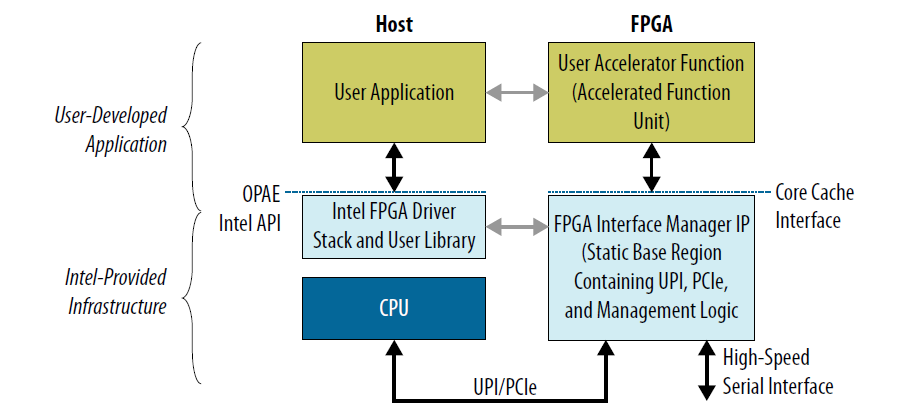
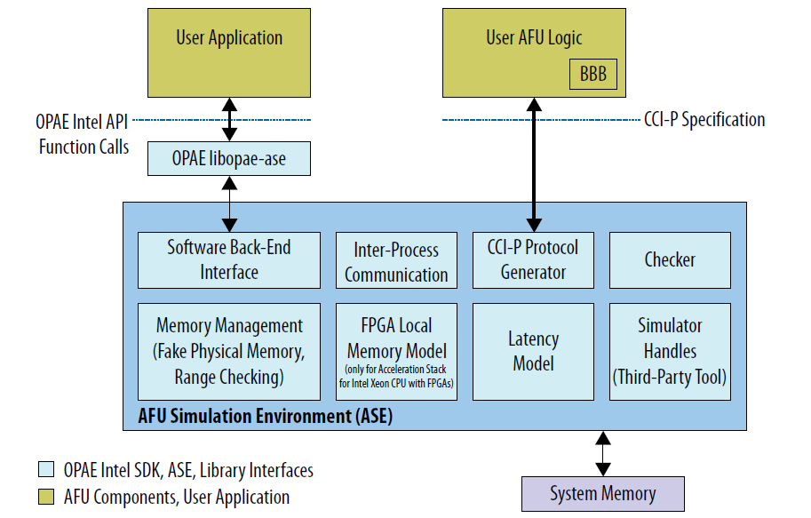
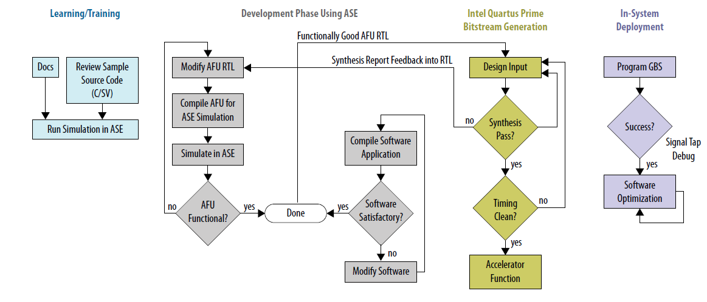
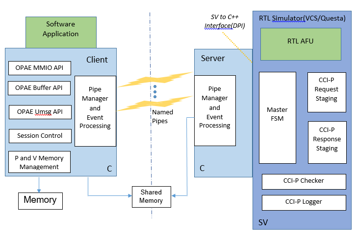
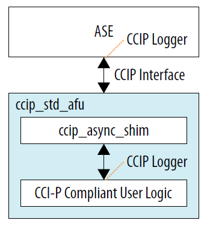
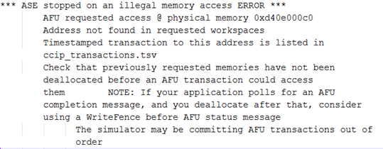

# Intel&reg; Accelerator Functional Unit (AFU) Simulation Environment (ASE) User Guide #

```eval_rst
.. toctree::

.. highlight:: c

.. highlight:: console
```

## Intended Audience ##

The *Accelerator Functional Unit (AFU) Accelerator Simulation Environment (ASE) User Guide* addresses both beginning and experienced developers. To be successful, you should have knowledge and experience
in the following areas:

* C/C++
* Verilog/SystemVerilog
* RTL simulators such as Synopsys VCS-MX\* or Mentor Graphics ModelSim-SE* or QuestaSim\*

Alternatively, you can create a team that includes developers who specialize in either RTL or software development.
Previous FPGA place and route (PAR) experience is not required to be successful, but PAR experience is also a useful skill.

## Introduction ##

The ASE provides a consistent transaction-level hardware interface and software API
that allows you to develop a production-quality Accelerated Functional Unit (AFU) and host software application.
The ASE supports both the Intel Xeon&reg; Processor with Integrated FPGA and the Intel Acceleration Stack for Intel
Xeon CPU with FPGAs also called the Intel Programmable Acceleration Card (PAC). The figures in this user guide illustrate
the Intel PAC with Arria&reg; 10 GX FPGA. The figures show a local memory that is only available on the PAC.

To use the ASE Environment you must have source code in a language that RTL simulators can interpret. The following languages are possible:

* Verilog
* SystemVerilog
* VHDL

```eval_rst
.. note::
    The ASE supports one AFU and one application at a time. The ASE does not support multiple-slot simulation.
```



### AFU Simulation Environment (ASE) Overview ###
ASE is a dual-process simulator. One process runs an AFU RTL simulation. The other process connects to software that
runs on the RTL AFU simulation. This unified simulation environment reduces AFU hardware and software development time.
The OPAE software distribution includes the ASE.



The ASE provides two interfaces:

* Software: OPAE API implemented in the C programming language.

* Hardware: Core Cache Interface (CCI-P) specification implemented in SystemVerilog.

Use these interfaces to deploy your IP on the Integrated FPGA Platform or the Intel PAC with Arria 10 GX FPGA.

### ASE Capabilities ###

* The ASE provides a protocol checker to ensure protocol correctness. The ASE also provides methods to identify potential issues early,
before in-system deployment.

* The ASE can help identify certain lock conditions and Configuration and Status Registers (CSR) address mapping and pointer
math errors.

* The ASE tracks memory requested from the accelerator. The memory model immediately
flags illegal memory transactions to locations outside of requested memory spaces. Consequently, you can fix incorrect memory
accesses early, during the simulation phase.

* The ASE does not guarantee that you can synthesize an AFU. After you verify the AFU RTL functionality in the ASE,
use the ASE and the Intel Quartus&reg; Prime Pro Edition software iteratively to generate the Accelerator Function (AF).

* The ASE provides a data hazard checker that identifies CCI-P traffic patterns that may cause Write After Write (WAW),
Read After Write (RAW), and Write After Read (WAR) hazards. Debug these transactions using a waveform viewer
or avoid them by using a relevant [Memory Properties Factory](https://github.com/OPAE/intel-fpga-bbb/wiki/BBB_cci_mpf)
(MPF) shim.

* The ASE does not require administrator privileges. After installing all the required tools, you can run the ASE on a plain
vanilla user Linux machine.

### ASE Limitations ###

When using ASE in the application development cycle, consider the following limitations:

* The ASE is a transaction-level simulator. It does not model either Intel UPI- or PCIe-specific packet structures and protocol layers.

* The ASE does not simulate caching and is not a cache simulator. It cannot reliably simulate cache collisions or
capacity issues.

* Although ASE models some latency parameters, it cannot model real-time system-specific latency. It is also not
an accurate timing simulation of the design or latency and bandwidth of the real system. The ASE models enable
you to develop functionally correct accelerators.

* The ASE does not simulate multi-AFU or multi-socket configurations.


### ASE-Based AFU Design Workflow ###



AFU development using the ASE includes the following four stages:

1. Learning/Training: Learn to use ASE and understand the interface specifications and platform. Review sample code to get an
understanding of the CCI-P specification and OPAE API function calls. Run samples in an ASE simulation.

2. Development Phase: Use the ASE to develop AFU RTL and software application in a single workflow. Develop RTL from the specification
or by modifying existing sample RTL. The ASE includes a behavioral model of the FPGA Interface Manager (FIM) IP that
provides immediate feedback on functionality during the development phase. The ASE flags errors in CCI-P protocols,
transactions, and memory accesses. Consequently, you can fix these errors before moving to the time-consuming bitstream
generation phase.

3. Bitstream Generation: Once AFU RTL and software are functionally correct, open the AFU RTL in the Intel Quartus Prime Pro
Edition software. Run the place and route (PAR) tools for your platform.

  Use the Synthesis reports to correct problems in the AFU RTL. Then, return to the development phase and revalidate in ASE.
  Bitstream generation can take hours depending on design complexity, area, and so on. After successful bitstream generation,
  perform timing analysis to check for timing corners, setup and hold violations, clock closure, and so on. After correcting
  failures found during timing analysis, revalidate in the ASE environment. When the AFU is error-free, generate the Accelerator
  Function (AF) bitstream that represents the AFU.

4. In-system Deployment: Test the AF in system hardware. Use Signal Tap to debug problems. Develop platform-specific software
optimizations.


The AFU RTL code and OPAE software code you create in the ASE is compatible with the Intel Quartus Prime PAR software if the following two conditions are true:
* The AFU RTL code is synthesizable.
* The AFU RTL code meets timing.

In the simulation environment, complete the following steps to create an AF bitstream and program the hardware:
1. Compile the AFU RTL in either the Synopsys VCS-MX or in the Mentor Graphics ModelSim-SE
    or QuestaSim simulators.
2. Compile the software application for an ASE-specific implementation of the OPAE API.
3. Synthesize the AFU RTL in the Intel Quartus Prime Pro software to generate a bitstream.
4. Program the hardware using this bitstream.

```eval_rst
.. note::
    The ASE only operates using the AFU RTL source code. It cannot take the AF bitstream as input.
```

## System Requirements ##

The OPAE software release includes the ASE. The current OPAE ASE release supports both Acceleration Stack for the Intel Xeon Processor
with Integrated FPGA and Acceleration Stack for the Intel PAC card.

The ASE is available only on 64-bit Linux operating systems with one of the following simulators:
* 64-bit Synopsys* RTL Simulator (minimum version VCS-MX H2013.06-SP1)
* 32 and 64-bit Mentor Graphics* Modelsim SE Simulator (minimum version 10.5a)
* 64-bit Mentor Graphics* QuestaSim Simulator (minimum version 10.4d)
 
ASE performance is better on a 64-bit RTL simulator.
Consult your RTL simulator vendor for Synopsys or Mentor Graphics for specific simulation requirements.

The ASE uses Inter-Process Communication (IPC) constructs. Under most circumstances these constructs operate without glitches.
The following Linux locations should exist and be writeable. In most Linux distributions, ```/dev/shm``` comes pre-mounted as a
default option.

Here are the other ASE requirements:

* C-Compiler: gcc 4.8.5 or above

    * Boost Development libraries
    * UUID Development libraries
    * JSON Development libraries
    * Please see the dependencies of the OPAE System library build process

* CMake: version 2.8.11 or above
* GLIBC: version 2.19 or above
* Python: version 2.7 or above
* Intel Quartus Prime Pro Edition: The ASE must find the ```$QUARTUS_HOME/eda/sim_lib/``` directory. You specify this directory
during project definition in the Intel Quartus Prime Pro Edition software.

The ASE provides the ```env_check.sh``` bash script in the ```/sw/opae-x.x.x/ase/scripts``` directory. Run this script to
verify the your installation.

Check the RTL simulator product information for supported operating systems, installation notes, and other related information.
The RTL simulator must be able to perform the following functions:

* Compilation of the SystemVerilog Direct Programming Interface (DPI) constructs
* Compilation of the standard examples that are included in the installation
* Support for SystemC


## Package Description ##

Download the ASE as source or in RPM format.

The source directory tree is:

```{.shell}

    OPAE_BASEDIR
        |-- ase
        |   |-- api
        |   |   -- src
        |   |-- in
        |   |-- rtl
        |   |   -- dcp_emif_model
        |   |-- scripts
        |   |-- sw
        |
        |-- cmake
        |-- common
        |   |-- include
        |   |   |-- opae
        |   |   |--safe_string
        |
        |-- doc
        |-- libopae
        |-- libopaecxx
        |-- platforms
        |-- pyopae
        |-- safe_string
        |-- samples
        |-- scripts
        |-- tools

```

This directory tree shows the package structure of the ASE distribution. The following directories implement and run the ASE simulator:

* ```ase```: This is the ASE simulator implementation directory. It contains the following subdirectories:
    * ```api/src```: This directory contains the OPAE Intel ASE implementation as a compiled library. You can link statically
      or dynamically to this library.
    * ```rtl```: This directory contains the RTL components of the ASE. You can compile this RTL for either platform.
        * ```dcp_emif_model```: This is the local DDR memory model for PAC card. Compile this model for PAC
          mode simulations.
    * ```scripts```: This directory contains several useful scripts. Refer to the [ASE Scripts](#ase-scripts)
      Section for more information.
    * ``` sw```: This directory contains the software components of the ASE. All simulations require the software components.
      The GNU Compiler Collection (GCC) compiles these components.
* ```common```: This directory contains the OPAE library definitions. It defines various macros for access to an FPGA in
an OPAE context.
* ```libopae```: This library is the Intel platform-specific implementation of the OPAE API.
* ```platforms```: This directory contains scripts and RTL to manage the connection between a platform and the AFU top-level interface.
* ```scripts```: This directory contains test build scripts.
* ```tools```: This directory contains the FPGA tools including the fpgadiag and fpgaconfig tools.


### ASE Scripts ###

The ASE distribution under the ```ase/scripts``` includes several scripts. Use these scripts to initialize, set up,
and clean an existing ASE simulation environment.

#### Simulation Tool Set Up  ####

Use ```ase/scripts/ase_setup_template.sh``` as a template script to set up the required tools. This script has many empty
placeholders for site- and environment-specific information. Consult your Electronic Design Automation (EDA) tools  administrator,
or the RTL simulator user guides for help setting up the tools.

#### ASE Environment Check  ####

This script checks the status of the OS distribution, distro, and available system libraries. This check is a non-exhaustive.
It looks for only the most important dependencies, such as the GCC version, GLIBC version, and so on.

```{.bash}

    $ ./ase/scripts/env_check.sh

```

#### AFU Simulation Using the ASE ####

Before configuring the ASE, follow the instructions for building the OPAE SDK and ensure that either the OPAE
installed ```bin``` or the OPAE build tree ```bin``` directory is on your shell's ```PATH```.

To simulate an AFU, replicate the ASE source tree and add the AFU-specific configuration. The OPAE installation includes
several scripts to accomplish this task. The primary script, ```afu_sim_setup```, is in the OPAE ```bin```
directory.

Refer to the [ASE Example](#ase-example) section below for a sample workload definition and execution flow.

#### afu_sim_setup ###

The ```afu_sim_setup``` script reads a file containing a list of RTL sources (\<rtl_sources.txt\>) and configures a simulation
environment for the specified sources. The ```afu_sim_setup``` command copies your base ASE environment to the \<target dir\>.

```{.bash}

    $ afu_sim_setup --sources=<rtl_sources.txt> <target dir>

```
* The only required argument to the `afu_sim_setup` command is the directory for the new AFU environment. Here are the
optional arguments:

* ```--help``` The ```help``` argument lists all the arguments to ```afu_sim_setup```.
* ```--platform```: The ```platform```argument specifies any platform defined in the platform database, including both
  the Integrated FPGA Platform or the Intel PAC. This argument is generally not required when a hardware platform
  release is installed. In that case, the OPAE_PLATFORM_ROOT environment variable points to the hardware release,
  which defines the platform.

`afu_sim_setup` is a wrapper for the following scripts. You can also access both of these scripts directly:

*  ```rtl_src_config```: This script transforms the list of RTL sources into simulator configuration files.

* `generate_ase_environment.py`: This script instantiates your simulated platform configuration.

#### rtl_src_config ####

The ```/platforms/scripts/rtl_src_config``` script maps a simple text file containing a list of RTL source files to an
ASE configuration file for simulation or an Intel Quartus Prime Pro configuration file for synthesis. ```rtl_src_config``` also
defines preprocessor variables. Source configuration files may be hierarchical, with one file including another. ```rtl_src_config```
can construct ASE-based simulation trees or Quartus build trees.

Run ```rtl_src_config --help``` for a list of options and the required command syntax.

#### generate_ase_environment.py ####

The ```/ase/scripts/generate_ase_environment.py``` generates platform configuration files. ```afu_sim_setup``` invokes it
automatically. A legacy mode in ```generate_ase_environment.py``` performs a brute-force check of the specified AFU RTL
directories, attempting to define a compilation. This brute-force mode is 
imperfect and lists every file ending in ```.sv, .vs, .vhd, or .v``` and directories separated by ```+```. It also may fail
when compilation is order-dependent.

Run ```generate_ase_environment.py --help``` for a list of arguments.

* The script requires a directory path to your RTL AFU.
* ```-t```: The default for the optional ```-t``` (tool) argument is ```VCS```. For Mentor tools, use the ```QUESTA``` option.
* ```-p```: The default for the optional ```-p``` (platform) argument is ```intg_xeon``` which stands for the Integrated FPGA
Platform. Use ```discrete``` for the Intel PAC.
* ```-x```: The optional exclusions argument lists exclusions for path searches.

The Synopsys and Mentor Graphics RTL simulators generate the following scripts.

* Synopsys: Creates ```synopsys_sim.setup``` and ```vcs_run.tcl``` in the ```VCS``` configuration directory.
* Mentor Graphics: Creates ```vsim_run.tcl``` in the ```QUESTA``` configuration directory.

The run-time simultation uses the ```.tcl``` files.

Details on generated files:
* ```vlog_files.list```: Lists all the Verilog and SystemVerilog files found in the AFU directory path.
* ```vhdl_files.list```: Lists all the VHDL files found in the AFU directory path.
* ```ase_sources.mk```: Ties the above two files into ```DUT_VLOG_SRC_LIST``` and ```DUT_VHD_SRC_LIST``` Makefile variables.
  * ```ASE_PLATFORM```: Sets the platform type to the default type or the type you specify.
  * Set additional VCS or QUESTA options using the ```SNPS_{VLOGAN,VHDLAN,VCS}_OPT``` or ```MENT_{VLOG,VCOM,VSIM}_OPT``` options
    in the Makefile. Refer to [ASE Makefile Variables](#ase-makefile-variables) for more information.

The simulation files use absolute paths when possible. To improve portability across users and groups, substitute  environment
variables in the generated files that build and run the simulator.

```eval_rst
.. note::
    You must manually check this file for correctness before using it in the simulation.
```

#### Cleaning the ASE Environment  ####

Use the ASE cleanup script located in ```scripts/ipc_clean.py``` to kill zombie simulation processes and temporary files left
behind by failed simulation processes or crashes.

```{.bash}

    $ ./ase/scripts/ipc_clean.py

    ############################################################
    #                                                          #
    #                ASE IPC Cleanup script                    #
    #                                                          #
    ############################################################
    IPC mounts seem to be readable... will attempt cleaning up IPC constructs by user ' user_foo '
    Removing .ase_ready file ...
    Type 'y' to clean up all zombie ase_simv processes : y
    Going ahead with cleaning up ASE processes opened by  user_foo
    $


```

## ASE Usage ##

The AFU ASE is a server-client simulation environment. The AFU RTL is the server process. The software application
compiled and linked to the  OPAE ASE library is the client process. Communication between server and client uses named pipes.
The ASE abstracts most of the simulation infrastructure. You do not need to modify it.




* **Server Process**:
    * The server process interfaces to 3rd-Party RTL Simulator packages. The server process currently supports Mentor
      Modelsim-SE\*  Questasim\* and Synopsys CS-MX\* via the SystemVerilog-DPI library and simulator software interface.
    * Named pipes implement communication to the client.  Named pipes also implement control, status and session management.
      The server process includes a pipe event monitoring engine.
    * SystemVerilog manages the CCI-P interface. All CCI-P events are logged and time stamped.
    * The server also includes a CCI-P protocol checker that checks CCI-P transactions originating in the AFU. This checker
      identifies CCI-P protocol issues, hazards, race conditions, and so on.
    * The buffer allocation calls map to POSIX Shared Memory (```/dev/shm```). The server-client processes share information
      about these buffers using named pipes.

.. note::
```
The Physical addresses generated in ASE are not realistic and are not replicable in-system.
```

* **Client Process**:
    * The client implements an OPAE interface and a library to access the ASE platform functionality including MMIO,
      Buffer management, and session control. The features available depend on the platform you specify at build time.
      These functions are available using the OPAE API.
    * The client process also provides a physical memory model that simulates the RTL AFU access to physical
      addresses. The physical memory model simulates address translation from virtual addresses to physical addresses.
    * A compiled program compiles and links to the ASE implementation of OPAE library. All OPAE calls route to ASE
      instead of the OPAE platform driver.

Separate build scripts build the server and client processes.

* Server: A makefile in the ```ase``` directory compiles the ASE server process, containing the ASE Software, SystemVerilog
  engines and the AFU RTL logic code.
* Client: The main ```cmake``` script in the root of the distribution builds the OPAE library implementations for the System
  and ASE.  The cmake script installs the library in the  ```lib``` directory.

### AFU Build Instructions ###

#### ASE Application (Client) Build Instructions ####

Follow these instructions if you are building the OPAE SDK from a source tar file. Otherwise go directly to the Application build step.

```eval_rst
.. note::
    In these instructions, the directory ``/tmp/opae/`` is the base directory where you install the OPAE API software
    distribution. The ``/tmp`` prefix may point to any system or user directory.

    The ASE Source directory points to ``/tmp/opae/ase/``
```

* To build the OPAE libraries:

```{.bash}

    # Change directory to the opae directory
    $ cd /tmp/opae/

    # Check contents
    $ ls
    ase cmake common doc libopae platforms safe_string samples scripts tools AUTHORS CMakeLists.txt COPYING
    README RELEASE_NOTES

    # Create an out-of-build directory, and change to it
    $ mkdir mybuild
    $ cd mybuild

    # Configure the software build using cmake (see options)
    # $ cmake <Path to CMakeLists.txt>
    # Install directory, in this example it is <Path  to opae>/myinst/

    $ cmake ../ -DBUILD_ASE=YES -DCMAKE_INSTALL_PREFIX=/tmp/opae/myinst/
    -- The C compiler identification is GNU 4.8.4
    -- The CXX compiler identification is GNU 4.8.4
    -- Check for working C compiler: /usr/bin/cc
    -- Check for working C compiler: /usr/bin/cc -- works
    .
    .
    .
    -- Configuring done
    -- Generating done
    -- Build files have been written to: /tmp/opae/mybuild

    # Build and install libraries
    $ make
    $ make install

    # The environment Variable PATH should point to /myinst/bin
    # Check library install paths
    $ cd /tmp/opae/myinst/
    $ ls
    doc  include  lib

    $ ls lib
    libopae-c-ase.so  libopae-c.so  libopae-c.so.0  libopae-c.so.0.1.0 ...

```

Build the software application for the ASE using ```libopae-c-ase.so``` and the ```gcc``` command.
You can build the software application using one of the following three methods:

##### Dynamically Linking libopae-c-ase.so #####

```{.bash}

    # Change directory to <Path to Directory>/opae/samples/
    #   The UUID code requires the -luuid argument
    #   Linking to the  ASE library requires the  -lopae-c-ase argument
    #
    $ gcc -g -o hello_fpga hello_fpga.c -L /tmp/opae/myinst/lib/ -I /tmp/opae/myinst/include/ -luuid -lpthread -lopae-c-ase -std=c99

    # When running the application be sure the relevant LD_LIBRARY_PATH variable is set
    $ ./hello_fpga

```
##### Dynamically Linking to the System Library and then Overriding It #####

The ASE implementation of the OPAE library simulates system behavior. Consequently, the application may also link dynamically
to the System library, `libopae-c.so` and `libopae-c-ase.so`, and then override the system library with the
```LD_PRELOAD``` environment.

```{.bash}

    # Change directory to <Path to Directory>/opae/samples/
    #   The UUID code requires the -luuid argument
    #   Linking to the  ASE library requires the  -lopae-c-ase argument
    #
    $ gcc -g -o hello_fpga hello_fpga.c -L /tmp/opae/myinst/lib/ -I /tmp/opae/myinst/include/ -luuid -lpthread -lopae-c -std=c99

    # When running the application be sure the relevant LD_LIBRARY_PATH variable is set
    # You must also set the ASE_WORKDIR environment variable
    $ LD_PRELOAD=libopae-c-ase.so ./hello_fpga

```

##### Compiling the libopae-c-ase.so Library with the OPAE Software Application #####

Use the OPAE ASE library implementation and compile it to the OPAE software application directly in one command using GCC.

```{.bash}

    # Compile command
    $ gcc -g -o hello_fpga_ase hello_fpga.c /tmp/opae/myinst/lib/libopae-c-ase.so -I /tmp/opae/myinst/include/ -std=c99 -luuid

	# When running the application, start the simulator, then set LD_LIBRARY_PATH and ASE_WORKDIR
	$ ./hello_fpga_ase

```

#### ASE Simulator (Server) Build Instructions ####

ASE uses a platform differentiation key in the simulator Makefile to enable different platform features and produces a
simulator configuration based on the differentiation key. These keys are set automatically by ```afu_sim_setup``` and
```generate_ase_environment.py```.

You must note the following required build configurations:

| Configuration | Description | Default |
|:---------------|:------------|:--------|
| ```ASE_PLATFORM``` | This is the platform differentiator. It must be set in ```ase_sources.mk``` to point to the required simulator features. <br>```FPGA_PLATFORM_INTG_XEON``` and ```FPGA_PLATFORM_DISCRETE``` are the only legal values. | ```FPGA_PLATFORM_INTG_XEON``` |
| ```SIMULATOR``` | This must be set in ```ase_sources.mk``` to point to the correct RTL simulator. <br>```VCS``` and ```QUESTA``` are the only legal values. | ```VCS``` |
|```DUT_VLOG_SRC_LIST```, ```DUT_VHDL_SRC_LIST```, and ```DUT_INCDIR``` | These options point to AFU Verilog, VHDL and include path settings required for RTL simulators to build the simulation model correctly. | None supplied &mdash; You must specify this. |

For more information on other switches, refer to [ASE Makefile targets](#ase-makefile-targets)

Use the ```scripts/generate_ase_environment.py``` script to generate the AFU-specific files for the simulator build.
This script is not infallible and 
requires manual inspection of generated configurations to achieve correct results.

```eval_rst
.. note::
    Edit `ase_sources.mk` to add AFU RTL-specific define macros or include paths.
```

You may use the [Generate ASE Environment](#generate_ase_environment.py) script to generate the required AFU ```ase_sources.mk``` and ```vlog_files.list``` files.

```{.bash}

    # change to ASE directory
    $ cd /tmp/opae/ase/

    # Use the scripts/generate_ase_environment.py
    $ ./scripts/generate_ase_environment.py -t VCS -p discrete <Path to sample RTL>
    .
    .
    .
    # Edit files as needed.

    $ ls
    ase_sources.mk  vcs_run.tcl  synopsys_sim.setup  vlog_files.list  ...

```
You may need to check  ```vlog_files.list``` and ```ase_sources.mk``` files for correctness. Now, build the simulator
with a 'make' command.

```{.shell}

    $ cd <opae>/ase/
    $ make
    .
    .

    $ ls work/ase_simv
    work/ase_simv

```

### ASE Runtime Instructions ###

The ASE server-client simulator makes the server before the client. Here are the run-time options:

```{.bash}

    $ make sim \
        [SIMULATOR=<VCS|QUESTA>] \
        [ASE_CONFIG=<Path to ase.cfg>] \
        [ASE_SCRIPT=<Path to ase_regress.sh if ASE_MODE=4>]

```

Use two terminal windows to start the simulation.

* Terminal 1: Runs `make sim`. The ASE initializes and the AFU issues a reset and then waits for incoming transactions.
The software application must wait until the "Ready for Simulation" message displays.

Specify the environment variable ```ASE_WORKDIR``` Terminal 1.

```{.shell}

    # Invoke the simulator
    $ make sim
    SIMULATOR=VCS
    CC=gcc
    #################################################################
    #                                                               #
    #             OPAE Intel(R) Xeon(R) + FPGA Library              #
    #               AFU Simulation Environment (ASE)                #
    #                                                               #
    #################################################################
    ASE platform set to MCP_SKYLAKE mode
    .
    .
    .
    SIM-SV: Transaction Logger started
    SIM-SV: Simulator started...
    SIM-C : +CONFIG /tmp/opae/ase/ase.cfg file found !
    SIM-C : +SCRIPT /tmp/opae/ase/ase_regress.sh file found !
    SIM-C : PID of simulator is 41819
    SIM-C : Reading /tmp/opae/ase/ase.cfg configuration file
    SIM-C : ASE was started in Mode 1 (Server-Client without SIMKILL)
            ASE mode                   ... Server-Client mode without SIMKILL
            Inactivity kill-switch     ... DISABLED
            Reuse simulation seed      ... ENABLED
            ASE Seed                   ... 1234
            ASE Transaction view       ... ENABLED
            User Clock Frequency       ... 312.500000 MHz, T_uclk = 3200 ps
            Amount of physical memory  ... 128 GB

    .
    .
    .
    SIM-C : ** ATTENTION : BEFORE running the software application **
        Set env(ASE_WORKDIR) in the terminal where application will run (copy-and-paste) =>
        $SHELL   | Run:
        ---------|---------------------------------------------------
        bash/zsh | export ASE_WORKDIR=/tmp/opae/ase/work
        tcsh/csh | setenv ASE_WORKDIR /tmp/opae/ase/work
        For any other $SHELL, consult your Linux administrator

        SIM-C : Ready for simulation...
        SIM-C : Press CTRL-C to close simulator...


```

You can close Terminal 1 ```make sim```by issuing a ```SIGTERM``` to the relevant ```ase_simv``` process or by typing  ```CTRL-C```.

* Terminal: First set the environment variable ```ASE_WORKDIR``` as specified in Terminal 1. In this example ```ASE_WORKDIR```
is set to ```/tmp/opae/ase/work```.  Then, start the software application.

```{.bash}

    # Set ASE_WORKDIR environment variable
    $ export ASE_WORKDIR=/tmp/opae/ase/work/

    # Run the application
    $ export LD_LIBRARY_PATH=/tmp/opae/myinst/lib/
    $ LD_PRELOAD=libopae-c-ase.so ./hello_fpga

```


```eval_rst
.. note::
    After the application exits, the simulation is complete. Close the simulator to allow the waveform dump
    process to complete. In Terminal 1, type the ``CTRL-C`` command.
```


```{.bash}


    <Simulator running>
    .
    .
    .
    SIM-C : Ready to run next test
    818602500C0Tx AlmFull toggled from 1 to 0

    818602500C1Tx AlmFull toggled from 1 to 0

    <CTRL-C Key hit>

    ^CSIM-C : Closing message queue and unlinking...
    SIM-C : Unlinking Shared memory regions....
    SIM-C : Session code file removed
    SIM-C : Removing message queues and buffer handles ...
    SIM-C : Cleaning session files...
    SIM-C : Simulation generated log files
        Transactions file       | $ASE_WORKDIR/ccip_transactions.tsv
        Workspaces info         | $ASE_WORKDIR/workspace_info.log
        ASE seed                | $ASE_WORKDIR/ase_seed.txt

    SIM-C : Tests run     => 1
    SIM-C : Sending kill command...
    SIM-SV: Simulation kill command received...

    Transaction count |       VA      VL0      VH0      VH1 |    MCL-1    MCL-2    MCL-4
    ========================================================================================
    MMIOWrReq           9 |
    MMIORdReq           2 |
    MMIORdRsp           2 |
    UMsgHint            0 |
    UMsgData            0 |
    RdReq           16384 |        0        0    16384        0 |    16384        0        0
    RdResp          16384 |        0        0    16384        0 |
    WrReq           16385 |        0        0    16385        0 |    16385        0        0
    WrResp          16385 |        0        0    16385        0 |    16385        0        0
    WrFence             1 |        0        0        1        0 |
    WrFenRsp            1 |        0        0        1        0 |

    $finish called from file "/tmp/opae/ase/rtl/ccip_emulator.sv", line 2657.
    $finish at simulation time           1514962500
    V C S   S i m u l a t i o n   R e p o r t
    Time: 1514962500 ps
    CPU Time:    142.500 seconds;       Data structure size:   1.1Mb
    Tue Jun 20 13:29:13 2017

```

Upon completion, the simulation generates the following files:

* Waveform dump: ```make wave``` opens the waveform for the selected tool.

    * ```inter.vpd```: VCS Waveform file
    * ```vsim.wlf```: Mentor/Questa waveform file.

* ```$ASE_WORKDIR/ccip_transactions.tsv```: CCI-P Events log listing all events observed on the CCI-P interface. The timestamps
indicate the corresponding time interval in the waveform dump VPD file.
* ```$ASE_WORKDIR/workspace_info.log```: Information about buffers the simulation opened.
* ```$ASE_WORKDIR/ase_seed.txt```: Information about the simulation seed.
* ```$ASE_WORKDIR/ccip_warnings_and_errors.txt```: Information about CCI-P warnings and errors.


### Recommendations ###

1. The ASE ```ccip_logger.sv``` module logs CCI-P events for designs that use the CCI-P protocol. This module allows
you to compare transactions and traffic flow through the CCI-P interfaces.

```eval_rst
.. note::
    Use a different file name for each instantiation of the of the ``ccip_logger``.
```



2. The ASE shutdowns simulations gracefully,  closing all mutexes, locks, POSIX structures safely before exiting via the
```$finish``` statement in SystemVerilog. If your AFU design uses ```$error``` or ```$finish``` to identify error conditions
while simulating, consider using the handle ```start_simkill_countdown()``` instead. ```start_simkill_countdown()``` calls
```$finish``` after completing the steps for a graceful shutdown.

3. You can script ASE simulations. When the simulator is ready for use, the simulation writes a lock file,
```$ASE_WORKDIR/.ase_ready```, to the work directory.

```{.bash}

    # Start Simulator in background
    make sim &

    # Wait for simulator readiness
    # When .ase_ready is available in the $ASE_WORKDIR, the ASE is ready for simulation
    while [ ! -f $ASE_WORKDIR/.ase_ready.pid ]
    do
        sleep 1
    done

    # Start application
    cd $PATH_TO_APPLICATION

    # Export ASE_WORKDIR variable
    export ASE_WORKDIR={Path to simulator mentioned in ASE green printout}
    ./Application

```

4. To reduce simulation time, make the following changes to the default simulation settings:
    * Turn OFF wave dumps: Check your RTL vendor's recommendation on switching off wave form dumps. In some cases, is possible
    to generate wave dumps for specific module hierarchies.
    * Turn OFF display messages by setting  ```ENABLE_CL_VIEW = 0``` in  ```ase.cfg```.

5. To generate random CCI-P transactions for every run, modify the ASE latency model, ```$ASE_SRCDIR/rtl/platform.vh```.
The ```*_LATRANGE``` constraint defines a min/max pair:

```{.verilog}

    `define X_LATRANGE     min, max

```

The ```min``` and ```max``` values are the minimum and maximum cycle counts for responses returning to the AFU. Simulation
assigns transactions a random latency in the (min, max) range. The larger the difference between (min, max), the larger the
standard deviation of latency for a given type of transaction. You can specify different (min, max) values for different
transaction types.

```eval_rst
.. note::
    The latency values specified for simulation are for testing only. They may not accurately represent the real
    latencies of your system hardware.
```


```{.verilog}

    /*
     * Latency model
     * Coded as a Min,Max tuple
     * -------------------------------------------------------
     * RDLINE_LATRANGE : ReadLine turnaround time
     * WRLINE_LATRANGE : WriteLine turnaround time
     * UMSG_LATRANGE   : UMsg latency
     * INTR_LATRANGE   : Interrupt turnaround time
     *
     * LAT_UNDEFINED   : Undefined latency
     *
     */
    `define MMIO_LATENCY                15
    `define RDLINE_S_LATRANGE          20,118
    `define RDLINE_I_LATRANGE          20,118
    `define WRLINE_M_LATRANGE          20,118
    `define WRLINE_I_LATRANGE          20,118
    `define UMSG_START2HINT_LATRANGE   39,41
    `define UMSG_HINT2DATA_LATRANGE    41,45
    `define UMSG_START2DATA_LATRANGE   82,85
    `define INTR_LATRANGE              10,15

    `define LAT_UNDEFINED              300

    `define RDWR_VL_LATRANGE           20,118
    `define RDWR_VH_LATRANGE           140,180

    `define ASE_MAX_LATENCY            300

```

6. The ASE includes a CCI-P protocol checker, ```$ASE_SRCDIR/rtl/ccip_checker.sv```. Use this module to verify CCI-P compliance.
The checker sniffs transactions, conditions and header settings and flags warnings or errors. Identify multiple issue
classes in the ```hw/ccip_sniffer.sv```. The ASE logs all warnings and errors in ```$ASE_WORKDIR/ccip_warnings_and_errors.txt```.



* Memory errors in transactions: Memory errors have the highest severity. The simulation stops immediately. The ASE logs
  memory errors, including timestamps, in  ```$ASE_WORKDIR/ase_memory_error.log```.

* Protocol warnings: Warnings do not stop the simulation. The ASE logs warnings in ```$ASE_WORKDIR/ccip_warning_and_errors.txt```.

* The ASE may also log memory hazards (RAW, WAR and WAW hazards).


## ASE Example ##

A tutorial for CCI-P systems is available in a separate [Basic Building Blocks repository](https://github.com/OPAE/intel-fpga-bbb)
in the [samples/tutorial](https://github.com/OPAE/intel-fpga-bbb/tree/master/samples/tutorial) tree. The first example,
[01_hello_world](https://github.com/OPAE/intel-fpga-bbb/tree/master/samples/tutorial/01_hello_world) follows the
```afu_sim_setup``` flow described above. Start with the tutorial's
[README](https://github.com/OPAE/intel-fpga-bbb/blob/master/samples/tutorial/README) file for configuration and execution
instructions. The example defines a set of sources and walks through the process of creating an ASE tree, running the
simulator and connecting it to a host program.


<!-- ### Using Basic Building Blocks (BBB) in ASE ### -->

<!-- #### Using CCI-P Asynchronous Shim in ASE #### -->

<!-- #### Using Memory Protocol Factory (MPF) in ASE #### -->


## Operation Reference ##

### ASE Simulator Makefile Switches ###

The ASE Makefile template comprises many targets and switches. Build your own compilation script for more complex simulations.

For a complete listing including the versions supported, see [System Requirements](#system-requirements) section.

#### ASE Makefile Build Flow ####

Complete the following steps to compile ASE Simulator:

1. Compile Software objects of ASE into a library file
    *First compile the Software components located in the ```ase/sw/``` directory into a software library.

```eval_rst
.. note::
    Define ``SIM_SIDE`` as a compilation macro when compiling the ASE simulator objects. The ``SIM_SIDE``
    switch is for simulation software, not the OPAE ASE software library.
```

2. Compile The ASE SystemVerilog files located in the ```ase/rtl/``` directory.
    Compile ASE RTL the platform components for the Integrated FPGA Platform or the Intel PAC into the
    simulation databases. For the PAC, compile the embedded memory interface (EMIF) Memory controller
    model into the ASE environment. If the simulation requires the Intel FPGA Gate libraries, compile
    the models into the ASE environment.

3. Compile AFU components into the ASE environment.
    Use the RTL simulator software tools to compile the AFU components. Use Synopsys or Mentor utilities to compile
    VHDL or SystemVerilog components.

#### ASE Makefile Targets ####

| Target             | Description |
|:-------------------|:------------|
| ```all```          | Default build target, builds a simulator in Synopsys VCS-MX |
| ```header```       | Print version and preamble |
| ```check```        | Environment check |
| ```sw_build```     | Build ```ase/sw/``` components into a software library. The ```SIM_SIDE``` switch builds the simulator software components |
| ```help```         | Print help information |
| ```vcs_build```    | Synopsys VCS-MX template build flow |
| ```questa_build``` | Mentor Graphics Modelsim-SE/QuestaSim template build flow |
| ```sim```          | Start the ASE Simulator |
| ```wave```         | Open selected RTL waveform viewer |
| ```clean```        | Clean build, simulation, and log files |
| ```distclean```    | Clean distribution - removes the AFU configuration files |


#### ASE Makefile Variables ####

| Makefile target    | Description | Default value |
|:-------------------|:------------|:--------------|
| ```VCS_HOME```           | Synopsys VCS-MX installation path | Installation tool specific |
| ```MTI_HOME```           | Mentor installation path | Installation tool  specific |
| ```QUARTUS_HOME```       | Intel Quartus Prime Pro installation path | Installation tool  specific |
| ```ASE_PLATFORM```       | Platform selection switch: <br> Specify either tightly-coupled FPGA or programmable FPGA acceleration card using ```FPGA_PLATFORM_INTG_XEON``` and ```FPGA_PLATFORM_DISCRETE```, respectively | ```FPGA_PLATFORM_INTG_XEON``` |
| ```SIMULATOR```          | Simulator Key to environment <br>Defined values ```VCS``` or ```QUESTA``` | ```VCS``` |
| ```ASE_SRCDIR```         | ASE source location | Current source path |
| ```ASE_WORKDIR```        | Location where ASE runs, usually ```$ASE_SRCDIR/work``` | Environment-specific execution path |
| ```WORK```               | Simulation library compilation location | ```work``` |
| ```ASE_DISABLE_LOGGER``` | Switch to disable logger build | ```0``` |
| ```ASE_DISABLE_CHECKER```| Switch to disable checker build <br>WARNING: Disabling this checker may have side effects on protocol correctness | ```0``` |
| ```GLS_SIM```            | Enable gate simulation build | ```1``` |
| ```GLS_VERILOG_OPT```    | Libraries that enable Intel gate simulation | Quartus EDA simulation library paths|
| ```ASE_CONFIG```         | ASE Run-time configuration file (described [here](#ase-runtime-configuration-options)) | ```$ASE_SRCDIR/ase.cfg``` |
| ```ASE_SCRIPT```         | ASE Regression script path | ```$ASE_SRCDIR/ase_regress.sh``` |
| ```TIMESCALE```          | Simulator timescale | ```1ps/1ps``` |
| ```ASEHW_FILE_LIST```    | ASE RTL File list | Refer to  ```ase/Makefile``` |
| ```ASE_MEM_FILE_LIST```  | ASE RTL file list for programmable FPGA acceleration card mode memory | Refer to  ```ase/Makefile``` |
| ```ASE_INCDIR```         | ASE Include directory paths | Refer to  ```ase/Makefile``` |
| ```ASE_TOP```            | ASE top level entity (must not be changed) | ```ase_top``` |
| ```CC_OPT```             | ASE Software Library compiler build options| ```-g -m64 -fPIC -D SIM_SIDE=1 -I $(ASE_SRCDIR)/sw/ -D SIMULATOR=VCS -D $(ASE_PLATFORM) -Wall -I $(VCS_HOME)/include/ ``` |
| ```ASE_LD_SWITCHES```    | ASE Software Linker switches | ```-lrt -lpthread -lstdc++ -luuid``` |
| ```SNPS_VHDLAN_OPT```    | Synopsys VCS-MX VHDL compile options (add extra options to ```ase_sources.mk```) | Refer to  ```ase/Makefile``` |
| ```SNPS_VLOGAN_OPT```    | Synopsys VCS-MX SystemVerilog compile options (add extra options to ```ase_sources.mk```) | Refer to  ```ase/Makefile``` |
| ```SNPS_VCS_OPT```       | Synopsys VCS-MX options for building simulator executable (add extra options to ```ase_sources.mk```) | Refer to  ```ase/Makefile``` |
| ```SNPS_SIM_OPT```       | Synopsys VCS-MX Simulation options (add extra options may to  ```ase_sources.mk```) | Refer to  ```ase/Makefile``` |
| ```MENT_VCOM_OPT```      | Mentor Modelsim-SE/Questasim VHDL compile options  (add extra options to ```ase_sources.mk```) | Refer to  ```ase/Makefile``` |
| ```MENT_VLOG_OPT```      | Mentor Modelsim-SE/Questasim {System}Verilog compile options  (add extra options to ```ase_sources.mk```) | Refer to ```ase/Makefile``` |
| ```MENT_VSIM_OPT```      | Mentor Modelsim-SE/Questasim VHDL simulation options  (add extra options to ```ase_sources.mk```) | Refer to  ```ase/Makefile``` |
| ```DUT_VLOG_SRC_LIST```  | Points to a text file listing AFU {System}Verilog files (usually ```vlog_files.list```) | User generated |
| ```DUT_VHDL_SRC_LIST```  | Points to a text file listing AFU VHDL files (usually ```vhdl_files.list``` | User generated |
| ```DUT_INCDIR```         | Lists AFU include directories separated by a '\+' (usually in ```ase_sources.mk```) | User generated |


### ASE Runtime Configuration Options ###

The ASE configuration file configures simulator behavior. An example configuration script is available at ```ase/ase.cfg```


| Switch Name              | Default                            | Description |
|:-------------------------|:-----------------------------------|:------------|
| ```ASE_MODE```               | 1                                  | ASE mode has the following valid values: <br>1 : Standard Server-Client Mode<br>2 : Simulator stops after ```ASE_TIMEOUT``` clocks<br>3 : Software shuts down simulator when client application releases session<br> 4 : Regression mode invoked by script<br>>=5 : Ignored (revert to ```ASE_MODE=1```) |
| ```ASE_TIMEOUT```            | 50000 (only if ```ASE_MODE=2```)        | Watchdog timer shuts down simulator after ```ASE_TIMEOUT``` clocks of CCI-P interface inactivity. |
| ```ASE_NUM_TESTS```          | 500 (only if ```ASE_MODE=4```)          | Number of tests in regression mode. If incorrectly set,  the simulator may exit pre-maturely or stall waiting for tests to get started. |
| ```ENABLE_REUSE_D```      | 1                                  | When set to 1, reuses the simulation seed, so that CCI-P transactions replay with the previous addresses. <br>When set to 0, obtains a new seed. |
| ```ASE_SEED```                | 1234 (only if ```ENABLE_REUSE_SEED=1```) | ASE seed setting, enabled when ```ENABLE_REUSE_SEED``` is set to 1, otherwise the simulations uses a different seed. <br>At the end of the simulation, the ASE writes the current seed to  ```$ASE_WORKDIR/ase_seed.txt```. |
| ```ENABLE_CL_VIEW```         | 1                                  | The ASE prints all CCI-P transactions. On long simulation runs, setting ```ENABLE_CL_VIEW``` to 0 may reduce simulation time. |
| ```PHYS_MEMORY_AVAILABLE_GB``` | 32                                 | Restricts ASE address generation the specified memory range. |


### Logging Verbosity Control ###

ASE provides the following three levels for logging message verbosity. By default, these messages print to ```stdout```:

* ASE_INFO: Prints mandatory information messages required to specify operation.
* ASE_ERR: Prints error messages during operation.
* ASE_MSG: Prints general messages indicating check points in the ASE. Suppress these messages by setting the environment
variable ```ASE_LOG``` to ```0```.

The following command  suppresses the ASE_MSG category:

````{.bash}

    $ ASE_LOG=0 LD_PRELOAD=libopae-c-ase ./hello_fpga

````
 You cannot suppress warnings and errors.


### Troubleshooting and Error Reference ###

The following list of ASE errors and warnings is not comprehensive:

| Observation               | Problem           | Next Steps           |
|:--------------------------|:------------------|:---------------------|
| Either all transactions are not seen or simulation ends earlier than expected. | ASE Simulation inactivity is too short for the application use-case to be successfully simulated in the ASE. | If using ```ASE_MODE=2``` (Daemon with timeout), in the ```ase.cfg``` file, increase the ```ASE_TIMEOUT``` setting or  disable ```ASE_TIMEOUT```. |
| ASE simulation build error - compilation, or linking failed | GCC version might be too old. | In the ```ase``` directory try the following command  <br> ``` $ make sw_build ``` <br>ASE builds correctly with GCC 4.8.5 or higher. Use the ```ase/scripts/env_check.sh``` script to identify issues. |
| Synopsys VCS-MX dumped stack while compiling or running | Possible corruption of compiled objects or problems with incremental compilation. | Clean the ASE environment using <br>```$ make clean``` <br> If this command fails, clean the distribution with <br>```$ ./distclean.sh```<br>then rebuild the simulation. |
| ERROR: Too many open files | Past ASE simulation runs did not close cleanly and may have left behind open IPC instances. | Use the  ``` $ASE_SRCDIR/scripts/ipc_clean.py ``` script to clean IPC instances. <br>Check if the [System Requirements](#system-requirements) have been met. <br>If problems continue, increase resource limits for your Linux distribution. |
| ``` $ASE_WORKDIR``` environment variable has not been set up | Application cannot find a valid simulation session | Follow the steps printed when the ASE simulation starts. These instructions are in green text. |
| ``` .ase_timestamp``` cannot be opened at ```<DIRECTORY>``` | Simulator may not have been started yet. Note that when started, the simulator prints: <br>Ready for Simulation<br>```$ASE_WORKDIR``` may not set up correctly. | Check the ASE\_WORKDIR  environment variable. <br>```$ echo $ASE_WORKDIR ``` <br>Wait for simulator to print:<br> ```Ready for Simulation``` |
| ```ase_sources.mk: No such file or directory``` | ASE Environment has not been generated. | Generate an AFU RTL listing (in ```vlog_files.list``` and ``` ase_sources.mk```) configuration. <br> You can use ```ase/scripts/generate_ase_environment.py```to generate these files. |
| An ASE instance is probably still running in current directory. | An ASE simulation is already running in the ```$ASE_WORKDIR``` directory. | If the simulation process is unusable or unreachable, use the ```ase/scripts/ipc_clean.py``` script to clean the simulation temporary files using: <br>```$ make clean```. <br> Then rebuild the simulator. |

## Revision History ##

 | Document Version |  Intel Acceleration Stack Version  | Changes  |
 | ---------------- |------------------------------------|----------|
 |2018.04.16 | 1.1 Alpha. <br>(Supported with Intel Quartus Prime Pro Edition 17.1.1.) | Made the following changes: <br> * Added ```afu_sim_setup``` script which reads a file containing a list of RTL sources and constructs an ASE tree to compile and simulate. <br> * Added ```/platforms/scripts/rtl_src_config``` script which maps a simple text file containing a list of RTL source files to an ASE configuration. <br> * Updated figures to show the hardware available in the Intel PAC with Arria&reg; 10 GX FPGA. |
