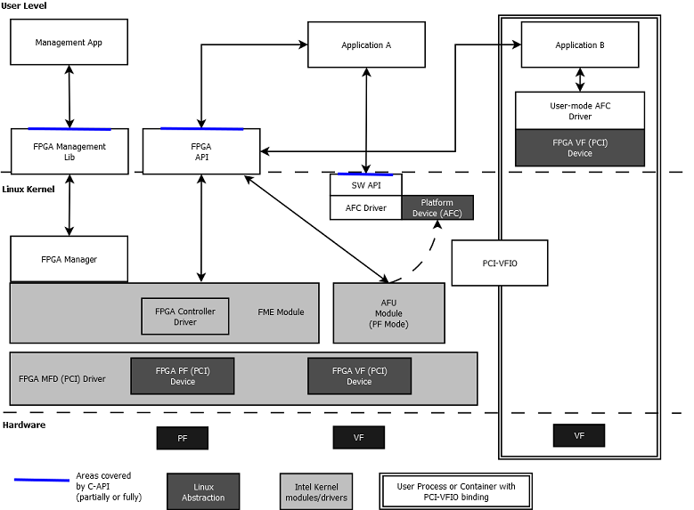

# Open Programmable Accelerator Engine (OPAE) Linux Device Driver Architecture #

.. toctree::

.. highlight:: c

.. highlight:: sh

.. highlight:: console

The OPAE FPGA Linux Device Driver provides interfaces for user-space applications to
configure, enumerate, open, and access FPGA accelerators on platforms equipped
with Intel FPGA solutions. The OPAE FPGA driver also enables system-level management functions such
as FPGA reconfiguration and virtualization.

## Hardware Architecture ##

The Linux Operating System treats the FPGA hardware as a PCIe\* device. A predefined data structure,
Device Feature List (DFL), allows for dynamic feature discovery in an Intel
FPGA solution.


The Linux Device Driver implements PCIe Single Root I/O Virtualization (SR-IOV) for the creation of
Virtual Functions (VFs). The device driver can release individual accelerators
for assignment to virtual machines (VMs).


## FPGA Management Engine (FME) ##

The FPGA Management Engine provides error reporting, reconfiguration, performance reporting, and other
infrastructure functions. Each FPGA has one FME which is always accessed through the Physical
Function (PF). The Intel Xeon&reg; Processor with Integrated FPGA also performs power and thermal management.
These functions are not available on the Intel Programmable Acceleration Card (PAC).

User-space applications can acquire exclusive access to the FME using `open()`,
and release it using `close()`. Device access may be managed by standard Linux
interfaces and tools.

.. Note::

```
    If an application terminates without freeing the FME or Port resources, Linux closes all
    file descriptors owned by the terminating process, freeing those resources.
```

## Port ##

A Port represents the interface between two components:
* The FPGA Interface Manager (FIM) which is part of the static FPGA fabric
* The Accelerator Function Unit (AFU) which is the partially reconfigurable region

The Port controls the communication from software to the AFU and makes features such as reset and debug available.

## Accelerator Function Unit (AFU) ##

An AFU attaches to a Port. The AFU provides a 256 KB memory mapped I/O (MMIO) region for accelerator-specific control registers.

* Use `open()` on the Port device to acquire access to an AFU associated with the Port device.
* Use `close()`on the Port device to release the AFU associated with the Port device.
* Use `mmap()` on the Port device to map accelerator MMIO regions.

## Partial Reconfiguration (PR) ##

Use PR to reconfigure an AFU from a bitstream file. Successful reconfiguration has the following requirement:

* You must generate the reconfiguration AFU for the exact FIM. The AFU and FIM are compatible if their interface IDs match.
You can verify this match by comparing the interface ID in the bitstream header against the interface ID that is
exported by the driver in sysfs.

In all other cases PR fails and may cause system instability.

.. note::

```
    Platforms that support 512-bit Partial Reconfiguration require
    binutils >= version 2.25.
```

Close any software programs accessing the FPGA, including those running in a virtualized host before
initiating PR. For virtualized environments, the recommended sequence is as
follows:

1. Unload the driver from the guest
2. Release the VF from the guest

.. note::

```
    NOTE: Releasing the VF from the guest while an application on the guest is
    still accessing its resources may lead to VM instabilities. We recommend
    closing all applications accessing the VF in the guest before releasing the
    VF.
```
3. Disable SR-IOV
4. Perform PR
5. Enable SR-IOV
6. Assign the VF to the guest
7. Load the driver in the guest

## FPGA Virtualization ##

To enable accelerator access from applications running on a VM, create a VF for
the port using the following process:

1. Release the Port from the PF using the associated ioctl on the FME device.

2. Use the following command to enable SR-IOV and VFs. Each VF can own a single Port with an AFU. In the following command,
N is the number of Port released from the PF.

```console
    echo N > $PCI_DEVICE_PATH/sriov_numvfs
```
.. note::

```
    NOTE: The number, 'N', cannot be greater than the number of supported VFs.
    This can be read from $PCI_DEVICE_PATH/sriov_totalvfs.
```

3. Pass the VFs through to VMs using hypervisor interfaces.

4. Access the AFU on a VF from applications running on the VM using the same driver inside the VM.

.. Note::

``
Creating VFs is only supported for port devices. Consequently, PR and other management functions are only available through
the PF.
```
## Driver Organization ##

### PCIe Module Device Driver ###

!## Driver Organization ##

### PCIe Module Device Driver ###




FPGA devices appear as a PCIe devices. Once enumeration detects a PCIe PF or VF, the Linux OS loads the FPGA PCIe
device driver. The device driver performs the following functions:

1. Walks through the Device Feature List in PCIe device base address register (BAR) memory to discover features
and their sub-features and creates necessary platform devices.
2. Enables SR-IOV.
3. Introduces the feature device infrastructure, which abstracts operations for sub-features and provides common functions
to feature device drivers.

### PCIe Module Device Driver Functions ###

The PCIe Module Device Driver performs the following functions:

1. PCIe discovery, device enumeration, and feature discovery.
2. Creates sysfs directories for the device, FME, and Port.
3. Creates the platform driver instances, causing the Linux kernel to load their respective drivers.

### FME Platform Module Device Driver ###

The FME Platform Module Device Driver loads automatically after the PCIe driver creates the
FME Platform Module. It provides the following features for FPGA management:

1. Power and thermal management, error reporting, performance reporting, and other infrastructure functions. You can access
these functions via sysfs interfaces the FME driver provides.

2. Partial Reconfiguration. During PR sub-feature initialization, the FME driver registers the FPGA Manager framework
to support PR. When the FME receives the relevant ioctl request from user-space, it invokes the common interface
function from the FPGA Manager to reconfigure the AFU using PR.

3. Port management for virtualization (releasing/assigning port device).

After a port device is released, you can use the PCIe driver SR-IOV interfaces to create/destroy VFs.

For more information, refer to "FPGA Virtualization".

### FME Platform Module Device Driver Functions ###

The FME Platform Module Device Driver performs the the following functions:

* Creates the FME character device node.
* Creates the FME sysfs files and implements the FME sysfs file accessors.
* Implements the FME private feature sub-drivers.
* FME private feature sub-drivers:
    * FME Header
    * Partial Reconfiguration
    * Global Error
    * Global Performance

### Port Platform Module Device Driver ###

After the PCIe Module Device Driver creates the Port Platform Module device,
the FPGA Port and AFU driver are loaded.  This module provides an
interface for user-space applications to access the individual
accelerators, including basic reset control on the Port, AFU MMIO region
export, DMA buffer mapping service, and remote debug functions.

### Port Platform Module Device Driver Functions ###

The Port Platform Module Device Driver performs the the following functions:

* Creates the Port character device node.
* Creates the Port sysfs files and implements the Port sysfs file accessors.
* Implements the following Port private feature sub-drivers.
    * Port Header
    * AFU
    * Port Error
    * Signal Tap

### OPAE FPGA Driver Interface ###
The user-space interface consists of a sysfs hierarchy and ioctl requests. Most
kernel attributes can be accessed/modified via sysfs nodes in this hierarchy.
More complex I/O operations are controlled via ioctl requests. The OPAE API
implementation, libopae-c, has been designed to use this interface to
interact with the OPAE FPGA kernel drivers.

