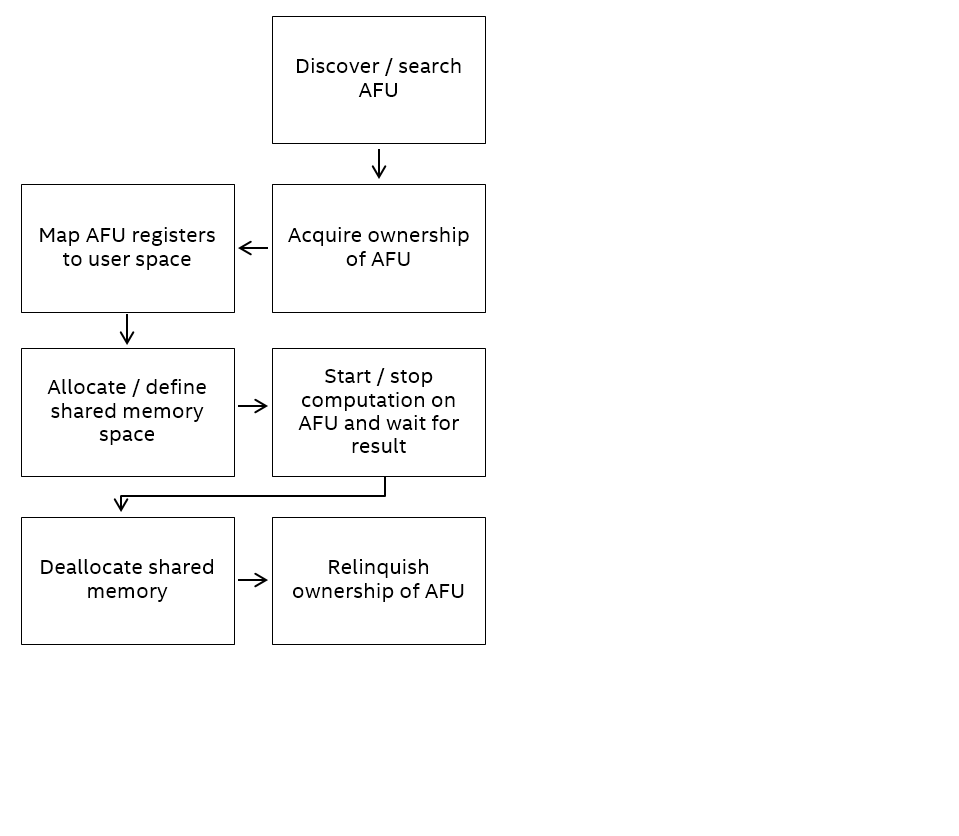

# OPAE C API Programming Guide #

.. toctree::

## Overview ##
The OPAE C library (*libopae-c*) is a lightweight user-space library that
provides abstraction for FPGA resources in a compute environment. Built on
top of the driver stack that supports the FPGA device, the library abstracts away
hardware specific and OS specific details and exposes the underlying FPGA
resources as a set of features accessible from within software programs
running on the host. These features include the acceleration logic
preconfigured on the device, as well as functions to manage and reconfigure
the device. Hence, the library can enable your applications to
transparently and seamlessly take advantage of the FPGA-based acceleration.


By providing a unified C API, the library supports different kinds of FPGA
integration and deployment models, ranging from single-node systems with one or
more FPGA devices to large-scale FPGA deployment in a data center.
A simple use case, for example, is for a user
application running on a system with an FPGA PCIe device to easily use the FPGA
to accelerate certain algorithms. At the other end of the spectrum, resource
management and orchestration services in a data center can use this API to
discover and select FPGA resources and then allocate them
to be used by workloads with acceleration needs.

## Philosophy ##

The purpose of OPAE is to provide a common base layer for as wide a range of
use cases as possible without sacrificing performance or efficiency. It aims
at freeing the developers of applications and frameworks from having to understand
the intricacies of the FPGA driver interfaces and FPGA interconnect details by
providing a thin abstraction to expose required details of the platform.

To that end, OPAE abstracts access to the key components that frameworks and
abstractions need to deal with (for example, FPGA devices and accelerators).
It then provides means to interact with these components in the most
efficient way possible. Essentially, it tries to provide friendly and
consistent interfaces to crucial components of the platform. At the same
time, OPAE tries not to constrain frameworks and applications by making
optimizations that do not translate to many use cases - and where it does
provide convenience functions or optimizations, these are optional.

For example, OPAE provides an interface to allocate physically contiguous
buffers in system memory that can be shared between user-space software and
an accelerator. This interface enables the most basic feature set of
allocating and sharing a large page of memory in one API call; it however
does *not* provide a malloc()-like interface backed by a memory pool or slab
allocator. These kinds of optimizations and added functionality are left to
higher layers of the software stack, which is better suited to make
domain-specific optimizations.

## Some Key Concepts ##
The following key concepts are essential for writing code using the
OPAE C API.
These concepts are modeled with corresponding data structures and functions in
the API specification, as discussed in the [Object model](#object-model) section.

* **FPGA**: [Field Programmable Gate Array](https://en.wikipedia.org/wiki/Field-programmable_gate_array)
is a
discrete or integrated peripheral device connecting to a host CPU via PCIe or
other type of interconnects.
* **AFU**: Accelerator Function Unit, is a computation logic preconfigured on
FPGA with the purpose of accelerating certain computation. It represents a
resource discoverable and usable by user applications. The
logic is designed in RTL and synthesized into a bitstream. A tool (_fpgaconf_)
is provided to reconfigure an FPGA using a bitstream.
* **Accelerator Function (AF)**: A bitstream for an application-specific
accelerator logic, for example, compression, encryption, and mathematical operations.
* **Accelerator**: An allocatable accelerator function implemented in an FPGA,
closely related to an AFU. An accelerator tracks the  _ownership_
of an AFU (or part of it) for a process that uses it. An accelerator can be shared by multiple
processes.
* **Shared memory buffers**: Memory buffers allocated in user process memory
on the host to be shared with an accelerator on the FPGA. Shared memory buffers
fascilitate data transfers between the user process and the accelerator it owns.
* **Events**: Events are asynchronous notification mechanism. The FPGA driver
triggers certian events to indicate error conditions. An accelerator logic can also
define its own events. User applications can choose to be
notified when certain types of the events occur and respond accordingly.
* **Reconfiguration**: An AFU can be replaced by another AFU by a user application
that has appropriate privilege.

## Link with the library ##
Linking with this library is straightforward.
Code using this library should include the header file `fpga.h`. Taking the GCC
compiler on Linux as an example, the minimalist compile and link line should look like:

`gcc myprog.c -I</path/to/fpga.h> -L</path/to/libopae-c.so> -lopae-c -luuid -ljson-c -lpthread`

.. note::

```
    Third-party library dependency: The library internally uses `libuuid` and
    `libjson-c`; but these are not distributed as part of the library. Make sure you
    have these libraries properly installed.
```

## Use the Sample Code ##
The library source includes two code samples. Use these samples
to learn how to call functions in the library. Build and run these samples as
quick sanity checks to determine if your installation and environment are set up
properly.

For details about using the sample code, refer to the [Running the Hello FPGA Example](https://www.altera.com/content/altera-www/global/en_us/index/documentation/dnv1485190478614.html#vks1498593668425) chapter in the Intel&reg; Acceleration Stack for  Intel&reg; Xeon&reg; CPU with FPGAs Getting Started Guide.

## High-Level Directory Structure ##
When successfully built and installed, you can see the following directory
structure. This discussion is using installation on Unix/Linux systems as an
example. However, it is a similar situation on Windows and MacOS
installations.

|Directory & Files |Contents |
|------------------|---------|
|include/opae      |Directory containing all header files|
|include/opae/fpga.h |Top-level header for user code to include|
|include/opae/access.h |Header file for accelerator acquire/release, MMIO, memory management, event handling, etc. |
|include/opae/bitstream.h |Header file for bitstream manipulation functions |
|include/opae/common.h |Header file for error reporting functions |
|include/opae/enum.h |Header file for AFU enumeration functions |
|include/opae/manage.h |Header file for FPGA management functions |
|include/opae/types.h |Various type definitions |
|lib               |Directory containing shared library files |
|lib/libopae-c.so    |The shared dynamic library for user application to link against|
|doc               |Directory containing API documentation |
|doc/html          |Directory for documentation of HTML format
|doc/latex         |Directory for documentation of LaTex format
|doc/man           |Directory for documentation of Unix man page format

## Basic Application Flow ##
The picture below depicts the basic application flow from the
viewpoint of a user-process.
API components are discussed in the next section. The `hello_fpga.c` sample code
is a good example showing the flow in action.



## API Components ##
The API is designed around an object model that abstracts physical FPGA device and
functions available on the device. The object model is not tied to a particular
type of FPGA product. Instead, it is a generalized model and can be extended to
describe any type of FPGAs.

### Object Model ###
* `fpga_objtype`: An enum type to represent the type of an FPGA resource, which
is either `FPGA_DEVICE` or `FPGA_ACCELERATOR`. An `FPGA_DEVICE` object is corresponding to
a physical FPGA device. Only `FPGA_DEVICE` objects can invoke management function.
`FPGA_ACCELERATOR` represents an instance of an AFU.
* `fpga_token`: An opaque type to represent a resource known to, but not
necessarily owned by, the calling process. The calling process must own a
resource before it can invoke functions of the resource.
* `fpga_handle`: An opaque type to represent a resource owned by the
calling process. API functions `fpgaOpen()` and `fpgaClose()` (see the [Functions](#functions) section)
acquire and release ownership of a resource represented by an `fpga_handle`.
* `fpga_properties`: An opaque type for a properties object. Your
applications use these properties to query and search for resources that suit
their needs. The properties visible to your applications are documented in the
[FPGA Resource Properties](#fpga-resource-properties) section.
* `fpga_event_handle`: An opaque handle used by the FPGA driver to notify your
application about an event, and used by the your application to wait for the
notification of the event.
* `fpga_event_type`: An enum type to represent kinds of events which can be
`FPGA_EVENT_INTERRUPT`, `FPGA_EVENT_ERROR`, or `FPGA_EVENT_POWER_THERMAL`.
* `fpga_result`: An enum type to represent the result of an API function. If the
function returns successfully the result is `FPGA_OK`. Otherwise, the result is
one of the error codes. Function `fpgaErrStr()` can translate an error code
into human-readable strings.

### Functions ###
The table below groups key API functions by their purposes. For more information about each of the functions, refer to the
[OPAE C API reference manual](https://opae.github.io/0.13.0/docs/fpga_api/fpga_api.html).

|Purpose |Functions |note |
|--------|----------|-----|
|Enumeration | `fpgaEnumerate()` | Query FPGA resources that match certain properties |
|Enumeration: Properties | `fpga[Get|Update|Clear|Clone|Destroy]Properties]()` | Manage `fpga_properties` life cycle |
|           | `fpgaPropertiesGet[Prop]()` | Get a certain property *Prop*, from the [FPGA Resource Properties](#fpga-resource-properties) chapter |
|           | `fpgaPropertiesSet[Prop]()` | Set a certain property *Prop*, from the [FPGA Resource Properties](#fpga-resource-properties) chapter |
|Access: Ownership  | `fpga[Open|Close]()` | Acquire/release ownership |
|Access: Reset      | `fpgaReset()` | Reset an accelerator |
|Access: Event handling | `fpga[Register|Unregister]Event()` | Register/unregister an event to be notified about |
|               | `fpga[Create|Destroy]EventHandle()` | Manage `fpga_event_handle` life cycle |
|Access: UMsg           | `fpgaGetNumUmsg()`, `fpgaSetUmsgAttributes()`, `fpgaTriggerUmsg()`, `fpgaGetUmsgPtr()` | Low-latency accelerator notification mechanism |
|Access: MMIO       | `fpgaMapMMIO()`, `fpgaUnMapMMIO()` | Map/unmap MMIO space |
|           | `fpgaGetMMIOInfo()` | Get information about a particular MMIO space |
|           | `fpgaReadMMIO[32|64]()` | Read a 32-bit/64-bit value from MMIO space |
|           | `fpgaWriteMMIO[32|64]()` | Write a 32-bit/64-bit value to MMIO space |
|Memory management: Shared memory | `fpga[Prepare|Release]Buffer()` | Manage memory buffer shared between the calling process and an accelerator |
|              | `fpgaGetIOVA()` | Return the virtual address of a shared memory buffer |
|Management: Reconfiguration | `fpgaReconfigureSlot()` | Replace an existing AFU with a new one |
|Error report | `fpgaErrStr()` | Map an error code to a human readable string |

### FPGA Resource Properties ###
These are the properties of a resource that can be queried by a user-application,
by plugging  property name for `Prop` in the names of `fpgaPropertiesGet[Prop]()` and
`fpgaPropertiesSet[Prop]()` functions.

|Property |FPGA |accelerator |note |
|---------|-----|----|-----|
|Parent |No |Yes |`fpga_token` of the parent object |
|ObjectType |Yes |Yes |The type of the resource: either `FPGA_DEVICE` or `FPGA_ACCELERATOR` |
|Bus |Yes |Yes |The bus number |
|Device |Yes |Yes |The PCI device number |
|Function |Yes |Yes |The PCI function number |
|SocketId |Yes |Yes |The socket ID |
|DeviceId |Yes |Yes |The device ID |
|NumSlots |Yes |No |Number of AFU slots available on an `FPGA_DEVICE` resource |
|BBSID |Yes |No |The FPGA Interface Manager (FIM) ID of an `FPGA_DEVICE` resource |
|BBSVersion |Yes |No |The FIM version of an `FPGA_DEVICE` resource |
|VendorId |Yes |No |The vendor ID of an `FPGA_DEVICE` resource |
|Model |Yes |No |The model of an `FPGA_DEVICE` resource |
|LocalMemorySize |Yes |No |The local memory size of an `FPGA_DEVICE` resource |
|Capabilities |Yes |No |The capabilities of an `FPGA_DEVICE` resource |
|GUID |Yes |Yes |The GUID of an `FPGA_DEVICE` or `FPGA_ACCELERATOR` resource |
|NumMMIO |No |Yes |The number of MMIO space of an `FPGA_ACCELERATOR` resource |
|NumInterrupts |No |Yes |The number of interrupts of an `FPGA_ACCELERATOR` resource |
|AcceleratorState |No |Yes |The state of an `FPGA_ACCELERATOR` resource: either `FPGA_ACCELERATOR_ASSIGNED` or `FPGA_ACCELERATOR_UNASSIGNED`|

## OPAE C API Return Codes ##
The OPAE C library returns one of these codes for every public API function exported. Usually, `FPGA_OK` denotes successful completion
of the requested operation, while any return code *other* than `FPGA_OK` indicates an error or other deviation from the expected
behavior. When using the OPAE C API, always check the API return codes and not the functions that failed output parameters.

|Error Code|Description|
|----------|-----------|
|`FPGA_OK`|Operation completed successfully|
|`FPGA_INVALID_PARAM`|Invalid parameter supplied|
|`FPGA_BUSY`|Resource is busy|
|`FPGA_EXCEPTION`|An exception occurred|
|`FPGA_NOT_FOUND`|A required resource was not found|
|`FPGA_NO_MEMORY`|Not enough memory to complete operation|
|`FPGA_NOT_SUPPORTED`|Requested operation is not supported|
|`FPGA_NO_DRIVER`|Driver is not loaded|
|`FPGA_NO_DAEMON`|FPGA Daemon (`fpgad`) is not running|
|`FPGA_NO_ACCESS`|Insufficient privileges or permissions|
|`FPGA_RECONF_ERROR`|Error while reconfiguring FPGA|

## Usage Models ##
This section illustrates a few typical API usage models with code snippets.

### Query and Search for a Resource ###
The user-code first populates an `fpga_properties` object with desired properties.
Afterwards, `fpgaEnumerate()` is accessed to search for matching resources.


.. note::

```
    `fpgaEnumerate()` may return more than one matching resources.

```


```c
    #include "fpga/fpga.h"

    fpga_guid               guid;
    fpga_properties         filter = NULL;
    fpga_result             res;
    fpga_token              tokens[MAX_NUM_TOKENS];
    uint32_t                num_matches = 0;

    /* Start with an empty properties object */
    res = fpgaGetProperties(NULL, &filter);

    /* Populate the properties object with desired values.
       In this case, we want to search for accelerators that match a
       particular GUID.
    */
    uuid_parse(GUID, guid);
    res = fpgaPropertiesSetObjectType(filter, FPGA_ACCELERATOR);
    res = fpgaPropertiesSetGuid(filter, guid);

    /* Query the number of matched resources */
    res = fpgaEnumerate(&filter, 1, NULL, 1, &num_matches);

    /* Return all matched resources in tokens */
    res = fpgaEnumerate(&filter, 1, tokens, num_matches, &num_matches);

    /* Destroy the properties object */
    res = fpgaDestroyProperties(&filter);

    /* More code */
    ......

    /* Destroy tokens */
    for (uint32_t i = 0; i < num_matches; ++i) {
        res = fpgaDestroyToken(tokens[i]);
    }
```

.. note::
```
    The `fpgaEnumerate()` function can take multiple `fpga_properties`
    objects (in an array). In this situation, the function returns resources that
    match *any* of the properties object. In other words, the multiple properties
    objects are logically OR'ed in the query operation.
    * Again, `fpga_token` objects return by `fpgaEnumerate()` do *not* signify
    ownership. To acquire ownership of a resource represented by a token, pass the
    token to `fpgaOpen()`.
```

### Acquire and Release a Resource ###
Acquiring and releasing ownership of a resource is done
using
`fpgaOpen()` and `fpgaClose()`. The calling process must own the resource
before it can do MMIO, share memory buffers, and use functions offered by the
resource.

```c
    #include "fpga/fpga.h"

    fpga_handle             handle;
    fpga_result             res;

    /* Acquire ownership of a resource that was previously returned by
       `fpgaEnumerate()` as a token
    */
    res = fpgaOpen(token, &handle);

    /* More code */
    ......

    /* Release the ownership */
    res = fpgaClose(handle);
```

### Shared Memory Buffer ###
This code snippet shows how to prepare a memory buffer for sharing between the
calling process and an accelerator.

```c
    #include "fpga/fpga.h"

    fpga_handle             handle;
    fpga_result             res;

    /* Hint for the virtual address of the buffer */
    volatile uint64_t       *addr_hint;
    /* An ID we can use to reference the buffer later */
    uint32_t                bufid;
    /* Flag to indicate if the buffer is preallocated or not */
    int                     flag = 0;

    /* Allocate (if necessary), pin, and map a buffer to be accessible
       by an accelerator
    */
    res = fpgaPrepareBuffer(handle, BUF_SIZE, (void **) &addr_hint,
                            &bufid, flag);

    /* The actual address mapped to the buffer */
    uint64_t                iova;
    /* Get the IO virtual address for the buffer */
    res = fpgaGetIOVA(handle, bufid, &iova);

    /* Inform the accelerator about the virtual address by writing to its mapped
       register file
    */
    ......

    /* More code */
    ......

    /* Release the shared buffer */
    res = fpgaReleaseBuffer(handle, bufid);
```

.. note::

```
    The `flag` variable can take a constant `FPGA_BUF_PREALLOCATED`, which
    indicates that the address space pointed to by `addr_hint` is already allocated
    by the calling process.
```

### MMIO ###
This code snippet shows how to map/unmap the register file of an accelerator into the
virtual memory space of the calling process.

```c
    #include "fpga/fpga.h"

    fpga_handle             handle;
    fpga_result             res;

    /* Index of the MMIO space. There might be multiple spaces on an accelerator */
    uint32_t                mmio_num = 0;
    /* Mapped address */
    uint64_t                mmio_addr;

    /* Map MMIO */
    res = fpgaMapMMIO(handle, mmio_num, &mmio_addr);

    /* Write to a 32-bit value to the mapped register file at a certain byte
       offset.

       CSR_CTL is the offset in the mapped space to where the value will be
       written. It's defined elsewhere.
    */
    res = fpgaWriteMMIO32(handle, mmio_num, CSR_CTL, value);

    /* More code */
    ......

    /* Unmap MMIO */
    res = fpgaUnmapMMIO(handle, mmio_num);
```

.. note::

```
    Every AFU has its own layout of register spaces and its own protocol about
    how to control its behavior through the registers. These are defined in the
    AF used to implemented the AFU.
```
