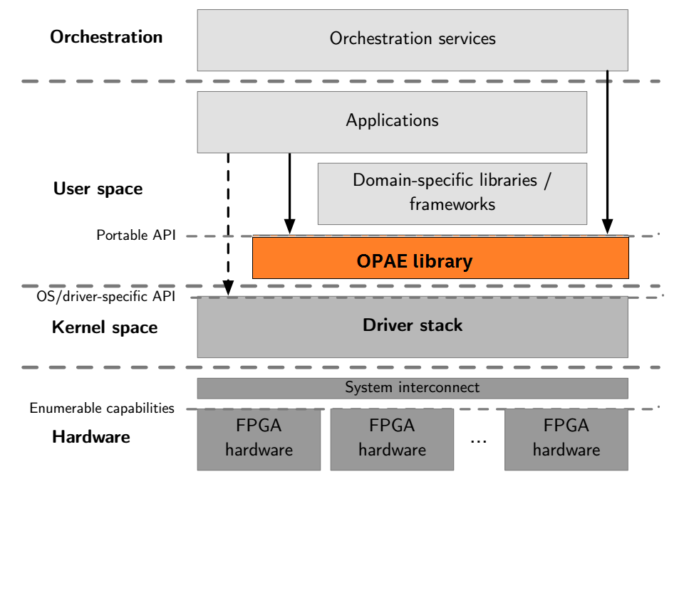
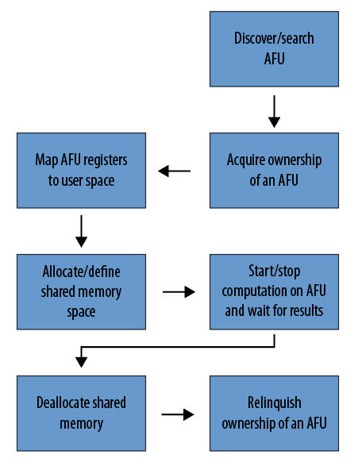

# OPAE C API Programming Guide #

.. toctree::

## Overview ##
The OPAE C library (*libopae-c*) is a lightweight user-space library that
provides abstractions for FPGA resources in a compute environment. The OPAE C library 
builds on the driver stack that supports the FPGA device, abstracting 
hardware- and OS-specific details. It provides access to the underlying FPGA
resources as a set of features available to software programs
running on the host. These features include the acceleration logic
preconfigured on the FPGA and functions to manage and reconfigure
the FPGA. The library enables your applications to
transparently and seamlessly benefit from FPGA-based acceleration.




By providing a unified C API, the library supports different FPGA
integration and deployment models, ranging from single-node systems with one or
a few FPGA devices to large-scale FPGA deployments in a data center.
At one end of the spectrum, the API supports a simple application using a PCIe link to reconfigure 
the FPGA with different accelerator functions. At the other end of the spectrum, resource
management and orchestration services in a data center can use this API to
discover and select FPGA resources and then allocate them for use by acceleration workloads.

## OPAE Role ##

The OPAE provides a common base layer for a wide range of
applications without sacrificing performance or efficiency. The abstraction layer limits 
the details of the FPGA hardware that software applications must handle. 

The OPAE provides consistent interfaces to crucial components of the platform. The  OPAE does not constrain
frameworks and applications by making optimizations with limited applicability. When the OPAE does
provide convenience functions or optimizations, they are optional.

For example, the OPAE provides an interface to allocate physically contiguous
buffers in system memory that user-space software and an accelerator can share. 
This interface enables the most basic feature set of
allocating and sharing a large page of memory in one API call. However, it 
does *not* provide a malloc()-like interface backed by a memory pool or slab
allocator. Higher layers of the software stack can make such
domain-specific optimizations.


## Intel Accelerator Stack Hardware Terminology ##

The following terms define the hardware and hardware processes involved in creating an accelerator function. 

* FPGA: [Field Programmable Gate Array](https://en.wikipedia.org/wiki/Field-programmable_gate_array) 
is a discrete or integrated device connecting to a host CPU via PCIe or other type of interconnects.
* Accelerator Function Unit (AFU): The AFU is the supplied implementation of an accelerator, typically
in HDL. AFUs implement a function such as compression, encryption, or mathematical operations.
The Quartus Prime Pro software synthesizes the RTL logic into a bitstream. 
* Accelerator Function (AF): The AF is the compiled binary for an AFU. An AF is a raw binary file (.rbf)
bitstream. A tool (_fpgaconf_) reconfigures the FPGA using an AF bitstream.
* Reconfiguration: The process of reprogramming the FPGA with a different AF.

## OPAE Software Concepts Reflected in the C API ##

The following OPAE data structures and functions integrate AFUs into the OPAE environment. 
The OPAE C API models these data structures and functions. For more information on the object 
models refer to the [Object model](#object-models) section.

* Accelerator: An accelerator is an allocable accelerator function implemented in an FPGA. 
An accelerator tracks the  _ownership_ of an AFU (or part of it) for a process that uses it.
Multiple processes can share an accelerator.
* Device: The OPAE enumerates and models two device types: the FPGA and the AFU.
* Events: Events are asynchronous notifications. The FPGA driver
triggers particular events to indicate error conditions. Accelerator logic can also
define its own events. User applications can choose to be
notified when particular events occur and respond appropriately.
* Shared memory buffers: Software allocates shared memory buffers in user process memory
on the host. Shared memory buffers facilitate data transfers between the user process and the 
accelerator that it owns.

## OPAE Library ##
Linking with this library is straightforward.
Code using the  OPAE library should include the header file `fpga.h`. Taking the GCC
compiler on Linux as an example, here is the simplest compile and link command:

`gcc myprog.c -I</path/to/fpga.h> -L</path/to/libopae-c.so> -lopae-c -luuid -ljson-c -lpthread`

.. note::

```
The OPAE library uses the third-party `libuuid` and `libjson-c` libraries that are not distributed with 
the OPAE library. Make sure to install these libraries.
```

## Sample Code ##
The library source includes two code samples. Use these samples
to learn how to call functions in the library. Build and run these samples
to determine if your installation and environment are set up properly. 

Refer to the [Running the Hello FPGA Example](https://www.altera.com/content/altera-www/global/en_us/index/documentation/dnv1485190478614.html#vks1498593668425) chapter in the _Intel&reg; Acceleration Stack
Quick Start Guide for for Intel Programmable Acceleration Card with Intel Arria&reg; 10 GX FPGA_ for more information about using the sample code.  


## High-Level Directory Structure ##
Building and installing the OPAE library results in the following directory structure on the Linux OS.
Windows and MacOS have similar directories and files.

|Directory & Files |Contents |
|------------------|---------|
|include/opae      |Directory containing all header files|
|include/opae/fpga.h |Top-level header for user code to include|
|include/opae/access.h |Header file for accelerator acquire/release, MMIO, memory management, event handling, and so on |
|include/opae/bitstream.h |Header file for bitstream manipulation functions |
|include/opae/common.h |Header file for error reporting functions |
|include/opae/enum.h |Header file for AFU enumeration functions |
|include/opae/manage.h |Header file for FPGA management functions |
|include/opae/types.h |Various type definitions |
|lib               |Directory containing shared library files |
|lib/libopae-c.so    |The shared dynamic library for linking with the user application |
|doc               |Directory containing API documentation |
|doc/html          |Directory for documentation of HTML format
|doc/latex         |Directory for documentation of LaTex format
|doc/man           |Directory for documentation of Unix man page format

## Basic Application Flow ##
The figure below shows the basic application flow from the
viewpoint of a user-process. 



## API Components ##
The API object model abstracts the physical FPGA device and
available functions. It is a generalized model and extends to 
describe any FPGA type. 

### Object Models ###
* `fpga_objtype`: An enum type that represents the type of an FPGA resource, either `FPGA_DEVICE` or `FPGA_ACCELERATOR`. 
An `FPGA_DEVICE` object corresponds to a physical FPGA device. Only `FPGA_DEVICE` objects can invoke management functions.
The `FPGA_ACCELERATOR` represents an instance of an AFU. 
* `fpga_token`: An opaque type that represents a resource known to, but not
necessarily owned by, the calling process. The calling process must own a
resource before it can invoke functions of the resource.
* `fpga_handle`: An opaque type that represents a resource owned by the
calling process. The API functions `fpgaOpen()` and `fpgaClose()` acquire and release ownership of a resource that an `fpga_handle` represents. (Refer to the [Functions](#functions) section for more information.)
* `fpga_properties`: An opaque type for a properties object. Your
applications use these properties to query and search for appropriate resources. The 
[FPGA Resource Properties](#fpga-resource-properties) section documents properties visible to your
applications.
* `fpga_event_handle`: An opaque handle the FPGA driver uses to notify your
application about an event. 
* `fpga_event_type`: An enum type that represents the types of events. The following are valid values: 
`FPGA_EVENT_INTERRUPT`, `FPGA_EVENT_ERROR`, and `FPGA_EVENT_POWER_THERMAL`. (The Intel Programmable Acceleration Card (PAC) with
Intel Arria 10 GX FPGA does not handle thermal and power events.)
* `fpga_result`: An enum type to represent the result of an API function. If the
function returns successfully the result is `FPGA_OK`. Otherwise, the result is
the appropriate error codes. Function `fpgaErrStr()` translates an error code
into human-readable strings.

### Functions ###
The table below groups important API calls by their functionality. For more information about each of the functions, refer to the 
[OPAE C API reference manual](https://opae.github.io/0.13.0/docs/fpga_api/fpga_api.html).

|Functionality |API Call |FPGA |Accelerator|Description |
|:--------|:----------|:-----:|:-----:|:-----------------------|
|Enumeration | ```fpgaEnumerate()``` |Yes| Yes| Query FPGA resources that match certain properties |
|Enumeration: Properties | ```fpga[Get, Update, Clear, Clone, Destroy Properties]()``` |Yes| Yes| Manage ```fpga_properties``` life cycle |
|           | ```fpgaPropertiesGet[Prop]()``` | Yes| Yes|Get the specified property *Prop*, from the [FPGA Resource Properties](#fpga-resource-properties) table |
|           | ```fpgaPropertiesSet[Prop]()``` | Yes| Yes|Set the specified property *Prop*, from the [FPGA Resource Properties](#fpga-resource-properties) table |
|Access: Ownership  | ```fpga[Open, Close]()``` | Yes| Yes|Acquire/release ownership |
|Access: Reset      | ```fpgaReset()``` |Yes| Yes| Reset an accelerator |
|Access: Event handling | ```fpga[Register, Unregister]Event()``` |Yes| Yes| Register/unregister an event to be notified about |
|               | ```fpga[Create, Destroy]EventHandle()```|Yes| Yes| Manage ```fpga_event_handle``` life cycle |
|Access: UMsg           | ```fpgaGetNumUmsg()```, ```fpgaSetUmsgAttributes()```, ```fpgaTriggerUmsg()```, ```fpgaGetUmsgPtr()``` | No|Yes| Low-latency accelerator notification mechanism.|
|Access: MMIO       | ```fpgaMapMMIO()```, ```fpgaUnMapMMIO()``` |Yes| Yes| Map/unmap MMIO space |
|           | ```fpgaGetMMIOInfo()``` |Yes| Yes| Get information about the specified MMIO space |
|           | ```fpgaReadMMIO[32, 64]()``` | Yes| Yes|Read a 32-bit or 64-bit value from MMIO space |
|           | ```fpgaWriteMMIO[32, 64]()``` |Yes| Yes| Write a 32-bit or 64-bit value to MMIO space |
|Memory management: Shared memory | ```fpga[Prepare, Release]Buffer()``` |Yes| Yes| Manage memory buffer shared between the calling process and an accelerator |
|              | ```fpgaGetIOAddress()``` | Yes| Yes|Return the device I/O address of a shared memory buffer |
|Management: Reconfiguration | ```fpgaReconfigureSlot()``` | Yes | No | Replace an existing AFU with a new one |
|Error report | ```fpgaErrStr()``` | Yes| Yes|Map an error code to a human readable string |

### FPGA Resource Properties ###
Applications query resource properties by specifying the property name for `Prop` in the 
`fpgaPropertiesGet[Prop]()` and `fpgaPropertiesSet[Prop]()` functions. The FPGA and Accelerator
columns state whether or not the Property is available for the FPGA or Accelerator objects.

|Property |FPGA |Accelerator |Description |
|:---------|:-----:|:----:|:-----|
|Parent |No |Yes |`fpga_token` of the parent object |
|ObjectType |Yes |Yes |The type of the resource: either `FPGA_DEVICE` or `FPGA_ACCELERATOR` |
|Bus |Yes |Yes |The bus number |
|Device |Yes |Yes |The PCI device number |
|Function |Yes |Yes |The PCI function number |
|SocketId |Yes |Yes |The socket ID |
|DeviceId |Yes |Yes |The device ID |
|NumSlots |Yes |No |Number of AFU slots available on an `FPGA_DEVICE` resource |
|BBSID |Yes |No |The FPGA Interface Manager (FIM) ID of an `FPGA_DEVICE` resource |
|BBSVersion |Yes |No |The FIM version of an `FPGA_DEVICE` resource |
|VendorId |Yes |No |The vendor ID of an `FPGA_DEVICE` resource |
|GUID |Yes |Yes |The GUID of an `FPGA_DEVICE` or `FPGA_ACCELERATOR` resource |
|NumMMIO |No |Yes |The number of MMIO space of an `FPGA_ACCELERATOR` resource |
|NumInterrupts |No |Yes |The number of interrupts of an `FPGA_ACCELERATOR` resource |
|AcceleratorState |No |Yes |The state of an `FPGA_ACCELERATOR` resource: either `FPGA_ACCELERATOR_ASSIGNED` or `FPGA_ACCELERATOR_UNASSIGNED`|

## OPAE C API Return Codes ##
The OPAE C library returns a code for every exported public API function.  `FPGA_OK` indicates successful completion
of the requested operation. Any return code other than `FPGA_OK` indicates an error or unexpected
behavior. When using the OPAE C API, always check the API return codes. 

|Error Code|Description|
|----------|-----------|
|`FPGA_OK`|Operation completed successfully|
|`FPGA_INVALID_PARAM`|Invalid parameter supplied|
|`FPGA_BUSY`|Resource is busy|
|`FPGA_EXCEPTION`|An exception occurred|
|`FPGA_NOT_FOUND`|A required resource was not found|
|`FPGA_NO_MEMORY`|Not enough memory to complete operation|
|`FPGA_NOT_SUPPORTED`|Requested operation is not supported|
|`FPGA_NO_DRIVER`|Driver is not loaded|
|`FPGA_NO_DAEMON`|FPGA Daemon (`fpgad`) is not running|
|`FPGA_NO_ACCESS`|Insufficient privileges or permissions|
|`FPGA_RECONF_ERROR`|Error while reconfiguring FPGA|

## Usage Models ##


### Query and Search for a Resource ###
The user-code first populates an `fpga_properties` object with the required properties.
Then, `fpgaEnumerate()` searches for matching resources. `fpgaEnumerate()` may return more
than one matching resource.

    #include "fpga/fpga.h"

    fpga_guid               guid;
    fpga_properties         filter = NULL;
    fpga_result             res;
    fpga_token              tokens[MAX_NUM_TOKENS];
    uint32_t                num_matches = 0;

    /* Start with an empty properties object */
    res = fpgaGetProperties(NULL, &filter);

    /* Populate the properties object with required values.
       In this case, search for accelerators that matches 
       the specified GUID.
    */
    uuid_parse(GUID, guid);
    res = fpgaPropertiesSetObjectType(filter, FPGA_ACCELERATOR);
    res = fpgaPropertiesSetGuid(filter, guid);

    /* Query the number of matching resources */
    res = fpgaEnumerate(&filter, 1, NULL, 1, &num_matches);

    /* Return tokens for all matching resources */
    res = fpgaEnumerate(&filter, 1, tokens, num_matches, &num_matches);

    /* Destroy the properties object */
    res = fpgaDestroyProperties(&filter);

    /* More code */
    ......

    /* Destroy tokens */
    for (uint32_t i = 0; i < num_matches; ++i) {
        res = fpgaDestroyToken(tokens[i]);
    }


The ```fpgaEnumerate()``` function can take multiple ```fpga_properties```objects in an array. In such cases,
the function performs a logical OR of  the properties object and returns resources that match any of 
the multiple properties. The  ```fpga_token``` objects that ```fpgaEnumerate()``` returns, do not signify
ownership. To acquire ownership of a resource represented by a token, pass the token to `fpgaOpen()`.


### Acquire and Release a Resource ###
Use `fpgaOpen()` and `fpgaClose()` to acquire and release ownership of a resource. 
The calling process must own the resource before it can initiate MMIO, access share memory buffers, 
and use functions offered by the resource.

```c
    #include "fpga/fpga.h"

    fpga_handle             handle;
    fpga_result             res;

    /* Acquire ownership of a resource that 
    `fpgaEnumerate()` previously returned as a token */
     
    res = fpgaOpen(token, &handle);

    /* More code */
    ......

    /* Release the ownership */
    res = fpgaClose(handle);
```

### Shared Memory Buffer ###
This code snippet shows how to prepare a memory buffer to be shared between the
calling process and an accelerator.

```c
    #include "fpga/fpga.h"

    fpga_handle             handle;
    fpga_result             res;

    /* Hint for the virtual address of the buffer */
    volatile uint64_t       *addr_hint;
    /* An ID we can use to reference the buffer later */
    uint32_t                bufid;
    /* Flag to indicate whether or not the buffer is preallocated */
    int                     flag = 0;

    /* Allocate (if necessary), pin, and map a buffer to be accessible
       by an accelerator
    */
    res = fpgaPrepareBuffer(handle, BUF_SIZE, (void **) &addr_hint,
                            &bufid, flag);

    /* The actual address mapped to the buffer */
    uint64_t                iova;
    /* Get the IO virtual address for the buffer */
    res = fpgaGetIOAddress(handle, bufid, &iova);

    /* Inform the accelerator about the virtual address by writing to its mapped
       register file
    */
    ......

    /* More code */
    ......

    /* Release the shared buffer */
    res = fpgaReleaseBuffer(handle, bufid);
```

.. note::

```
The `flag` variable can take a constant `FPGA_BUF_PREALLOCATED` to
indicate that the calling process has already allocated the address space
that `addr_hint` points to.
```

### MMIO ###
This code snippet shows how to map and unmap the register file of an accelerator into the
calling process's virtual memory space.

```c
    #include "fpga/fpga.h"

    fpga_handle             handle;
    fpga_result             res;

    /* Index of the MMIO space. There might be multiple spaces on an accelerator */
    uint32_t                mmio_num = 0;
    /* Mapped address */
    uint64_t                mmio_addr;

    /* Map MMIO */
    res = fpgaMapMMIO(handle, mmio_num, &mmio_addr);

    /* Write to a 32-bit value to the mapped register file at a certain byte
       offset.

       CSR_CTL is the offset in the mapped space to where the value will be
       written. It's defined elsewhere.
    */
    res = fpgaWriteMMIO32(handle, mmio_num, CSR_CTL, value);

    /* More code */
    ......

    /* Unmap MMIO */
    res = fpgaUnmapMMIO(handle, mmio_num);
```

.. Note::

```
Every AFU has its own register adress space and its own protocol to control operation through 
the registers. 
```

