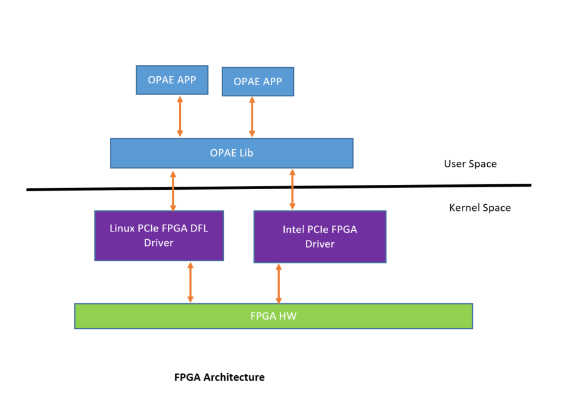

# Enable OPAE on FPGA PCIe drivers #

.. toctree::

.. highlight:: c

.. highlight:: console

FPGA PCIe driver for PCIe-based Field-Programmable Gate Array (FPGA) solutions which implement
the Device Feature List (DFL). This driver provides interfaces for user space applications to
configure, enumerate, open and access FPGA accelerators on the FPGA DFL devices. additionally, it
also enables system level management functions such as FPGA partial reconfiguration, power management,
virtualization with DFL framework and DFL feature device drivers.

OPAE 1.3 release supports both FPGA Intel Linux driver as well as Linux FPGA DFL driver patch set1.
Linux PCIe FPGA DFL driver supports Intel FPGA devices.

FPGA Upstream Linux driver source code available 
https://git.kernel.org/pub/scm/linux/kernel/git/stable/linux.git/tree/drivers/fpga?h=v4.19.14

List of FPGA features enabled on different FPGA drivers

| FPGA Features                                            | OPAE/FPGA Intel driver                            | OPAE/FPGA DFL driver version 1                        |
|----------------------------------------------------------|---------------------------------------------------|-------------------------------------------------------|
| FPGA Device Enumeration                                  | YES                                               | YES                                                   |
| Memory map, FPGA control & status registers              | YES                                               | YES                                                   |
| Shared system memory                                     | YES                                               | YES                                                   |
| Low-latency notifications                                | YES                                               | NO                                                    |
| Partial Reconfiguration                                  | YES                                               | NO                                                    |
| Assign /Release Accelerators to host interfaces          | YES                                               | NO                                                    |
| Metrics/Telemetry                                        | YES                                               | NO                                                    |
| FPGA Events                                              | YES                                               | NO                                                    |

List of OPAE tools enabled on different FPGA drivers:

| OPAE tool            | OPAE/FPGA Intel driver                            |OPAE/FPGA DFL driver version 1                         |
|----------------------|---------------------------------------------------|-------------------------------------------------------|
| hello_fpga           | YES                                               | YES                                                   |
| fpgaconf             | YES                                               | NO                                                    |
| fpgad                | YES                                               | NO                                                    |
| fpgainfo             | YES                                               | NO                                                    |
| fpgametrics          | YES                                               | NO                                                    |
| hello_events         | YES                                               | NO                                                    |
| hssi_config          | YES                                               | NO                                                    |
| hssi_loopback        | YES                                               | NO                                                    |
| object_api           | YES                                               | NO                                                    |
| mmlink               | YES                                               | NO                                                    |
| bist_app             | YES                                               | NO                                                    |
| coreidle             | YES                                               | NO                                                    |
| discover_fpgas       | YES                                               | NO                                                    |
| fpga_dma_test        | YES                                               | NO                                                    |
| hello_cxxcore        | YES                                               | YES                                                   |
| ras                  | YES                                               | NO                                                    |
| userclk              | YES                                               | NO                                                    |
| nlb0                 | YES                                               | NO                                                    |
| nlb3                 | YES                                               | NO                                                    |
| nlb7                 | YES                                               | NO                                                    |
| packager             | YES                                               | YES                                                   |
