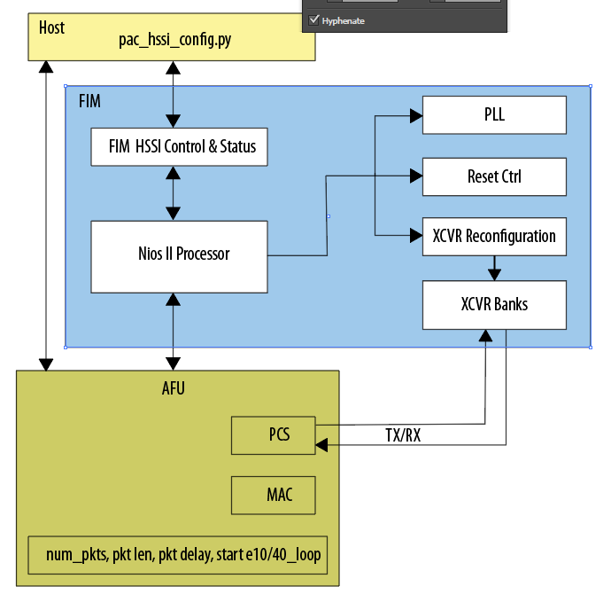

```eval_rst
# pac_hssi_config #

## SYNOPSIS ##
```console
pac_hssi_config.py [-h] subcommand [subarg] [bdf]
```

## DESCRIPTION ##
The `pac_hssi_config.py` tool exercises the Ethernet 10 Gbps (10GbE) and 40GbE transceivers for designs using the
Intel&reg; Programmable Acceleration Card (PAC) with Intel Arria&reg; 10 GX FPGA. This tool does not support the 
Intel Xeon&reg; Processor with Integrated FPGA. 



The two required arguments to the `pac_hssi_config.py` tool specify the subcommand and bus, device, and function (BDF)
for the PCIe device under test. You must provide the BDF parameter for systems with more than one PCIe card. 

```eval_rst
.. note::
    If you do not provide the BDF when required, the command prints a list of valid BDFs for the system. You can also
    determine the BDF using the ``lspci`` command.
```


For usage help, type the following at a command prompt:

```pac_hssi_config.py [-h|--help]```

To configure the network ports, send data, and read statistics, use the following form of the `pac_hssi_config.py` script:

```pac_hssi_config.py subcommand [subarg] [bdf]```

Only a subset of subcommand arguments support `subarg`. 

### Table 1. General Subcommands ###
| Subcommand | Subarg | Description |
|------------|:--------:| ------------|
| `stat`     | N/A      | Prints high speed serial interface (HSSI) controller statistics. |
| `eeprom`   | N/A      | Reads the 128-bit unique board ID, MAC address, and board-specific IDs from EEPROM. |

### Table 2. 10/40 GbE Traffic Generation Subcommands ###
| Subcommand | Subarg | Description |
|------------|:--------:| ------------|
| `e10init` and `e40init`     | N/A | Initializes HSSI PHY to 10GbE or 40GbE mode.  Clears statistics and enable internal HSSI transceiver loopback. |
| `e10loop` and `e40loop`   | On/Off | Turns on or off internal HSSI transceiver loopback. |
| `e10reset` and `e40reset` | On/Off | Asserts or deasserts AFU reset.  Clears packet statistics and disables internal HSSI transceiver loopback. |
| `e10send` and `e40send` | N/A      | Sends 1,000,000 1500-byte packets. For 10GbE sends packets on all four ports. 40GbE has a single port. |
| `e10stat` and `e40stat` | N/A      | Prints packet statistics. |
| `e10statclr` and `e40statclr` | N/A | Clears packet statistics.  Use this command after switching loopback modes to clear any transient statistics accumulated during the mode switch. |

The transceiver equalization `eqwrite` and `eqread` subcommands write and read transceiver equalization settings. 
These subcommands require you to specify the transceiver channel, the equalization setting, and the value (for writes). 
Use the following form for the `eqwrite` command:

```pac_hssi_config.py eqwrite [transceiver channel number] [equalization setting] [equalization value] [bdf]```

Use the following form for the `eqread`command:

```pac_hssi_config.py eqread [transceiver channel number] [equalization setting] [bdf]``` 

### Table 3. Transceiver Equalization Subcommands ###
| Subcommand | Channel Number  | Equalization Setting | Value |
|------------|:--------:| ------------|-------------- |
| `eqwrite` |  0-3 | 0 = Continuous time-linear equalization (CTLE) <br> 1 = Variable gain amplifier (VGA) <br> 2 = DCGAIN <br> 3 = Pre-emphasis first post-tap <br> 4 = Pre-emphasis second post-tap <br> 5 = Pre-emphasis first pre-tap <br> 6 = Pre-emphasis second pre-tap <br> 7 = Differential output voltage (VOD) | Specifies the value for the specified equalization setting. | 
| `eqread` | 0-3 |  0 = Continuous time-linear equalization (CTLE) <br> 1 = Variable gain amplifier (VGA) <br> 2 = DCGAIN <br> 3 = Pre-emphasis first post-tap <br> 4 = Pre-emphasis second post-tap <br> 5 = Pre-emphasis first pre-tap <br> 6 = Pre-emphasis second pre-tap <br> 7 = Differential output voltage (VOD) | N/A |

For more information about reconfiguring transceiver analog parameter settings In Arria&reg; 10 devices, refer to "Changing PMA Analog
Parameters" in the 
[Intel&reg; Arria&reg; 10 Transceiver PHY User Guide](https://www.altera.com/content/dam/altera-www/global/en_US/pdfs/literature/hb/arria-10/ug_arria10_xcvr_phy.pdf). 


## Revision History ##

| Date | Intel Acceleration Stack Version | Changes Made |
|:------|----------------------------|:--------------|
|2018.05.21| DCP 1.1 Beta (works with Quartus Prime Pro 17.1.1) | Added the following subcommands to the `pac_hssi_config.py` tool: <br> `eeprom` <br> `eqwrite` <br> `eqread` <br> Added links to related information. <br> Fixed typos. |
|2018.04.13| DCP 1.1 Alpha (works with Quartus Prime Pro 17.1.1) |   Initial release. |


   
 
