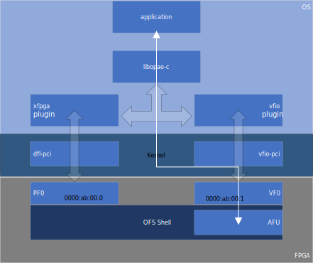

# VFIO Plugin

The OPAE vfio plugin, v-opae, is an OPAE plugin designed to discover and
interface with accelerator resources on PCIe devices bound to the vfio-pci
kernel driver. Given that the OPAE object model currently differentiates
between management (`FPGA_DEVICE`) and accelerator (`FPGA_ACCELERATOR`)
objects, the vfio plugin focuses on enabling developers to create user-mode
drivers for accelerators using the OPAE API. This means that even when a PCIe
device with management IP may be bound to the vfio-pci driver, the OPAE
operations allowed for those resources are limited mostly to those relating
to discovery and identification.

### Sample Use Case
As mentioned before, this plugin is best used for running user-space
drivers with vfio-pci kernel driver. An example hardware configuration
could expose managment functions via a PF (physical fucntion) endpoint
and one or more accelerator functions via VF (virtual function) endpoints.
The image below depicts such an example and shows accelerator data flow
between a software application and the accelerator functional unit (AFU).

<p align="center">
  
</p>

#### Binding vfio-pci Driver
Using the example above, the following shows how one may bind the vfio-pci
driver to the VF for the AFU. For this example, the PCIe vendor ID is 8086
and the device IDs for the PF and VF are aba0 and aba1 respectively.

Load the vfio-pci driver and create one VF.
```shell
> sudo modprobe vfio-pci
> echo 1 | sudo tee /sys/bus/pci/devices/0000\:ab\:00.0/sriov_numvfs
```

At this point, if this is the first VF created for the device, a
sysfs node will be created for it using function 1. The new PCIe
address will be `0000:ab:00.1`. If a driver claims this then it
must be unbound from the device.
```shell
> echo 0000:ab:00.1 | sudo tee /sys/bus/pci/drivers/<vf-driver>/unbind
```

Write the vendor and device id (in hex) to the new_id sysfs attribute
for the vfio-pci driver.
```shell
> echo 8086 a0a1 > /sys/bus/pci/drivers/vfio-pci/new_id
```

More information about vfio can be found
[here](https://www.kernel.org/doc/Documentation/vfio.txt).

#### Enabling the Plugin
Currently, the vfio plugin will not automatically load. One must use the OPAE
configuration file in order to enable it. The example below shows how to
enable it by adding a configuration item into the configurations dictionary
(as identified by the `vfio` name) and by adding the identifier to the list
of plugins.

```json
{
    "configurations": {
        "vfio": {
            "configuration": {
            },
        "enabled": true,
        "plugin": "libv-opae.so"
        }
    },
    "plugins": [
        "vfio"
    ]
}
```

### OPAE Operations
As mentioned above, the goal of this plugin is to enable the development of
user-mode driver software for accelerator IP discovered via PCIe.
The table below describes the supported OPAE API functions and the OPAE
object types supported.

_Note_: All functions that operate on properties are supported. All other OPAE API
functions not listed here are not supported.
See [here](https://opae.github.io/latest/docs/fpga_api/fpga_api.html) for details
on the OPAE API.

Function  | FPGA_DEVICE | FPGA_ACCELERATOR | Notes
----------|-------------|------------------|------
fpgaEnumerate |  Yes | Yes | Used to discover resources and get token objects.
fpgaCloneToken |  Yes | Yes | Clone a token object created with `fpgaEnumerate`.
fpgaDestroyToken |  Yes | Yes | Destroys a token data structure.
fpgaGetProperties |  Yes | Yes | Get new resource properties structure or an updated structure given a token object.
fpgaUpdateProperties |  Yes | Yes | Update properties from a token structure.
fpgaOpen  | Yes | Yes | Open a resource and get a handle data structure.
fpgaGetPropertiesFromHandle |  Yes | Yes | Get resource properties given a handle object.
fpgaClose | Yes | Yes | Close a resource identified by the handle.
fpgaReset |  No | Yes | Reset accelerator resource.
fpgaWriteMMIO64 |  No | Yes | Write 64-bit word.
fpgaReadMMIO64 |  No | Yes | Read 64-bit word.
fpgaWriteMMIO32 |  No | Yes | Write 32-bit word.
fpgaReadMMIO32 |  No | Yes | Read 32-bit word.
fpgaMapMMIO |  No | Yes | Map and get MMIO pointer for an accelerator resource.
fpgaUnmapMMIO |  No | Yes | Unmap MMIO space for accelerator resource.
fpgaPrepareBuffer |  No | Yes | Allocate and prepare buffer for use by accelerator.
fpgaGetIOAddress |  No | Yes | Get the IO Address of a prepared buffer.
fpgaReleaseBuffer |  No | Yes | Release a previously prepared buffer.

