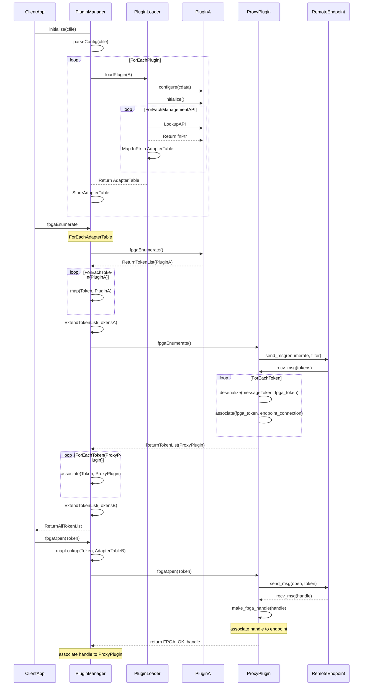

# Plugin Architecture #
An OPAE plugin is a software library that can be loaded dynamically at runtime and is either specific to a given platform or is a proxy for one or more remote endpoints.
While it is not required that a plugin implements the complete OPAE API, it is required, however, to adhere to the plugin interface. Futhermore, any OPAE API functions implemented by a plugin must follow their corresponding function interfaces as defined in the OPAE API specification.

## Objective ##
The objective of this document is to provide architectural details about the plugin interface as well as the plugin manager. While it is possible to use the plugin manager to design a framework for pooling of OPAE resources, it is outside of the scope of this document. Details of how to manage and connect to remote endpoints are also out of scope for the plugin architecture although proxy or remote resources may be mentioned.

An additonal goal of this architecture is to use as much of the existing OPAE
APIs as possible with few modifications to the API.

## High Level Design ##
In order for a plugin design to be scalable and extensible, some data structures and operations should be decoupled and abstracted. Each entity involved in any operation may keep internal data structures to assocate control data it recieves with its origin. Additionaly, any data sent can be associated with data used in assembling it.

### Example Use Case ###
The example below illustrates a case of a client application linking to the plugin manager.
The plugin manager is responsible for managing plugins and forwarding API function calls to
any plugins it has configured and initialized. The plugin manager can use an internal data
structure to associate any API objects it receives from one of its plugin.
This example shows a plugin manager and two plugins. One of the plugins in this scenario is
a proxy plugin which acts as a proxy to resources on remote endpoints.

The sequence of events shows what happens when the client appliction calls `fpgaEnumerate`.
The implementation of `fpgaEnumerate` in the plugin manager involves it calling `fpgaEnumerate`
for each of its plugins. The relationship between tokens it receives and their origin (plugin)
is stored in some sort of internal data structure and is used in any future operations
invloling these tokens, like `fpgaOpen`. When the plugin manager receives the `fpgaOpen` call,
it finds the plugin the token came from, the proxy plugin, and calls `fpgaOpen` in the plugin.
The proxy plugin then uses its internal data structures to find the endpoint the token came from.
Next, it sends a message with the request of open and the token information in its payload.
The receiving endpoint then maps the token information it receives to an fpga_token and calls
`fpgaOpen` to open the device (local to itself). Upon successfully opening the resource,
it will send a response indicating success and include the handle information in the payload.
The proxy plugin receives the response and creates an fpga_handle to assign to its fpga_handle
variable. Before competing its implementation of `fpgaOpen`, the proxy plugin associates this
fpga_handle object with the endpoint that sent it.



## Components ##

### Plugin Interface ###
The following list describes features that are compatible with the Plugin Loader:
* It must implement at least one OPAE API function
* Any OPAE API functions it implements must use the same function signature as defined by the OPAE API specification
* It may define an optional configuration routine in a function called `opaePluginConfigure` to provide a mechanism for configuration of the plugin from external configuration data. It must follow the following function signature:
  * The function takes one argument of type `const char*` used to pass in any configuration related data.
  
    The configuration data will be encoded in a JSON structure. In order to avoid introducing dependencies on other libraries, it will be extected that the JSON structure be serialized. It is up to the plugin on how it will deserialize it.
  * The function must return zero (0) upon successful configuration and a non-zero value otherwise. It is up to the plugin developer to define and document return codes.

  The following is an example of the configuration function declaration:
  ```C
  int opaePluginConfigure(const char* jsonConfig);
  ```

* It may define an optional initialization routine in a function called `opaePluginInitialize` to provide a mechanism for initialization of the plugin. It must follow the function signature:
  * The function takes no arguments
  * The function must return zero (0) upon successful initialization and a non-zero value otherwise. It is up to the plugin developer to define and document return codes.

  The following is an example of the initialization function declaration:
  ```C
  int opaePluginInitialize();
  ```

* It may define an optional finalization routine in a function called `opaePluginFinalize` to provide a mechanism for plugin finalization (or any cleanup routines). It must follow the function signature:
  * The function takes no arguments
  * The function must return zero (0) upon successful initialization and a non-zero value otherwise. It is up to the plugin developer to define and document return codes.

  The following is an example of the finalization function declaration:
  ```C
  int opaePluginFinalize();
  ```

* Any plugin interfaces implemented must have the ABI vislibility set to default. This is implicitly set by not setting the visibility attribute or by explicitly setting it to default as listed in the example below:
  ```C
  #define DLL_PUBLIC __attribute__((visibility ("default")))

  int DLL_PUBLIC opaePluginConfigure(const char* c);
  ```

#### Required Changes to OPAE API ####
One change to the API that is needed to for identification and filtering of
resources based on the location of the resource with respect to the client
application is the addition of a property called `RemoteStatus` of integer type.
A value of 0 indicates that a resource is local and any non-zero value is used
to denote a relative latency. It is currently undetermined how those values
will be measured or calculated one possibility may involve measuring latency
for certain operations.

### Plugin Manager ###

The Plugin Manager is the software component that is linked as a shared library
and implements the OPAE C API. Because it implements the OPAE C API, it can be
liked at runtime by any application that links against the API. It will then
forward API calls to the appropriate plugins that have been loaded.

The plugin manager parses the plugins section of the configuration file to determine the list of plugins to load.
The manager then invokes the Plugin Loader to load each plugin. The result of loading a plugin is the adapter table
for the plugin. The plugin manager maintains the following mappings:

* Each API adapter table is mapped to its plugin.
* Each enumerated `fpga_token` is mapped to its plugin.
* Each opened `fpga_handle` is mapped to its plugin.

#### Enumeration ####

When the API's main `fpgaEnumerate` is called, the plugin manager iterates over each loaded plugin,
using its adapter table to call the plugin's `fpgaEnumerate` entry point. The tokens resulting from an individual
plugin enumeration are each mapped to the originating plugin. Finally, the tokens are collected into the token
array for returning to the caller.

#### Opening a device ####

When the API's main `fpgaOpen` is called, the plugin manager resolves the given token to its plugin. The adapter
table's `fpgaOpen` is then invoked. Finally, the resulting `fpga_handle` is mapped to its originating plugin,
and the handle is returned to the caller.

### Plugin Loader ###

The plugin loader is responsible for opening each plugin and constructing a plugin adapter table based on the
contained API entry points. The loader calls opaePluginConfigure(), passing the relevant configuration file contents.
Once the plugin is configured, the plugin loader calls back into the plugin's opaePluginInitialize() entry point.
If initialization is successful, the plugin loader begins resolving API entry points.
Each API entry point from the plugin is placed into the plugin's adapter table. The adapter table for the plugin
is then returned to the plugin manager, where it is associated with the plugin in the manager's internal data
structures.


#### Calling a Function ####

#### Fault Tolerance ####


```
# pluginLoader
load_plugin(name, config, plugin_struct):
    h = dlopen(name)
    c = dlsym(h, "configure")
    if c:
        c(config)
    for each plugin_API_func:
        fp = dlsym(h, plugin_API_func)
        plugin_struct.plugin_API_func = fp


class pluginManger
    init(config)
        cd = parse_config(config)
        for each plugin in cd["plugins"]:
            plugin_struct ps
            load_plugin(plugin["name"], config, ps)
            myplugins.add(ps)

fpgaEnumerate(filter, tokens)
    for each plugin in resourcemanager:
        plugin.fpgaEnumerate(filter, plugin_tokens)
        for each plugin_token:
            tag_token(plugin_token, plugin)
            tokens.append(plugin_token)
    return FPGA_OK

fpgaOpen(t, h):
    p = rm.find_plugin(t.plugin)
    p.fpgaOpen(t, h)
    tag_handle(h, p)


```

```
so_plugin (libopae-c):
    configure(config): NA
    init(): NA

    fpgaEnumerate()

so_plugin ()


proxy_plugin:
    configure(config)
        addr = config[address]
        c = connect(addr)
        store connection info
    init()
        discover()

    fpgaEnumerate(filter, tokens):
        c.send_message({"enumerate", [filters]})
        data = c.recv()

        process_data(data, tokens)

        return FPGA_OK

    fpgaOpen(t, h):
        c.send_message({"open", toke})
        data = c.recv()
        make_handle(data)
        return FPGA_OK
```
