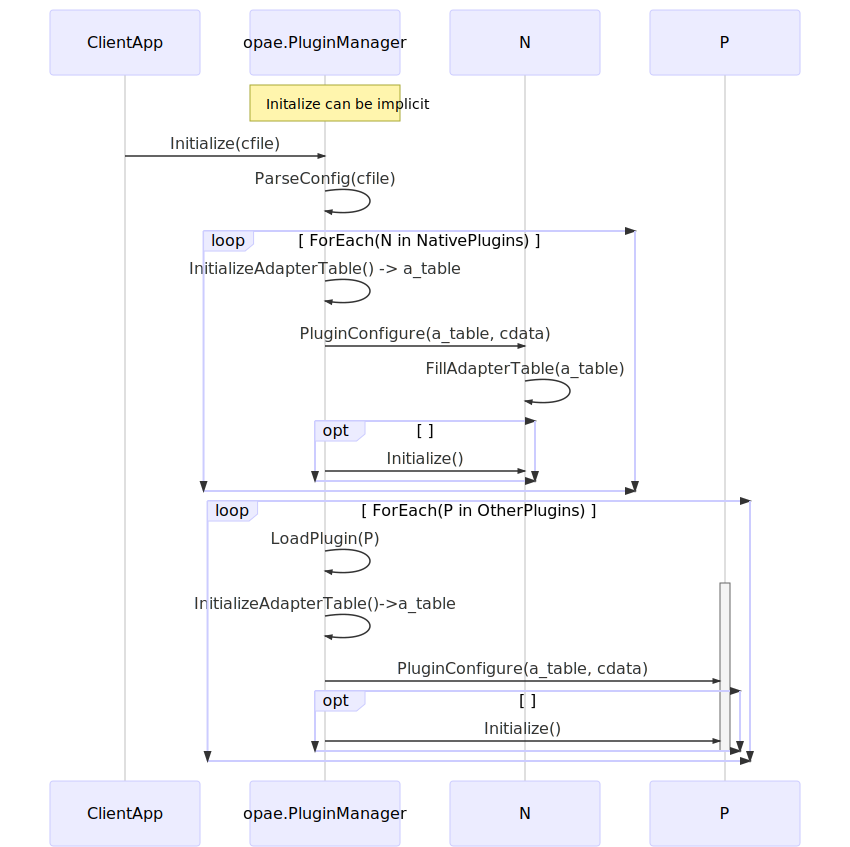
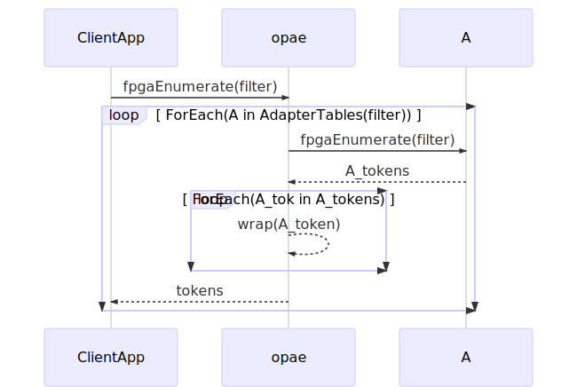
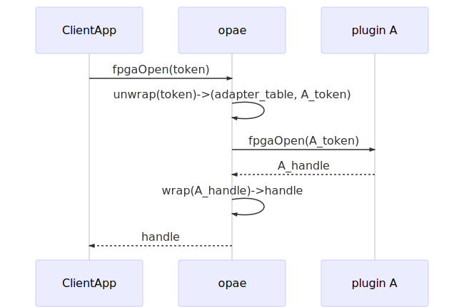
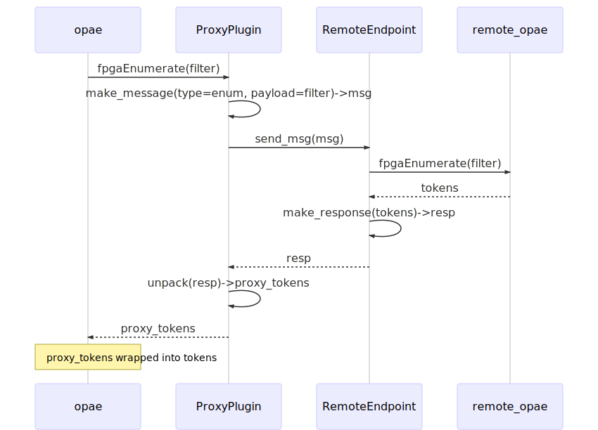

# Plugin Architecture #
The OPAE Plugin Architecture describes the interfaces and data structures
involved in designing and building the core plugin framework, OPAE compatible
plugins, and an OPAE application that uses the OPAE API. An OPAE plugin is a
software library that can be loaded dynamically at runtime and is either
specific to a given platform or is a proxy for one or more remote endpoints.
OPAE plugins use the OPAE API for their prototype definitions but are free to
use any internal data structures and functions in their implementations.
While it is not required that a plugin implements the complete OPAE API, it
is required, however, to adhere to the plugin interface. Futhermore, any OPAE
API functions implemented by a plugin must follow their corresponding
function interfaces as defined in the OPAE API specification.

## Objective ##
The objective of this document is to provide architectural details about the
plugin interface as well as the Plugin Manager, the Plugin Loader, and an OPAE
plugin.

The requirements for the Plugin Architecture are as follows:
* Describe plugin types.
* Define the plugin interface.
  This is how plugins register with the OPAE Plugin Manager and includes
  defining API functions as well as plugin configuration functions.
* Describe how OPAE API calls are forwarded to an appropriate implementation.
* Define the C API that applications link to. This API will:
  * Be a superset of the APIs defined in the existing OPAE C API and any other
  extension APIs.
  * Define functions that control how the system is configured and initialized.
* Use as much of the existing OPAE APIs as possible with few modifications to the API.
* Define a configuration schema that can be used to configure:
  * What plugins to load.
  * Plugin-specific parameters.
  * Policies for how OPAE APIs are enabled and connected at runtime.
  * Policies for error handling.

While it is possible to use the Plugin Manager to design a framework
for pooling of OPAE resources, that is outside of the scope of this document.
While this document and any samples in this document may refer to using remote
resources, details of how to manage and connect to remote endpoints are also
out of scope for the plugin architecture, although proxy or remote resources may
be mentioned.


## High Level Design ##
In order for a plugin design to be scalable and extensible, some data
structures and operations should be decoupled and abstracted with well-defined
interfaces that are used to connect the different components. For OPAE, the
components that make up the plugin design are the Plugin Manager, Plugin
Loader, and the Plugin libraries. The following provide brief descriptions of
these components. More detailed descriptions of these components and their
interfaces are provided later in this document.

### The Plugin Manger ###
  The Plugin Manager implements the OPAE C API and is responsible for delegating
  its calls to the appropriate plugin.

### The Plugin Loader ###
  The plugin loader can be considered a component of the Plugin Manager.
  Its job is to load plugins and initialize them.

### Plugin Types ###
The OPAE codebase and library will include a set of default or native plugins
that require little to no configuration. The goal of these plugins is to:
* Be backwards compatible with the devices/drivers currently supported by OPAE.
* Support remote resources via RDMA transport.

### Plugin ###
  A plugin is a library that implements functions defined in the OPAE API
  specification. It is called by the Plugin Manager to discover or operate
  on OPAE resources.


## Interface Design ##


### Plugin Interface ###
The following list describes features that are compatible with the Plugin Manager and Plugin Loader:


* It must implement a configuration routine in a function called
  `opae_plugin_configure` to provide a mechanism for any necessary
  configuration of the plugin. It must follow the following function
  signature:
  * The function takes two arguments of type `opae_api_adapter_table *` and  `const char *`.
    * The first argument is a pointer to an adapter table structure that the
      Plugin Manager has allocated and pre-initialized. The plugin will set
      both the API function pointers here as well as the function pointers used
      by the plugin framework.
    
    * The second is a pointer to the configuration data which will be encoded
      in a JSON structure. In order to avoid introducing dependencies on
      other libraries, it will be expected that the JSON structure be
      serialized before passing it to the plugin. It is up to the plugin to
      determine how it will deserialize the configuration data.
  * The function must return zero (0) upon successful configuration and a
  non-zero value otherwise. It is up to the plugin developer to define and
  document return codes.

  The following is an example of the configuration function declaration:
  ```C
  int opae_plugin_configure(opae_api_adapter_table *table, const char *jsonConfig);
  ```

* It may define an optional initialization routine in a function called `opae_plugin_initialize` to provide a mechanism for initialization of the plugin. It must follow the function signature:
  * The function takes no arguments.
  * The function must return zero (0) upon successful initialization and a non-zero value otherwise. It is up to the plugin developer to define and document return codes.

  The following is an example of the initialization function declaration:
  ```C
  int opae_plugin_initialize(void);
  ```

* It may define an optional finalization routine in a function called `opae_plugin_finalize` to provide a mechanism for plugin finalization (or any cleanup routines). It must follow the function signature:
  * The function takes no arguments.
  * The function must return zero (0) upon successful initialization and a non-zero value otherwise. It is up to the plugin developer to define and document return codes.

  The following is an example of the finalization function declaration:
  ```C
  int opae_plugin_finalize(void);
  ```

* It may define two optional functions used to indicate if the plugin supports
  devices based on the device type or the device host. Both functions return
  bool and both functions take one argument of type `const char*`. The plugin will
  use the argument to determine if a device is supported, returning true
  if the device is supported and false otherwise.
  If either of these functions is set in the adapter table, the function will
  be called by the OPAE library during enumeration to determine if
  `fpgaEnumerate` should be called in the plugin.

* The `opae_api_adapter_table` is used to fill out a plugin's API and
  initialization/finalization functions. This structure looks something like:

  ```C
  struct opae_api_adapter_table {
    ...

    fpga_result (*fpgaEnumerate)(const fpga_properties *, uint32_t, fpga_token *, uint32_t, uint32_t *);
    fpga_result (*fpgaOpen)(fpga_token, fpga_handle *, int);
    fpga_result (*fpgaClose)(fpga_handle);
    // ... Other API functions

    // configuration functions
    int (*initialize)(void);
    int (*finalize)(void);

    // first-level query
    bool (*supports_device)(const char *device_type);
    bool (*supports_host)(const char *hostname);

  }
  ```

* Any OPAE API functions it implements must use the same function signature as
defined by the OPAE API specification.

* The configuration interfaces implemented must have the ABI visibility set to
  default. This allows the Plugin Manager to lookup this symbol and call it.
  It is implicitly set by not setting the visibility attribute or by
  explicitly setting it to default as listed in the example below:
  ```C
  #define DLL_PUBLIC __attribute__((visibility ("default")))

  int DLL_PUBLIC opae_plugin_configure(opae_api_adapter_table *a, const char *c);
  ```

#### Required Changes to OPAE API ####
Two new properties will be introduced to the `fpga_properties` structure to
aid in filtering and identifying resources by device type or by host. These
two properties are:
* `host`

  This can be a host name or an IP address used to indicate a remote host.
  For backwards compatibility, the absence of this property in an
  `fpga_properties` structure will indicate resources on the local host. A
  proxy plugin for remote endpoints should set the host name of the
  corresponding endpoints here. To aid in filtering for resources generically
  by host, the following three keywords will be reserved:
    * `localhost`
      This is equivalent to not including a host property and refers to
      resources on the local host.
     * `^localhost`
       This will be used to indicate that the matching criteria exclude local
       resources (only include resources from remote hosts).
     * `*`
       This is a wildcard used to indicate resources on any host (which can
       be local or remote).

* `device type`

  This is an enumeration and is used to indicate the device type (or device
  family) similar to `device id`. However, the difference with `device id` is
  that a `device id` refers to the ID registered with the PCI ID repository and
  is unique to one product releaes. A `device type` is broader and refers to a
  family of devices that include one or more `device ids`. The enumerated
  values are TBD.

The accessor methods that will be added to the OPAE API are:
* `fpgaPropertiesSetHost(const fpga_properties, fpga_token *, char *)`
* `fpgaPropertiesGetHost(const fpga_properties, fpga_token *, char *)`
* `fpgaPropertiesSetDeviceType(const fpga_properties, fpga_device_type)`
* `fpgaPropertiesGetDeviceType(const fpga_properties, fpga_device_type *)`

## Component Designs ##

Because the data structures defined in the OPAE API are opaque types, any
implementation of the API (including the Plugin Manager) is free to define its
own versions of the concrete types to fit its own implementation.

The Plugin Manager defines its internal versions of these concrete types as
data structures that are composed of both the adapter table and the plugin's instance
of an opaque type. The Plugin Manager will then use this association to forward
calls to appropriate function pointers in the adapter table.

### Plugin Manager ###

The Plugin Manager is the software component that is linked as a shared library
and implements the OPAE C API. Because it implements the OPAE C API, it can be
linked at runtime by any application that links against the API. It will then
forward API calls to the appropriate plugins that have been loaded.

The Plugin Manager parses the plugins section of the configuration file to
determine the list of plugins to load.
The manager then invokes the Plugin Loader to load each plugin. The result of
loading a plugin is the adapter table for the plugin. The Plugin Manager
maintains the following mappings:

* Each API adapter table is mapped to its plugin.
* Each enumerated `fpga_token` is mapped to its plugin.
* Each opened `fpga_handle` is mapped to its plugin.

#### Enumeration ####

When the API's main `fpgaEnumerate` is called, the Plugin Manager iterates
over each loaded plugin, using its adapter table to call the plugin's
`fpgaEnumerate` entry point. The tokens resulting from an individual
plugin enumeration are each mapped to the originating plugin. Finally,
the tokens are collected into the token array for returning to the caller.

#### Opening a device ####

When the API's main `fpgaOpen` is called, the Plugin Manager resolves
the given token to its plugin. The adapter table's `fpgaOpen` is then
invoked. Finally, the resulting `fpga_handle` is mapped to its
originating plugin, and the handle is returned to the caller.

### Plugin Loader ###

The plugin loader is responsible for opening each plugin and constructing a
plugin adapter table based on the contained API entry points. The loader
calls opae_plugin_configure(), passing a pre-initialized adapter table object
and any relevant configuration data. It is expected that the plugin set
function pointer fields in the adapter table that point to API functions
implemented by the plugin. The adapter table also has fields for setting
functions defined in the plugin that can be called by the Plugin Manager for
non API related functionality. These include initialization, finalization, and
pre-filtering functions that can be used for plugin selection during
enumeration.

### Configuration Schema ###
The OPAE Plugin system will use JSON for defining any runtime configuration
parameters. This includes the list of plugins to load, their instance names,
and their individual configuration data.

```JSON
{
        "plugins":
        [
                {
                        "module": "libopae-net-proxy",
                        "name": "tcp-proxy1",
                        "config": {
                                "transport": "tcp",
                                "discovery": "none",
                                "hosts": ["host1", "host2", "host3"]
                        },
                        "load_policy" : {}
                },
                {
                        "module": "libopae-net-proxy",
                        "name": "rdma-proxy1",
                        "config": {
                                "transport": "rdma",
                                "discovery": "none",
                                "hosts": ["host1", "host2", "host3"]
                        },
                        "load_policy": {}
                }
        ]
}
```

## Example Use Case ##

The diagrams below illustrate a case of a client application linking to the
plugin-enabled OPAE library. The Plugin Manager in OPAE is responsible for
managing plugins and forwarding API function calls to any plugins that have
been registered. The Plugin Manager wraps any API data structures
(`fpga_token`, `fpga_handle`) created by API functions in any of its
registered plugins in its own version of the data structures before returning
them to the client application. When operating on its own API data
structures, it will unwrap them to get a plugin's API data structure along
with its adapter table.

### Initialization ###
This first diagram below shows the initialization sequence when the OPAE
library is first loaded. The initialization routine in the OPAE library can
either be called explicitly from the client application or implicitly by the
library's constructor. In either case, when the initialization routine is
called, it parses the configuration file to get configuration parameters for
any of its plugins (including native plugins). As mentioned in [Plugin
Types](#plugin-types) section, native plugins should require little or no
configuration. However, any configuration parameters that can be overridden
can be included in the configuration file. See the psuedo-code for the
[Plugin Manager](cpseudo.md#plugin-manager) and [Plugin
Loader](cpseudo.md#plugin-loader) for skeleton implementations.


### OPAE Stack ###
Calling OPAE API functions requires going up and down the OPAE SW stack.
These examples refer to the SW stack with respect to the OPAE usermode APIs.
Refer to the pseudocode for skeleton implementations of routines for API
functions in the [OPAE Stack](cpseudo.md#opae-stack).

#### Enumeration ####
This next diagram below shows the enumeration flow from a client application
to an arbitrary plugin, A. The filter, a set of `fpga_properties` objects, is
passed to the plugin. Upon successful enumeration by the plugin, it returns a
set of `fpga_token` structures (A_tokens) to the caller (the
OPAE.PluginManager). For each token in the returned tokens, the Plugin
Manager wraps these tokens into its own internal token data structure which
is composed of the token from the plugin and the adapter table that contains
the plugin's API functions.



#### Opening a Resource ####
Opening a resource requires unwrapping an `fpga_token` object by the Plugin
Manager to get both the plugin's adapter table and the plugin's version of
the `fpga_token` object. It then calls the `open` function in the adapter
table with the plugin's token (or the wrapped token). The diagram below shows
this sequence of events.



#### Remote Enumeration ####
The pseudo-code for [Proxy Plugins](cpseudo.md#proxy-plugins) outlines notional
implementations for the two kinds of proxy plugins. The diagram below
illustrates the general sequence.

