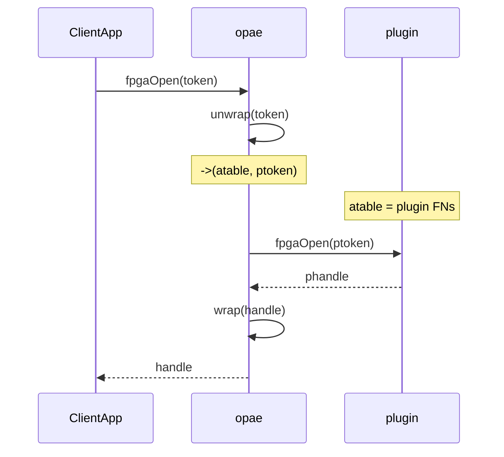

```mermaid
sequenceDiagram
    participant ClientApp
    ClientApp->>opae: fpgaOpen(token)
    opae->>opae: unwrap(token)
    Note over opae: ->(atable, ptoken)
    Note over plugin: atable = plugin FNs
    opae->>plugin: fpgaOpen(ptoken)
    plugin-->>opae: phandle
    opae->>opae: wrap(handle)
    opae-->>ClientApp: handle
```
