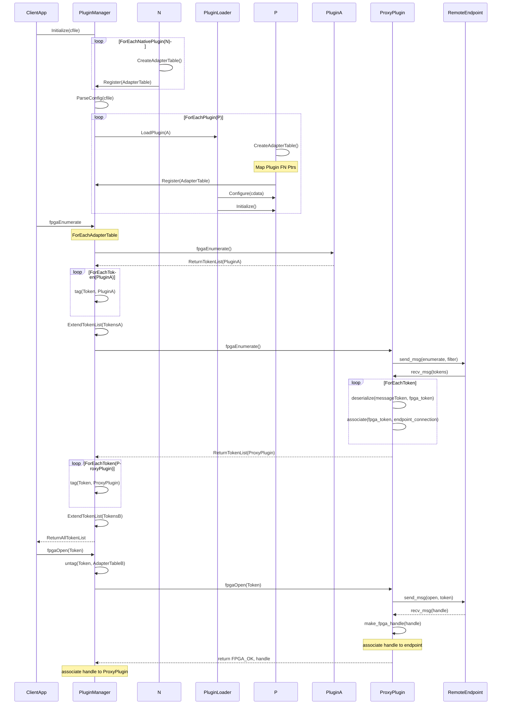

```mermaid
sequenceDiagram
    participant ClientApp
    ClientApp->PluginManager: Initialize(cfile)
    loop ForEachNativePlugin(N)
        N->N: CreateAdapterTable()
        N->>PluginManager: Register(AdapterTable)
    end
    PluginManager->PluginManager: ParseConfig(cfile)
    loop ForEachPlugin(P)
        PluginManager->>PluginLoader: LoadPlugin(A)
        P->P: CreateAdapterTable()
        Note over P: Map Plugin FN Ptrs
        P->>PluginManager: Register(AdapterTable)
        PluginLoader->>P: Configure(cdata)
        PluginLoader->>P: Initialize()
    end
    ClientApp->>PluginManager: fpgaEnumerate
    Note over PluginManager: ForEachAdapterTable
    PluginManager->>PluginA: fpgaEnumerate()
    PluginA-->>PluginManager: ReturnTokenList(PluginA)
    loop ForEachToken(PluginA)
        PluginManager->>PluginManager: tag(Token, PluginA)
    end
    PluginManager->>PluginManager: ExtendTokenList(TokensA)
    PluginManager->>ProxyPlugin: fpgaEnumerate()
    ProxyPlugin->>RemoteEndpoint: send_msg(enumerate, filter)
    RemoteEndpoint->>ProxyPlugin: recv_msg(tokens)
    loop ForEachToken
        ProxyPlugin->ProxyPlugin:deserialize(messageToken, fpga_token)
        ProxyPlugin->ProxyPlugin:associate(fpga_token, endpoint_connection)
    end
    ProxyPlugin-->>PluginManager: ReturnTokenList(ProxyPlugin)
    loop ForEachToken(ProxyPlugin)
        PluginManager->>PluginManager: tag(Token, ProxyPlugin)
    end
    PluginManager->>PluginManager: ExtendTokenList(TokensB)
    PluginManager-->>ClientApp: ReturnAllTokenList

    ClientApp->>PluginManager: fpgaOpen(Token)
    PluginManager->>PluginManager: untag(Token, AdapterTableB)
    PluginManager->>ProxyPlugin: fpgaOpen(Token)
    ProxyPlugin->>RemoteEndpoint: send_msg(open, token)
    RemoteEndpoint-->>ProxyPlugin: recv_msg(handle)
    ProxyPlugin->>ProxyPlugin: make_fpga_handle(handle)
    Note over ProxyPlugin: associate handle to endpoint
    ProxyPlugin-->>PluginManager: return FPGA_OK, handle
    Note over PluginManager: associate handle to ProxyPlugin
```