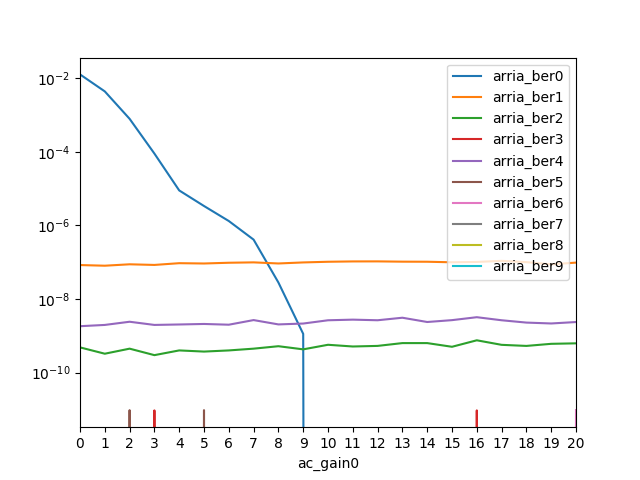

# hssi_tuner #

## NAME ##

_hssi_tuner_ - Arria/Alaska transceivers tuner

## PREREQUISITES ##

- Operating system RHEL 7.3 with kernel 3.10.
- CPU SKX+FPGA H0/B0.
- Platform Purley-FPGA.
- cmake version >=2.8.12
- boost library version >=1.53

## BUILD ##

```console
$ tar -xf PACKAGE_PATH/hssi_config.tar.gz
$ cd hssi_config
$ mkdir build ; cd build
$ cmake -DCMAKE_BUILD_TYPE=Release ..
$ make install DESTDIR=INSTALL_DIR
```

Output binaries are located in `INSTALL_DIR`.

## SYNOPOSIS ##
```console
# hssi_tuner --pci_device resource_path [--platform kind] --xcvr_config arria config_path --xcvr_config alaska config_path --sweep options [--sweep options]... [OPTION]...
# hssi_tuner --pci_device resource_path [--platform kind] --dump_cfg device kind config_path
```

## DESCRIPTION ##
hssi_tuner is a tool to tune the HSSI link between the Arria10 and the Alaska card. The tool sets initial parameters for transceivers on boths sides of the link and performs a cartesian product of specified parameter sweeps. Please refer to "Intel(R) FPGA IP High-Speed Link Tuning Using Signal Conditioning Circuitry in Intel(R) Arria(R) 10 Transceivers" document for more details on the tuning procedure.

```eval_rst
.. important:: Tuning requires `lfsr_with_mdio` GBS to be loaded.
```

The sweep procedure is as follows:

1. Configure all devices according to `--xcvr_config` files.
2. Step single parameter according to specified `--sweep` parameter.
3. Reset all transceivers.
4. Start PRBS on all Tx and Rx.
5. Wait for lock (up to `lock_timeout` seconds).
6. Check if lock is stable (up to `lock_timeout` seconds).
7. Reset error counters.
8. Wait for `ber_timeout` seconds and note measured BER on all receivers.
9. Go back to step 2.

## COMMON OPTIONS ##
`--help`

    Print help information and exit.

`--pci_device resource_path`

    `path`: path to resource0 of fpga device eg. `/sys/devices/pci0000:5e/0000:5e:00.0/resource0`

    Use `lspci` to find path to the PCIe device.

```console
$ lspci -d 8086:bcc0
5e:00.0 Processing accelerators: Intel Corporation Device bcc0
be:00.0 Processing accelerators: Intel Corporation Device bcc0
$ readlink -e $(lspci -nd 8086:bcc0 | awk '{print "/sys/bus/pci/devices/*"$1"/resource0"}')
/sys/devices/pci0000:5e/0000:5e:00.0/resource0
/sys/devices/pci0000:be/0000:be:00.0/resource0
```

## HSSI_TUNER OPTIONS ##

`--platform kind`

    `kind`: nc (NeonCity) or bmp (BlueMountainPass) (default: bmp)

```eval_rst
.. note:: `--xcvr_config`, `--out`, `--lock_tout`, `--ber_tout`, `--ber`, `--link` options are strictly related to `sweep` command, for `dump_cfg` command these options are ignored.
```

`--xcvr_config device file`

    `device`: arria or alaska

    `file`: filename to device initial configuration

    Arria config file requires set of parameters for every link.

    Arria config supports parameters in given order:

        - vod (default: 31)
        - pre_emp_1st_post_tap (default: 0)
        - pre_emp_2nd_post_tap (default: 0)
        - pre_emp_1st_pre_tap (default: 0)
        - pre_emp_2nd_pre_tap (default: 0)
        - equalizer_engine (default: 4)
        - dc_gain (default: 1)
        - ac_gain (default: 7)
        - vga (default: 5)

    Config file consist of header with parameters name and rows with values for corresponding link.

    Example of arria config file (only comma ',' is allowed as separator):


```eval_rst
.. code-block:: yaml

    vod,pre_emp_1st_post_tap,pre_emp_2nd_post_tap,pre_emp_1st_pre_tap,pre_emp_2nd_pre_tap,eq_engine,dc_gain,ac_gain,vga
    31,0,0,0,0,4,1,7,5
    31,0,0,0,0,4,1,7,5
    31,0,0,0,0,4,1,7,5
    31,0,0,0,0,4,1,7,5
    31,0,0,0,0,4,1,7,5
    31,0,0,0,0,4,1,7,5
    31,0,0,0,0,4,1,7,5
    31,0,0,0,0,4,1,7,5
    31,0,0,0,0,4,1,7,5
    31,0,0,0,0,4,1,7,5

..

    Example for alaska:
```

```eval_rst
.. code-block:: yaml

    pre_cursor,attenuation,post_cursor
    0,0,0
    0,0,0
    0,0,0
    0,0,0
    0,0,0
    0,0,0
    0,0,0
    0,0,0
    0,0,0
    0,0,0

..

    For default, use "-".
```

`--link value`

    `value`: arria transceiver link 0..9|all (default: 0)

    Links can be numbered differently for arria and alaska transceivers.

    Given value is arria tranceiver link - corresponding alaska transceiver link is decoded internally.

    Additionally `all` can be provided as value and xcvr parameters during sweep command will be changed on all links simultaneously.

`--out file`

    `file`: filename to save sweep results. (default = none, write to stdout)

    Output file contains parameters under test and other gathered informations which allows to determine signal integrity.

    Results are appended to an existing file.

`--lock_tout lock_timeout`

    `lock_timeout`: time to lock link in secs 1..60 (default 1)

`--ber_tout ber_timeout`

    `ber_timeout`: time to measure ber in secs 1..600 (default 1)

## HSSI_TUNER COMMANDS ##

`--dump_cfg device kind file`

    `device`: arria or alaska

    `kind`: default or current

    `file`: filename to save configuration

    Dump device configuration and exit.

`--sweep device channel param min max interval`

    `device`: arria or alaska

    `param`: parameter to be swept

    `channel`: tx or rx

    `min`: minimal value of parameter

    `max`: maximal value of parameter

    `interval`: sweep interval of parameter

    Multiple sweep commands are accepted for app execution.

    In case of invalid values an error will be reported.

## USAGE EXAMPLE ##

Usage example
```console
# ./hssi_tuner --pci_device /sys/devices/pci0000:de/0000:de:00.0/resource0 --xcvr_config arria ../cfg/arria.cfg --xcvr_config alaska ../cfg/alaska.cfg --link 0 --sweep arria rx ac_gain 0 20 1 --out ac_gain_0_0_20.csv
```

This command will sweep the `ac_gain` parameter of Arria's link 0 receiver over values `[0, 1, .., 20]` and measure the impact on BER on all receivers in the network.

```eval_rst
:download:`See example result <ac_gain_0_0_20.csv>`
```



Sample python script used for the plot above (requires `pandas` and `matplotlib` python packages):

```python
import pandas as pd
import matplotlib.pyplot as plt

arr = pd.read_csv('ac_gain_0_0_20.csv', index_col=('ac_gain0'))

ber = pd.DataFrame(arr, columns=[col for col in arr.columns
                                   if col.startswith('arria_ber')])
ber.plot(logy=True, xticks=ber.index)
plt.show()
```
