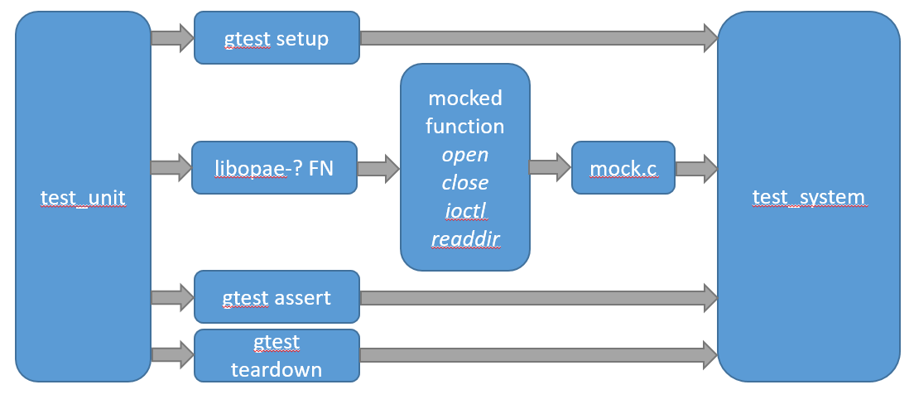

# OPAE Testing Framework #

## Objective ##

The main goal of the testing framework used by OPAE is to enable (Google test)
tests that don't require the presence of either an OPAE kernel driver or an
OPAE compatible FPGA. An additional goal is to allow authoring tests that can
easily ported from a mock environment to a real system.

## Mocking the Kernel Driver ##

The two interfaces to the OPAE Linux driver are `ioctl` calls and `sysfs`
files. The OPAE C library uses both of these interfaces in its implementation
to control and/or query the device. To test the API functions (including
internal functions used within), a `mock` driver has been developed that can
allow for calling these functions without calling the kernel driver through
these interfaces. At a high level, system calls related to `ioctl` and `sysfs`
files (eg. `ioctl`, `open`) are implemented in a C file called `mock.c` which
in turn calls into a C++ singleton class called `test_system` using its C
interface. This C++ singleton can also be used by any google test code to call
any necessary setup and teardown routines. When calls such as `open` are called
and handled by `test_system`, paths used by the OPAE kernel driver
(`/dev/intel-fpga-port.0` or `/sys/class/fpga/intel-fpga-port.0`) can be
re-rooted to point to files in a mock sysfs subtree.

The following diagram illustrate a general flow of a google test using the mock
driver and the test_system.
 

### test_system ###

As mentioned above, `test_system` is a singleton class that is designed to be
called from either C code (by using its C interface) or by using its C++
`instance()` function. This allows it to be called from both google test tests
as well as from C functions that are being mocked. Tests that depend on any
sysfs paths handled by the OPAE kernel driver should be implemented as part of
a test fixture. This fixture should call `test_system::initialize` in its setup
and should also call `test_system::finalize` in its teardown. If a unit test
does not depend on any sysfs paths used by the OPAE kernel driver, then there
is no need to call these two functions and those functions should be
implemented without a fixture. The class `test_system` is compiled into a
shared library (`libtest_system.so`) and should be linked with any OPAE test
that uses it. Additionally, the file `mock.c` is not included in this library
and should be included into any test executable that uses `test_system`.

### ioctl handlers ###

The file `ioctl_handlers.cpp` includes some default ioctl handler functions for
most of the ioctl requests (as identified by the request constant in
`intel-fpga.h`). This file calls the function
`test_system::register_ioctl_handler` which maps a request constant to a
function that should be called when the request is made. A templated function,
`dummy_ioctl` is provided to allow registering an ioctl handler that uses its
template arguments to define what to return from ioctl and also to specify what
`errno` should be set to. This is intended for authoring negative tests that
depend on `ioctl` calls.

